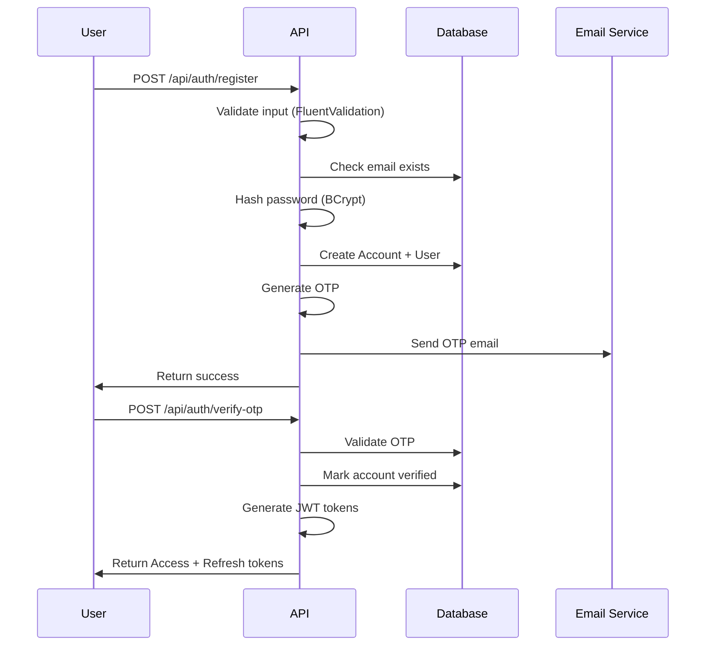
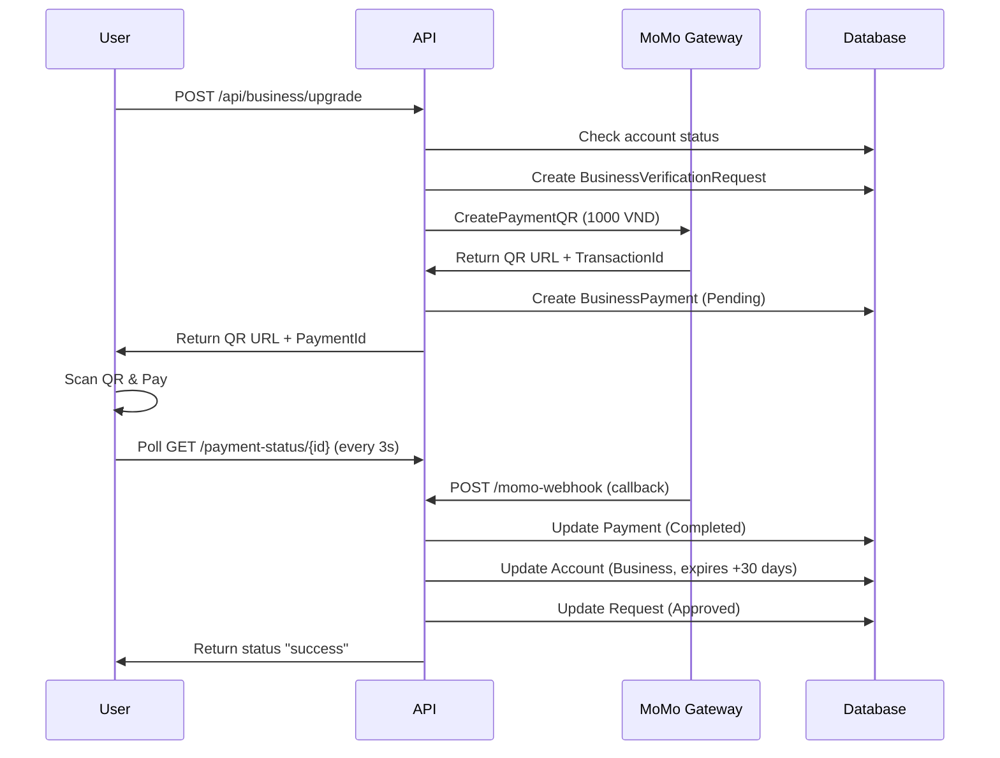
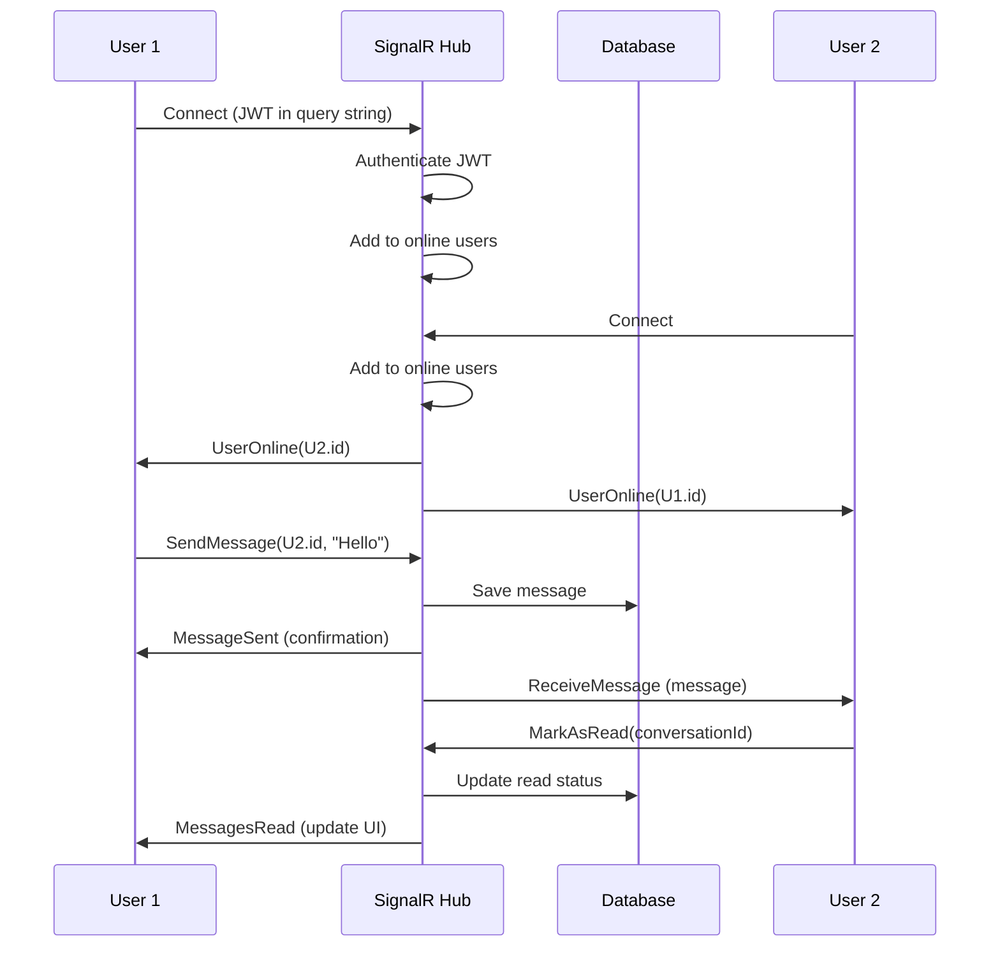
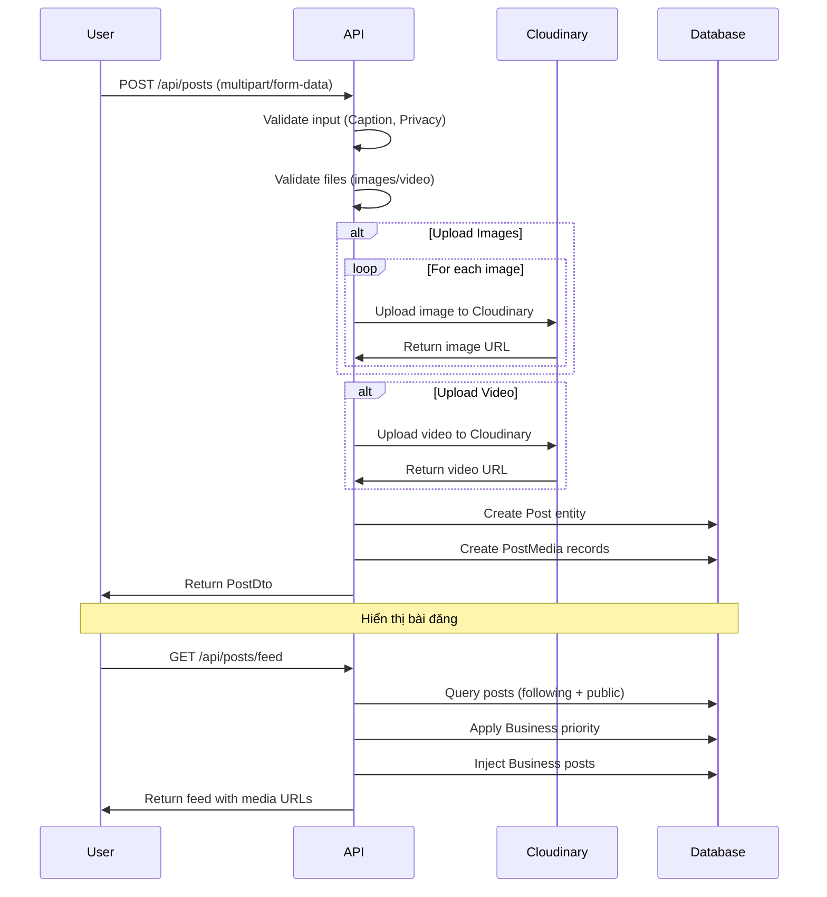

# 📱 Ứng Dụng Mạng Xã Hội MediaLite

> **Hệ thống mạng xã hội toàn diện** được xây dựng theo kiến trúc Clean Architecture, với backend .NET 8, frontend React Native, tích hợp AI moderation (PhoBERT), thanh toán MoMo, WebSocket real-time (SignalR), hệ thống RBAC đầy đủ và dashboard thống kê admin chi tiết.

[](https://dotnet.microsoft.com/)
[](https://reactnative.dev/)
[](https://www.docker.com/)
[](https://www.microsoft.com/sql-server)
[](https://blog.cleancoder.com/uncle-bob/2012/08/13/the-clean-architecture.html)
[](https://dotnet.microsoft.com/apps/aspnet/signalr)
[](https://github.com/VinAIResearch/PhoBERT)

---

## 📋 Mục Lục

1. [Tổng Quan Dự Án](#-tổng-quan-dự-án)
2. [Kiến Trúc Hệ Thống](#-kiến-trúc-hệ-thống)
   - [Clean Architecture](#clean-architecture-pattern)
   - [System Architecture](#system-architecture)
   - [Technology Stack](#technology-stack)
   - [Mô hình RBAC](#mô-hình-rbac-role-based-access-control)
3. [Sơ Đồ Tuần Tự](#-sơ-đồ-tuần-tự-sequence-diagrams)
   - [Authentication Flow](#1-authentication-flow)
   - [Business Upgrade Flow](#2-business-upgrade-payment-flow)
   - [Real-time Messaging Flow](#3-real-time-messaging-flow)
   - [Post Creation & Feed Flow](#4-post-creation--feed-flow)
   - [AI Moderation Flow](#5-ai-moderation-flow-phobert)
4. [Công Nghệ Sử Dụng](#-công-nghệ-sử-dụng)
5. [Tính Năng Chính](#-tính-năng-chính)
6. [Cấu Trúc Dự Án](#-cấu-trúc-dự-án)
7. [Database Schema](#-database-schema)
8. [API Endpoints](#-api-endpoints)
9. [Nghiệp Vụ Chi Tiết](#-nghiệp-vụ-chi-tiết)
10. [Cài Đặt & Triển Khai](#-cài-đặt--triển-khai)
11. [Tài Liệu Liên Quan](#-tài-liệu-liên-quan)

> 📐 **[Xem tất cả sơ đồ kiến trúc chi tiết tại đây](./ARCHITECTURE_DIAGRAMS.md)** - Bao gồm RBAC diagrams, Sequence diagrams, ER diagrams và Module architecture đầy đủ

---

## 🎯 Tổng Quan Dự Án

**MediaLite** là một nền tảng mạng xã hội toàn diện được xây dựng theo mô hình **Clean Architecture**, tích hợp đầy đủ các tính năng của một ứng dụng mạng xã hội hiện đại với mục đích:

### 🎯 Mục Tiêu Chính
- **Kết nối người dùng**: Cho phép tạo hồ sơ, theo dõi bạn bè, chia sẻ nội dung đa phương tiện
- **Kinh doanh**: Hỗ trợ tài khoản Business với tính năng nâng cao, ưu tiên hiển thị và analytics
- **Quản trị**: Dashboard admin với thống kê chi tiết, kiểm duyệt nội dung
- **Thanh toán**: Tích hợp hoàn chỉnh MoMo Payment Gateway
- **Real-time**: SignalR WebSocket cho chat, notifications và cập nhật tức thời
- **AI Moderation**: Tích hợp PhoBERT AI để kiểm duyệt nội dung độc hại tự động

### 🎨 Đặc Điểm Nổi Bật

✅ **Clean Architecture** - Tách biệt rõ ràng Domain, Application, Infrastructure, Presentation với dependency inversion  
✅ **RBAC System** - Role-Based Access Control với 3 roles (User, Business, Admin) và 42 permissions chi tiết  
✅ **Microservices Ready** - Thiết kế module hóa, dễ dàng scale và tách service  
✅ **Docker Compose** - Triển khai đơn giản với 1 command, multi-container orchestration  
✅ **JWT Authentication** - Bảo mật với Access Token (15 phút) & Refresh Token (30 ngày)  
✅ **SignalR WebSocket** - 4 Hubs cho real-time messaging, notifications, comments  
✅ **MoMo Integration** - Thanh toán QR Code tự động với webhook callback  
✅ **AI Content Moderation** - PhoBERT Vietnamese NLP để detect toxic content  
✅ **Admin Analytics** - Dashboard thống kê business intelligence với charts  
✅ **Mobile-First** - React Native app cross-platform cho iOS & Android  
✅ **Cloudinary CDN** - Lưu trữ và tối ưu hóa media (images/videos)  
✅ **Background Services** - Auto cleanup expired stories, business accounts, pending accounts  

### 📊 Thống Kê Dự Án

| Metric | Value |
|--------|-------|
| **Backend Lines of Code** | ~25,000+ lines C# |
| **Frontend Lines of Code** | ~15,000+ lines JS/JSX |
| **Total API Endpoints** | 120+ endpoints |
| **Database Tables** | 45+ tables |
| **Entities (Domain)** | 33+ entities |
| **Services (Application)** | 20+ services |
| **Repositories** | 20+ repositories |
| **SignalR Hubs** | 4 hubs (Chat, GroupChat, Notification, Comment) |
| **External Integrations** | 4 (Cloudinary, MoMo, PhoBERT, Email) |
| **Modules Documented** | 12+ modules |

---

## 🏗️ Kiến Trúc Hệ Thống

### Clean Architecture Pattern

Dự án được xây dựng theo mô hình **Clean Architecture** của Uncle Bob, đảm bảo tính độc lập, dễ test và dễ maintain.

```
┌─────────────────────────────────────────────────────────────────────────┐
│                         PRESENTATION LAYER                               │
│  ┌──────────────┐  ┌──────────────┐  ┌──────────────┐  ┌──────────────┐│
│  │   WebAPI     │  │  MobileApp   │  │  WebAdmin    │  │  WebUsers    ││
│  │ (.NET Core)  │  │(React Native)│  │   (HTML/JS)  │  │   (React)    ││
│  │              │  │              │  │              │  │              ││
│  │ - Controllers│  │ - Components │  │ - Dashboard  │  │ - Pages      ││
│  │ - Hubs       │  │ - Screens    │  │ - Charts     │  │ - Components ││
│  │ - Middleware │  │ - Services   │  │ - Analytics  │  │ - Services   ││
│  └──────────────┘  └──────────────┘  └──────────────┘  └──────────────┘│
└────────────────────────────────┬────────────────────────────────────────┘
                                 │ HTTP/WebSocket
                                 ↓
┌─────────────────────────────────────────────────────────────────────────┐
│                        APPLICATION LAYER                                 │
│  • Services (Business Logic)                                             │
│    - AuthService, UserService, PostService, MessageService, etc.         │
│  • DTOs (Data Transfer Objects)                                          │
│    - LoginDto, PostDto, UserDto, MessageDto, etc.                        │
│  • Interfaces (Service Contracts)                                        │
│    - IBusinessUpgradeService, ITokenService, IEmailService               │
│  • Use Cases (CQRS-style)                                                │
│    - User Registration, Post Creation, Message Sending                   │
│  • Validators (FluentValidation)                                         │
│    - LoginValidator, RegisterValidator, PostValidator                    │
└────────────────────────────────┬────────────────────────────────────────┘
                                 │ Business Logic
                                 ↓
┌─────────────────────────────────────────────────────────────────────────┐
│                       INFRASTRUCTURE LAYER                               │
│  • Repositories (Data Access)                                            │
│    - AccountRepository, UserRepository, PostRepository, MessageRepo      │
│  • DbContext (Entity Framework Core)                                     │
│    - AppDbContext with 45+ DbSets                                        │
│  • External Services                                                     │
│    - CloudinaryService (Media CDN)                                       │
│    - MoMoPaymentService (Payment Gateway)                                │
│    - EmailService (SMTP)                                                 │
│    - PhoBertModerationService (AI)                                       │
│  • Configurations (Entity Mappings)                                      │
│    - UserConfiguration, PostConfiguration, MessageConfiguration          │
│  • Background Services                                                   │
│    - ExpiredStoriesCleanupService                                        │
│    - ExpiredBusinessAccountService                                       │
│    - ExpiredPendingAccountsCleanupService                                │
└────────────────────────────────┬────────────────────────────────────────┘
                                 │ Repository Pattern
                                 ↓
┌─────────────────────────────────────────────────────────────────────────┐
│                          DOMAIN LAYER (CORE)                             │
│  • Entities (Business Objects)                                           │
│    - Account, User, Admin, Post, Comment, Message, Story, etc.           │
│  • Value Objects (Immutable Types)                                       │
│    - Email, PhoneNumber, PasswordHash, ImageUrl                          │
│  • Enums (Business Rules)                                                │
│    - Gender, Privacy, ReactionType, NotificationType                     │
│  • Interfaces (Repository Contracts)                                     │
│    - IAccountRepository, IUserRepository, IPostRepository                │
│  • Domain Events (Future)                                                │
│    - UserRegisteredEvent, PostCreatedEvent                               │
└─────────────────────────────────────────────────────────────────────────┘
```

**🔑 Nguyên Tắc Clean Architecture:**

1. **Dependency Rule**: Dependencies chỉ hướng vào trong (Presentation → Application → Infrastructure → Domain)
2. **Domain Layer**: Core business logic, không phụ thuộc vào bất kỳ layer nào
3. **Application Layer**: Use cases và business logic, depend vào Domain
4. **Infrastructure Layer**: Triển khai chi tiết (DB, External APIs), depend vào Application & Domain
5. **Presentation Layer**: UI/Controllers, depend vào Application

---

### System Architecture

Sơ đồ kiến trúc hệ thống tổng quan với các components và luồng dữ liệu:

```
┌────────────────────────────────────────────────────────────────────────────────┐
│                              CLIENT TIER                                        │
│  ┌────────────────┐  ┌────────────────┐  ┌────────────────┐                   │
│  │  Mobile App    │  │  Web Admin     │  │  Web Users     │                   │
│  │ (React Native) │  │   (HTML/JS)    │  │    (React)     │                   │
│  │                │  │                │  │                │                   │
│  │ • Expo SDK     │  │ • Vanilla JS   │  │ • React 18     │                   │
│  │ • SignalR WS   │  │ • Charts.js    │  │ • Vite         │                   │
│  │ • Axios HTTP   │  │ • Bootstrap    │  │ • TailwindCSS  │                   │
│  └────────────────┘  └────────────────┘  └────────────────┘                   │
│           │                   │                    │                            │
│           └───────────────────┴────────────────────┘                            │
│                               │                                                 │
│                    HTTPS/WSS  │  JWT Bearer Token                               │
└───────────────────────────────┼─────────────────────────────────────────────────┘
                                │
┌───────────────────────────────┼─────────────────────────────────────────────────┐
│                               │        API GATEWAY / LOAD BALANCER              │
│                        ┌──────▼──────┐                                          │
│                        │   NGINX     │                                          │
│                        │ Reverse     │                                          │
│                        │ Proxy       │                                          │
│                        └─────────────┘                                          │
└───────────────────────────────┼─────────────────────────────────────────────────┘
                                │
┌───────────────────────────────┼─────────────────────────────────────────────────┐
│                               │        APPLICATION TIER                          │
│                    ┌──────────▼──────────┐                                      │
│                    │   ASP.NET Core 8    │                                      │
│                    │   WebAPI Server     │                                      │
│                    │                     │                                      │
│                    │ ┌─────────────────┐ │                                      │
│                    │ │  Controllers    │ │                                      │
│                    │ │  • Auth         │ │                                      │
│                    │ │  • Posts        │ │                                      │
│                    │ │  • Messages     │ │                                      │
│                    │ │  • Business     │ │                                      │
│                    │ │  • Admin        │ │                                      │
│                    │ └─────────────────┘ │                                      │
│                    │                     │                                      │
│                    │ ┌─────────────────┐ │                                      │
│                    │ │  SignalR Hubs   │ │                                      │
│                    │ │  • ChatHub      │ │                                      │
│                    │ │  • GroupChatHub │ │                                      │
│                    │ │  • NotificationHub│                                      │
│                    │ │  • CommentHub   │ │                                      │
│                    │ └─────────────────┘ │                                      │
│                    │                     │                                      │
│                    │ ┌─────────────────┐ │                                      │
│                    │ │  Middleware     │ │                                      │
│                    │ │  • JWT Auth     │ │                                      │
│                    │ │  • CORS         │ │                                      │
│                    │ │  • Rate Limit   │ │                                      │
│                    │ │  • Exception    │ │                                      │
│                    │ └─────────────────┘ │                                      │
│                    └─────────────────────┘                                      │
│                               │                                                 │
│              ┌───────────────┼────────────────┐                                │
│              │               │                │                                │
└──────────────┼───────────────┼────────────────┼────────────────────────────────┘
               │               │                │
        ┌──────▼───────┐ ┌────▼─────┐  ┌──────▼────────┐
        │              │ │          │  │               │
┌───────┴──────────┐  │ │          │  │  ┌────────────┴──────┐
│   DATA TIER      │  │ │          │  │  │  EXTERNAL SERVICES │
│                  │  │ │          │  │  │                    │
│ ┌──────────────┐ │  │ │          │  │  │ ┌────────────────┐ │
│ │ SQL Server   │ │  │ │          │  │  │ │  Cloudinary    │ │
│ │   2022       │ │  │ │          │  │  │ │   CDN          │ │
│ │              │ │  │ │          │  │  │ │                │ │
│ │ • Accounts   │ │  │ │          │  │  │ │ • Image Store  │ │
│ │ • Users      │ │  │ │          │  │  │ │ • Video Store  │ │
│ │ • Posts      │ │  │ │          │  │  │ │ • Optimization │ │
│ │ • Messages   │ │  │ │          │  │  │ └────────────────┘ │
│ │ • RBAC       │ │  │ │          │  │  │                    │
│ │ • 45+ Tables │ │  │ │          │  │  │ ┌────────────────┐ │
│ └──────────────┘ │  │ │          │  │  │ │  MoMo Payment  │ │
│                  │  │ │          │  │  │ │   Gateway      │ │
└──────────────────┘  │ │          │  │  │ │                │ │
                      │ │          │  │  │ │ • QR Payment   │ │
┌─────────────────┐   │ │          │  │  │ │ • Webhook IPN  │ │
│   CACHE TIER    │   │ │          │  │  │ └────────────────┘ │
│  (Future)       │   │ │          │  │  │                    │
│ ┌─────────────┐ │   │ │          │  │  │ ┌────────────────┐ │
│ │   Redis     │ │   │ │          │  │  │ │  Email SMTP    │ │
│ │             │ │   │ │          │  │  │ │   (Gmail)      │ │
│ │ • Sessions  │ │   │ │          │  │  │ │                │ │
│ │ • Cache     │ │   │ │          │  │  │ │ • OTP Emails   │ │
│ └─────────────┘ │   │ │          │  │  │ │ • Notifications│ │
└─────────────────┘   │ │          │  │  │ └────────────────┘ │
                      │ │          │  │  │                    │
┌─────────────────┐   │ │          │  │  │ ┌────────────────┐ │
│  AI SERVICE     │   │ │          │  │  │ │  PhoBERT AI    │ │
│                 │   │ │          │  │  │ │  Moderation    │ │
│ ┌─────────────┐ │   │ │          │  │  │ │                │ │
│ │  Python     │ │   │ │          │  │  │ │ • Toxic Detect │ │
│ │  FastAPI    │ │───┘ │          │  │  │ │ • Vietnamese   │ │
│ │             │ │─────┘          │  │  │ │ • ML Model     │ │
│ │ • PhoBERT   │ │────────────────┘  │  │ └────────────────┘ │
│ │ • ML Models │ │                   │  └────────────────────┘
│ └─────────────┘ │                   │
└─────────────────┘                   │
                                      │
┌─────────────────────────────────────┼────────────────────────┐
│           BACKGROUND SERVICES       │                        │
│                                     │                        │
│  • ExpiredStoriesCleanupService     │ (Runs every 1 hour)    │
│  • ExpiredBusinessAccountService    │ (Runs every 1 hour)    │
│  • ExpiredPendingAccountsCleanup    │ (Runs every 1 hour)    │
│                                                              │
└──────────────────────────────────────────────────────────────┘
```

**🔄 Luồng Dữ Liệu (Data Flow):**

1. **HTTP Request**: Client → NGINX → WebAPI → Controllers → Services → Repositories → Database
2. **WebSocket**: Client ↔ SignalR Hub ↔ Services ↔ Database (real-time bidirectional)
3. **Media Upload**: Client → Controller → Cloudinary Service → Cloudinary CDN
4. **Payment**: Client → Controller → MoMo Service → MoMo Gateway → Webhook Callback
5. **AI Moderation**: Service → PhoBERT API (Python) → ML Model → Response
6. **Background Jobs**: Hosted Service → Services → Repositories → Database

---

### Technology Stack

#### 🎯 Backend Stack (.NET 8.0)

| Công Nghệ | Phiên Bản | Mục Đích |
|-----------|-----------|----------|
| **ASP.NET Core** | 8.0 | Web API Framework |
| **Entity Framework Core** | 8.0/9.0 | ORM - Database Access |
| **SQL Server** | 2022 | Relational Database |
| **SignalR** | 1.1.0 | WebSocket Real-time |
| **BCrypt.Net** | 4.0.3 | Password Hashing |
| **JWT Bearer** | 8.0.11 | Authentication |
| **CloudinaryDotNet** | 1.27.8 | Image/Video Storage |
| **FluentValidation** | 11.3.0 | Input Validation |
| **Swagger/OpenAPI** | 6.6.2 | API Documentation |
| **DotNetEnv** | 3.1.1 | Environment Variables |
| **Polly** | 10.0.0 | Resilience & Retry Logic |

| Công Nghệ | Phiên Bản | Mục Đích |
|-----------|-----------|----------|
| **React Native** | 0.81.5 | Mobile Framework |
| **Expo SDK** | 54.0.23 | Development Tools |
| **React Navigation** | 7.x | Routing & Navigation |
| **Axios** | 1.13.2 | HTTP Client |
| **SignalR Client** | 10.0.0 | WebSocket Client |
| **AsyncStorage** | 2.2.0 | Local Storage |
| **Expo Image Picker** | 17.0.8 | Media Selection |
| **Expo AV** | 16.0.7 | Audio/Video Player |
| **React Native Gesture Handler** | 2.28.0 | Touch Gestures |

### DevOps & Infrastructure

| Công Nghệ | Mục Đích |
|-----------|----------|
| **Docker Compose** | Container Orchestration |
| **SQL Server 2022** | Database Container |
| **Ngrok** | Tunneling for Webhooks |
| **Git** | Version Control |
| **GitHub** | Code Repository |

---

## ✨ Tính Năng Chính

### 🔐 1. Hệ Thống Xác Thực & Phân Quyền

#### Authentication
- **Đăng ký tài khoản** với email/phone + OTP verification
- **Đăng nhập** với JWT (Access Token + Refresh Token)
- **Quên mật khẩu** với OTP qua email
- **Đổi mật khẩu** với xác thực OTP
- **Session Management** - Refresh token tự động khi expired
- **Multi-device Login** - Quản lý nhiều session đăng nhập

#### Authorization
- **3 Loại Tài Khoản**:
  - `User` - Người dùng thường
  - `Business` - Tài khoản doanh nghiệp (trả phí)
  - `Admin` - Quản trị viên
- **Policy-based Authorization**:
  - `AdminOnly` - Chỉ admin mới truy cập
  - `UserOnly` - Chỉ user/business mới truy cập
- **JWT Claims** - userId, email, accountType, roles

### 👥 2. Quản Lý Người Dùng & Profile

#### User Profile
- **Thông tin cá nhân**: FullName, Bio, Avatar, DateOfBirth, Gender, Address, Hometown, Job, Website
- **Privacy Settings**: Public/Private profile
- **Follow System**: Follow/Unfollow người dùng khác
- **Block System**: Chặn người dùng không mong muốn
- **Search Users**: Tìm kiếm theo username, fullname
- **Public Profile**: Xem profile công khai của người khác
- **Account Type Badge**: Hiển thị badge xanh cho Business accounts

### 📝 3. Quản Lý Bài Viết (Posts)

#### Tạo & Chia Sẻ
- **Đa phương tiện**: Hỗ trợ text, images (nhiều ảnh), video
- **Privacy Control**: Public, Private, Followers-only
- **Location Tagging**: Gắn vị trí địa lý
- **Caption**: Nội dung mô tả bài viết
- **Upload to Cloudinary**: Lưu media trên CDN

#### Tương Tác
- **Reactions**: Like, Love, Haha, Wow, Sad, Angry (kiểu Facebook)
- **Comments**: Bình luận, trả lời bình luận (nested comments)
- **Comment Mentions**: Tag người dùng trong comment (@username)
- **Comment Reactions**: React vào comment
- **Shares**: Chia sẻ bài viết
- **Edit History**: Lịch sử chỉnh sửa comment

#### Hiển Thị
- **Feed**: Bài viết của người theo dõi + bài public
- **Reels**: Video ngắn dạng TikTok
- **My Posts**: Bài viết của chính mình
- **User Posts**: Bài viết của người khác
- **Priority Algorithm**: Business posts được ưu tiên hiển thị
- **Injection Algorithm**: Chèn business posts vào feed định kỳ

### 💬 4. Hệ Thống Nhắn Tin Real-time

#### 1-1 Messaging
- **WebSocket (SignalR)**: Nhắn tin real-time không delay
- **HTTP Fallback**: Tự động chuyển sang HTTP nếu WebSocket fail
- **Typing Indicators**: Hiển thị "đang gõ..."
- **Online/Offline Status**: Trạng thái online của người dùng
- **Read Receipts**: Đã đọc/chưa đọc tin nhắn
- **Message History**: Lịch sử tin nhắn với pagination
- **Unread Count**: Số lượng tin chưa đọc
- **Delete Messages**: Xóa tin nhắn
- **Auto Reconnect**: Tự động kết nối lại WebSocket khi mất kết nối

#### Group Chat
- **Create Group**: Tạo nhóm chat
- **Add/Remove Members**: Quản lý thành viên
- **Group Admins**: Admin nhóm có quyền quản lý
- **Group Messages**: Nhắn tin nhóm real-time
- **Group Reactions**: React vào tin nhắn nhóm
- **Read Status**: Theo dõi ai đã đọc tin nhắn
- **Message Restrictions**: Hạn chế gửi tin (nếu bị restrict)

### 📖 5. Stories (Tin Tức 24h)

- **Upload Story**: Hình ảnh/video tự động xóa sau 24h
- **View Stories**: Xem stories của người theo dõi
- **Story Feed**: Danh sách stories mới nhất
- **View Tracking**: Theo dõi ai đã xem story
- **Auto Delete**: Tự động xóa sau khi hết hạn

### 🔔 6. Hệ Thống Thông Báo

#### Real-time Notifications (SignalR)
- **Follow Notifications**: Ai đó theo dõi bạn
- **Reaction Notifications**: Ai đó thích bài viết/comment của bạn
- **Comment Notifications**: Ai đó bình luận bài viết của bạn
- **Reply Notifications**: Ai đó trả lời comment của bạn
- **Message Notifications**: Tin nhắn mới
- **Share Notifications**: Ai đó chia sẻ bài viết của bạn

#### Notification Management
- **Mark as Read**: Đánh dấu đã đọc
- **Unread Count**: Badge số lượng thông báo chưa đọc
- **Notification History**: Lịch sử thông báo
- **Push to App**: Gửi real-time qua SignalR Hub

### 🔍 7. Tìm Kiếm (Search)

- **Search Users**: Tìm người dùng theo username, fullname
- **Search Posts**: Tìm bài viết theo caption
- **Search History**: Lưu lịch sử tìm kiếm
- **Top Keywords**: Từ khóa được tìm nhiều nhất (cho admin)

### 💼 8. Tài Khoản Business & Thanh Toán

#### Business Upgrade
- **MoMo QR Payment**: Quét mã QR để thanh toán
- **Package**: 1,000 VND/30 ngày (test price)
- **Auto Verification**: Tự động nâng cấp sau khi thanh toán thành công
- **QR Expiry**: Mã QR hết hạn sau 5 phút
- **Payment Polling**: Kiểm tra trạng thái thanh toán tự động
- **Webhook Integration**: Nhận callback từ MoMo khi thanh toán

#### Business Features
- **Priority Display**: Bài viết được ưu tiên hiển thị
- **Post Injection**: Chèn vào feed của người dùng
- **Blue Badge**: Tích xanh verified trên profile
- **Analytics Access**: Xem thống kê (tính năng mở rộng)

### 📊 9. Admin Dashboard & Analytics

#### Dashboard Summary
- **Business Growth Chart**: Tăng trưởng tài khoản Business theo Day/Week/Month/Year
- **Revenue Chart**: Doanh thu từ thanh toán Business
- **Post Growth Chart**: Tăng trưởng số lượng bài đăng
- **Top Keywords**: 10 từ khóa tìm kiếm nhiều nhất
- **Top Engaged Posts**: 10 bài viết có tương tác cao nhất (reaction + comment)
- **Overall Stats**: Tổng số users, business accounts, posts, revenue, searches

#### Admin Features (Đã chuẩn bị database)
- **User Management**: Quản lý tài khoản người dùng
- **Content Moderation**: Kiểm duyệt nội dung vi phạm
- **Content Reports**: Xử lý báo cáo vi phạm
- **Account Sanctions**: Phạt/khóa tài khoản
- **Moderation Logs**: Lịch sử hành động kiểm duyệt
- **Admin Actions**: Lịch sử hành động admin

### 📤 10. Upload & Media Management

- **Image Upload**: JPG, PNG, GIF, WebP
- **Video Upload**: MP4, MOV, M4V, AVI, WMV, MKV (max 100MB)
- **Cloudinary Integration**: Lưu trữ và tối ưu media trên CDN
- **Image Compression**: Tự động nén ảnh khi upload
- **Video Thumbnails**: Tạo thumbnail cho video

---

## 🗂️ Cấu Trúc Dự Án

#
```
UngDungMangXaHoi/
├── Domain/                           # 🎯 Domain Layer (Core Business)
│   ├── Entities/                     # Domain Entities (33 files)
│   │   ├── Account.cs               # Tài khoản (User/Admin/Business)
│   │   ├── User.cs                  # Thông tin người dùng
│   │   ├── Admin.cs                 # Thông tin admin
│   │   ├── Post.cs                  # Bài viết
│   │   ├── Comment.cs               # Bình luận
│   │   ├── Reaction.cs              # Reaction (Like, Love...)
│   │   ├── Follow.cs                # Quan hệ theo dõi
│   │   ├── Block.cs                 # Chặn người dùng
│   │   ├── Message.cs               # Tin nhắn 1-1
│   │   ├── Conversation.cs          # Cuộc trò chuyện 1-1
│   │   ├── GroupConversation.cs     # Nhóm chat
│   │   ├── GroupMessage.cs          # Tin nhắn nhóm
│   │   ├── Story.cs                 # Stories 24h
│   │   ├── Notification.cs          # Thông báo
│   │   ├── Share.cs                 # Chia sẻ bài viết
│   │   ├── BusinessPayment.cs       # Thanh toán Business
│   │   ├── BusinessVerificationRequest.cs  # Yêu cầu nâng cấp
│   │   ├── SearchHistory.cs         # Lịch sử tìm kiếm
│   │   ├── OTP.cs                   # Mã OTP xác thực
│   │   ├── RefreshToken.cs          # Token làm mới
│   │   ├── LoginHistory.cs          # Lịch sử đăng nhập
│   │   ├── ContentReport.cs         # Báo cáo vi phạm
│   │   ├── ContentModeration.cs     # Kiểm duyệt nội dung
│   │   ├── AccountSanction.cs       # Xử phạt tài khoản
│   │   ├── ModerationLog.cs         # Log kiểm duyệt
│   │   ├── AdminAction.cs           # Hành động admin
│   │   ├── CommentReaction.cs       # Reaction comment
│   │   ├── CommentMention.cs        # Mention trong comment
│   │   ├── CommentEditHistory.cs    # Lịch sử sửa comment
│   │   └── GroupMessageReaction.cs  # Reaction tin nhắn nhóm
│   │
│   ├── ValueObjects/                # Value Objects
│   │   ├── Email.cs                # Email với validation
│   │   ├── PhoneNumber.cs          # Số điện thoại
│   │   ├── PasswordHash.cs         # Mật khẩu đã hash
│   │   ├── ImageUrl.cs             # URL hình ảnh
│   │   ├── DashUserNews.cs         # Thống kê user mới
│   │   └── DashboardStatistics.cs  # Thống kê dashboard
│   │
│   └── Interfaces/                  # Repository Interfaces
│       ├── IAccountRepository.cs
│       ├── IUserRepository.cs
│       ├── IPostRepository.cs
│       ├── ICommentRepository.cs
│       ├── IReactionRepository.cs
│       ├── IFollowRepository.cs
│       ├── IMessageRepository.cs
│       ├── IConversationRepository.cs
│       ├── IGroupChatRepository.cs
│       ├── IStoryRepository.cs
│       ├── INotificationRepository.cs
│       ├── IBusinessPaymentRepository.cs
│       ├── IDashboardRepository.cs
│       ├── IPasswordHasher.cs
│       ├── IEmailService.cs
│       └── ... (33+ interfaces)
│
├── Application/                     # 🔧 Application Layer (Business Logic)
│   ├── DTOs/                       # Data Transfer Objects
│   │   ├── AuthDto.cs             # Login, Register, Token DTOs
│   │   ├── UserDto.cs             # User Profile DTOs
│   │   ├── PostDto.cs             # Post, CreatePost DTOs
│   │   ├── CommentDto.cs          # Comment DTOs
│   │   ├── MessageDto.cs          # Message, Conversation DTOs
│   │   ├── GroupChatDto.cs        # Group Chat DTOs
│   │   ├── NotificationDto.cs     # Notification DTOs
│   │   ├── BusinessDto.cs         # Business Payment DTOs
│   │   ├── DashBoardDto.cs        # Dashboard Statistics DTOs
│   │   ├── AdminDto.cs            # Admin Profile DTOs
│   │   └── ... (15 DTO files)
│   │
│   ├── Services/                   # Business Logic Services (20 files)
│   │   ├── AuthService.cs         # Đăng nhập, đăng ký, JWT
│   │   ├── UserService.cs         # Quản lý user, profile
│   │   ├── UserProfileService.cs  # Profile cá nhân
│   │   ├── UserFollowService.cs   # Follow/Unfollow logic
│   │   ├── PostsService.cs        # CRUD bài viết
│   │   ├── CommentService.cs      # CRUD comment
│   │   ├── ReactionService.cs     # React bài viết/comment
│   │   ├── MessageService.cs      # Nhắn tin 1-1
│   │   ├── GroupChatService.cs    # Nhóm chat
│   │   ├── GroupMessageService.cs # Tin nhắn nhóm
│   │   ├── StoryService.cs        # Stories 24h
│   │   ├── NotificationService.cs # Thông báo
│   │   ├── ShareService.cs        # Chia sẻ bài viết
│   │   ├── SearchService.cs       # Tìm kiếm
│   │   ├── BusinessUpgradeService.cs  # Nâng cấp Business
│   │   ├── DashBoardService.cs    # Thống kê admin
│   │   ├── AdminService.cs        # Quản lý admin
│   │   ├── UserPostPrioritizationService.cs  # Ưu tiên bài Business
│   │   └── BusinessPostInjectionService.cs   # Chèn bài Business vào feed
│   │
│   ├── Interfaces/                 # Service Interfaces
│   │   ├── IBusinessUpgradeService.cs
│   │   └── IDashBoardService.cs
│   │
│   └── Validators/                 # FluentValidation
│       └── AdminValidator.cs
│
├── Infrastructure/                  # 🔌 Infrastructure Layer (External)
│   ├── Persistence/
│   │   └── AppDbContext.cs        # EF Core DbContext (40+ DbSets)
│   │
│   ├── Configurations/             # Entity Framework Configurations
│   │   ├── AccountConfiguration.cs
│   │   ├── UserConfiguration.cs
│   │   ├── PostConfiguration.cs
│   │   ├── CommentConfiguration.cs
│   │   ├── MessageConfiguration.cs
│   │   └── ... (33 configuration files)
│   │
│   ├── Repositories/               # Repository Implementations
│   │   ├── AccountRepository.cs
│   │   ├── UserRepository.cs
│   │   ├── PostRepository.cs
│   │   ├── CommentRepository.cs
│   │   ├── MessageRepository.cs
│   │   ├── DashBoardRepository.cs
│   │   └── ... (20+ repositories)
│   │
│   ├── Services/                   # Infrastructure Services
│   │   ├── BCryptPasswordHasher.cs     # BCrypt hashing
│   │   ├── EmailService.cs             # SMTP email
│   │   └── MoMoPaymentService.cs       # MoMo Payment Gateway
│   │
│   ├── ExternalServices/
│   │   └── CloudinaryService.cs        # Cloudinary CDN
│   │
│   └── Migrations/                 # EF Core Migrations
│       └── ... (database migrations)
│
├── Presentation/                    # 🎨 Presentation Layer
│   ├── WebAPI/                     # ASP.NET Core Web API
│   │   ├── Controllers/           # API Controllers (17 files)
│   │   │   ├── AuthController.cs        # Đăng nhập, đăng ký
│   │   │   ├── ProfileController.cs     # Profile cá nhân
│   │   │   ├── UserController.cs        # User management
│   │   │   ├── PostsController.cs       # CRUD posts
│   │   │   ├── CommentsController.cs    # CRUD comments
│   │   │   ├── ReactionsController.cs   # Reactions
│   │   │   ├── MessagesController.cs    # Nhắn tin 1-1
│   │   │   ├── GroupChatController.cs   # Nhóm chat
│   │   │   ├── GroupMessageController.cs # Tin nhắn nhóm
│   │   │   ├── StoriesController.cs     # Stories
│   │   │   ├── NotificationsController.cs # Thông báo
│   │   │   ├── SharesController.cs      # Chia sẻ
│   │   │   ├── SearchController.cs      # Tìm kiếm
│   │   │   ├── UploadController.cs      # Upload media
│   │   │   ├── BusinessUpgradeController.cs # Business payment
│   │   │   ├── DashBoardController.cs   # Admin dashboard
│   │   │   └── AdminController.cs       # Admin management
│   │   │
│   │   ├── Hubs/                  # SignalR WebSocket Hubs
│   │   │   ├── MessageHub.cs      # Real-time messaging
│   │   │   └── NotificationHub.cs # Real-time notifications
│   │   │
│   │   ├── Services/
│   │   │   ├── SignalRService.cs          # SignalR helper
│   │   │   └── SignalRNotificationService.cs
│   │   │
│   │   ├── Program.cs             # Application startup
│   │   ├── appsettings.json       # Configuration
│   │   ├── Dockerfile             # Dev Docker image
│   │   └── Dockerfile.production  # Prod Docker image
│   │
│   ├── MobileApp/                  # React Native Mobile App
│   │   ├── src/
│   │   │   ├── API/               # API clients
│   │   │   │   └── Api.js        # Axios HTTP client
│   │   │   ├── Services/
│   │   │   │   └── MessageWebSocketService.js  # SignalR client
│   │   │   ├── ServicesSingalR/
│   │   │   │   └── NotificationService.js      # Notification SignalR
│   │   │   ├── Auth/              # Login, Register screens
│   │   │   ├── Home/              # Home feed
│   │   │   ├── User/              # Profile screens
│   │   │   ├── Messegers/         # Chat screens
│   │   │   ├── Business/          # Business upgrade screens
│   │   │   ├── Searchs/           # Search screens
│   │   │   ├── Components/        # Reusable components
│   │   │   └── Utils/             # Helper functions
│   │   ├── App.js
│   │   ├── package.json
│   │   └── Dockerfile             # Mobile app Docker (optional)
│   │
│   └── WebApp/                     # Admin Web Dashboard (HTML/JS)
│       └── WebAdmins/
│           ├── pages/
│           │   ├── home/          # Dashboard home
│           │   ├── users/         # User management
│           │   ├── analytics/     # Analytics & charts
│           │   ├── moderation/    # Content moderation
│           │   ├── reports/       # Report management
│           │   ├── settings/      # Settings
│           │   └── ai/            # AI features
│           ├── API/
│           │   └── Api.js        # Admin API client
│           ├── Context/
│           │   └── SidebarHelper.js
│           └── styles.css
│
├── SQL/                            # SQL Scripts
│   ├── 00.sql                     # Initial database setup
│   ├── create_all_comment_tables.sql
│   ├── create_group_chat_tables.sql
│   ├── add_comment_id_to_notifications.sql
│   └── ... (SQL migration scripts)
│
├── scripts/                        # Automation Scripts
│
├── secrets/                        # Production Secrets (not in git)
│   ├── *.txt.example             # Secret templates
│   └── README.md                 # Secrets documentation
│
├── .env                           # Development env vars (not in git)
├── .env.example                   # Env template
├── .env.production.example        # Production env template
├── docker-compose.yml             # Dev environment
├── docker-compose.override.yml    # Dev overrides
├── docker-compose.prod.yml        # Production config
├── Jenkinsfile                    # CI/CD pipeline
├── DEPLOYMENT.md                  # Deployment guide
├── MESSAGING_SYSTEM_SUMMARY.md    # Messaging docs
└── README.md                      # This file
```

---

## 🗄️ Database Schema

### Core Tables (33 bảng chính)

#### Authentication & Users
- `Accounts` - Tài khoản đăng nhập (User/Admin/Business)
- `Users` - Thông tin người dùng
- `Admins` - Thông tin admin
- `RefreshTokens` - JWT refresh tokens
- `OTPs` - Mã OTP xác thực
- `LoginHistories` - Lịch sử đăng nhập

#### Social Features
- `Posts` - Bài viết
- `Comments` - Bình luận
- `Reactions` - Reactions (Like, Love, Haha...)
- `CommentReactions` - Reactions cho comment
- `CommentMentions` - Tag người dùng trong comment
- `CommentEditHistories` - Lịch sử chỉnh sửa comment
- `Follows` - Quan hệ theo dõi
- `Blocks` - Chặn người dùng
- `Shares` - Chia sẻ bài viết
- `Stories` - Stories 24h
- `SearchHistories` - Lịch sử tìm kiếm

#### Messaging
- `Conversations` - Cuộc trò chuyện 1-1
- `Messages` - Tin nhắn 1-1
- `GroupConversations` - Nhóm chat
- `GroupConversationMembers` - Thành viên nhóm
- `GroupMessages` - Tin nhắn nhóm
- `GroupMessageReactions` - Reactions tin nhắn nhóm
- `GroupMessageReads` - Trạng thái đã đọc
- `GroupMessageRestrictions` - Hạn chế gửi tin

#### Notifications
- `Notifications` - Thông báo

#### Business & Payments
- `BusinessVerificationRequests` - Yêu cầu nâng cấp Business
- `BusinessPayments` - Thanh toán Business

#### Admin & Moderation
- `ContentReports` - Báo cáo vi phạm
- `ContentModerations` - Kiểm duyệt nội dung
- `AccountSanctions` - Xử phạt tài khoản
- `ModerationLogs` - Log kiểm duyệt
- `AdminActions` - Hành động admin

### Quan Hệ Database

```
Account (1) ─→ (0..1) User
Account (1) ─→ (0..1) Admin
Account (1) ─→ (*) RefreshTokens
Account (1) ─→ (*) OTPs
Account (1) ─→ (*) LoginHistories
Account (1) ─→ (*) BusinessVerificationRequests
Account (1) ─→ (*) BusinessPayments

User (1) ─→ (*) Posts
User (1) ─→ (*) Comments
User (1) ─→ (*) Reactions
User (1) ─→ (*) Follows (as Follower)
User (1) ─→ (*) Follows (as Following)
User (1) ─→ (*) Blocks (as Blocker)
User (1) ─→ (*) Blocks (as Blocked)
User (1) ─→ (*) Stories
User (1) ─→ (*) Notifications
User (1) ─→ (*) SearchHistories
User (1) ─→ (*) Messages
User (1) ─→ (*) Conversations

Post (1) ─→ (*) Comments
Post (1) ─→ (*) Reactions
Post (1) ─→ (*) Shares

Comment (1) ─→ (*) CommentReactions
Comment (1) ─→ (*) CommentMentions
Comment (1) ─→ (0..1) ParentComment
```

---

## 🔌 API Endpoints

### 🔐 Authentication (`/api/auth`)

| Method | Endpoint | Mô Tả | Auth |
|--------|----------|-------|------|
| POST | `/register` | Đăng ký tài khoản mới | ❌ |
| POST | `/login` | Đăng nhập | ❌ |
| POST | `/refresh-token` | Làm mới access token | ❌ |
| POST | `/logout` | Đăng xuất | ✅ |
| POST | `/forgot-password` | Gửi OTP quên mật khẩu | ❌ |
| POST | `/verify-reset-otp` | Xác thực OTP reset password | ❌ |
| POST | `/resend-otp` | Gửi lại OTP | ❌ |

### 👤 Profile (`/api/profile`)

| Method | Endpoint | Mô Tả | Auth |
|--------|----------|-------|------|
| GET | `/` | Lấy profile của mình | ✅ |
| PUT | `/update` | Cập nhật profile | ✅ |
| POST | `/upload-avatar` | Upload avatar | ✅ |

### 👥 Users (`/api/user`)

| Method | Endpoint | Mô Tả | Auth |
|--------|----------|-------|------|
| GET | `/{userId}/profile` | Xem profile công khai | ✅ |
| GET | `/username/{username}/profile` | Xem profile by username | ✅ |
| POST | `/{userId}/follow` | Follow người dùng | ✅ |
| DELETE | `/{userId}/follow` | Unfollow người dùng | ✅ |
| GET | `/{userId}/followers` | Danh sách followers | ✅ |
| GET | `/{userId}/following` | Danh sách following | ✅ |
| POST | `/{userId}/block` | Chặn người dùng | ✅ |
| DELETE | `/{userId}/block` | Bỏ chặn người dùng | ✅ |
| GET | `/blocked` | Danh sách đã chặn | ✅ |

### 📝 Posts (`/api/posts`)

| Method | Endpoint | Mô Tả | Auth |
|--------|----------|-------|------|
| POST | `/` | Tạo bài viết mới | ✅ |
| GET | `/feed` | Lấy feed (bài public + bài của following) | ✅ |
| GET | `/reels` | Lấy video reels | ✅ |
| GET | `/me` | Bài viết của mình | ✅ |
| GET | `/{postId}` | Chi tiết bài viết | ✅ |
| PUT | `/{postId}` | Cập nhật bài viết | ✅ |
| DELETE | `/{postId}` | Xóa bài viết | ✅ |
| GET | `/user/{userId}` | Bài viết của user | ✅ |

### 💬 Comments (`/api/comment`)

| Method | Endpoint | Mô Tả | Auth |
|--------|----------|-------|------|
| POST | `/` | Thêm comment | ✅ |
| GET | `/{commentId}` | Chi tiết comment | ✅ |
| PUT | `/{commentId}` | Sửa comment | ✅ |
| DELETE | `/{commentId}` | Xóa comment | ✅ |
| GET | `/post/{postId}` | Comments của bài viết | ✅ |
| POST | `/{commentId}/reply` | Trả lời comment | ✅ |
| GET | `/{commentId}/replies` | Danh sách reply | ✅ |

### ❤️ Reactions (`/api/reactions`)

| Method | Endpoint | Mô Tả | Auth |
|--------|----------|-------|------|
| POST | `/posts/{postId}` | React bài viết | ✅ |
| DELETE | `/posts/{postId}` | Xóa reaction bài viết | ✅ |
| GET | `/posts/{postId}` | Danh sách reactions | ✅ |
| POST | `/comments/{commentId}` | React comment | ✅ |
| DELETE | `/comments/{commentId}` | Xóa reaction comment | ✅ |

### 📤 Shares (`/api/shares`)

| Method | Endpoint | Mô Tả | Auth |
|--------|----------|-------|------|
| POST | `/` | Chia sẻ bài viết | ✅ |
| GET | `/post/{postId}` | Danh sách shares | ✅ |
| GET | `/post/{postId}/count` | Số lượt share | ✅ |
| GET | `/my-shares` | Bài đã share của mình | ✅ |
| GET | `/user/{userId}` | Bài đã share của user | ✅ |

### 📖 Stories (`/api/stories`)

| Method | Endpoint | Mô Tả | Auth |
|--------|----------|-------|------|
| POST | `/` | Tạo story mới | ✅ |
| GET | `/feed` | Story feed | ✅ |
| GET | `/user/{userId}` | Stories của user | ✅ |
| POST | `/{storyId}/view` | Đánh dấu đã xem | ✅ |
| DELETE | `/{storyId}` | Xóa story | ✅ |

### 💬 Messages (`/api/messages`)

#### REST API
| Method | Endpoint | Mô Tả | Auth |
|--------|----------|-------|------|
| GET | `/conversations` | Danh sách conversations | ✅ |
| GET | `/conversations/{userId}` | Conversation với user | ✅ |
| POST | `/send` | Gửi tin nhắn (HTTP fallback) | ✅ |
| PUT | `/read/{conversationId}` | Đánh dấu đã đọc | ✅ |
| DELETE | `/{messageId}` | Xóa tin nhắn | ✅ |
| GET | `/mutual-followers` | Người có thể nhắn tin | ✅ |

#### SignalR Hub (`/hubs/messages`)
- `SendMessage(dto)` - Gửi tin nhắn real-time
- `MarkAsRead(conversationId)` - Đánh dấu đã đọc
- `UserTyping(receiverId, isTyping)` - Thông báo đang gõ
- `GetOnlineUsers()` - Lấy danh sách online
- `DeleteMessage(messageId)` - Xóa tin nhắn

**Events:**
- `ReceiveMessage(message)` - Nhận tin mới
- `MessageSent(message)` - Xác nhận đã gửi
- `MessagesRead(data)` - Tin đã đọc
- `UserTyping(data)` - User đang gõ
- `UserOnline(userId)` / `UserOffline(userId)` - Online status
- `MessageDeleted(messageId)` - Tin đã xóa

### 👥 Group Chat (`/api/group-chat`)

| Method | Endpoint | Mô Tả | Auth |
|--------|----------|-------|------|
| POST | `/create` | Tạo nhóm chat | ✅ |
| GET | `/my-groups` | Nhóm của mình | ✅ |
| GET | `/{conversationId}` | Chi tiết nhóm | ✅ |
| POST | `/{conversationId}/add-member` | Thêm thành viên | ✅ |
| DELETE | `/{conversationId}/remove-member` | Xóa thành viên | ✅ |
| PUT | `/{conversationId}/update-name` | Đổi tên nhóm | ✅ |
| POST | `/{conversationId}/leave` | Rời nhóm | ✅ |
| GET | `/{conversationId}/members` | Danh sách thành viên | ✅ |

### 💬 Group Messages (`/api/group-messages`)

| Method | Endpoint | Mô Tả | Auth |
|--------|----------|-------|------|
| GET | `/{conversationId}/messages` | Tin nhắn của nhóm | ✅ |
| POST | `/send` | Gửi tin nhắn nhóm | ✅ |
| DELETE | `/{messageId}` | Xóa tin nhắn | ✅ |
| POST | `/{messageId}/react` | React tin nhắn | ✅ |
| PUT | `/{conversationId}/mark-read` | Đánh dấu đã đọc | ✅ |

### 🔔 Notifications (`/api/notifications`)

#### REST API
| Method | Endpoint | Mô Tả | Auth |
|--------|----------|-------|------|
| GET | `/` | Danh sách thông báo | ✅ |
| PUT | `/{notificationId}/read` | Đánh dấu đã đọc | ✅ |
| GET | `/unread-count` | Số thông báo chưa đọc | ✅ |
| PUT | `/mark-all-read` | Đánh dấu tất cả đã đọc | ✅ |

#### SignalR Hub (`/hubs/notifications`)
- `JoinNotificationGroup()` - Join nhận thông báo
**Events:**
- `ReceiveNotification(notification)` - Nhận thông báo real-time

### 🔍 Search (`/api/search`)

| Method | Endpoint | Mô Tả | Auth |
|--------|----------|-------|------|
| GET | `/users` | Tìm kiếm người dùng | ✅ |
| GET | `/posts` | Tìm kiếm bài viết | ✅ |
| GET | `/history` | Lịch sử tìm kiếm | ✅ |
| DELETE | `/history` | Xóa lịch sử | ✅ |

### 📤 Upload (`/api/upload`)

| Method | Endpoint | Mô Tả | Auth |
|--------|----------|-------|------|
| POST | `/image` | Upload ảnh lên Cloudinary | ✅ |

### 💼 Business (`/api/business`)

| Method | Endpoint | Mô Tả | Auth |
|--------|----------|-------|------|
| POST | `/upgrade` | Yêu cầu nâng cấp Business (tạo QR) | ✅ UserOnly |
| GET | `/payment-status/{paymentId}` | Kiểm tra trạng thái thanh toán | ✅ UserOnly |
| POST | `/momo-webhook` | Webhook từ MoMo | ❌ AllowAnonymous |

### 📊 Dashboard (`/api/dashboard`)

| Method | Endpoint | Mô Tả | Auth |
|--------|----------|-------|------|
| GET | `/summary` | Tổng hợp dashboard | ✅ AdminOnly |
| GET | `/new-user-stats` | Thống kê user mới | ✅ AdminOnly |
| GET | `/activeUser` | Số user hoạt động | ✅ AdminOnly |
| GET | `/business-growth-chart` | Biểu đồ tăng trưởng Business | ✅ AdminOnly |
| GET | `/revenue-chart` | Biểu đồ doanh thu | ✅ AdminOnly |
| GET | `/post-growth-chart` | Biểu đồ tăng trưởng bài đăng | ✅ AdminOnly |
| GET | `/keyword-top` | Top từ khóa tìm kiếm | ✅ AdminOnly |
| GET | `/posts-top` | Top bài đăng tương tác | ✅ AdminOnly |

### 👨‍💼 Admin (`/api/admin`)

| Method | Endpoint | Mô Tả | Auth |
|--------|----------|-------|------|
| GET | `/profile` | Profile admin | ✅ AdminOnly |
| PUT | `/update-profile` | Cập nhật profile | ✅ AdminOnly |
| POST | `/change-password` | Đổi mật khẩu (gửi OTP) | ✅ AdminOnly |
| POST | `/verify-change-password-otp` | Xác thực OTP đổi mật khẩu | ✅ AdminOnly |

---

## ⚙️ Nghiệp Vụ Chi Tiết

### 1. Quy Trình Đăng Ký & Đăng Nhập



**Chi tiết:**
1. User nhập email, password, fullname
2. Backend validate (email format, password strength)
3. Hash password bằng BCrypt (salt rounds = 12)
4. Tạo Account (status = "pending")
5. Tạo User entity liên kết
6. Generate OTP 6 số, lưu vào bảng OTPs (expires sau 10 phút)
7. Gửi OTP qua email (SMTP Gmail)
8. User nhập OTP để verify
9. Nếu đúng: status = "active", generate JWT (Access 15 phút, Refresh 30 ngày)
10. Lưu RefreshToken vào database
11. Trả về cả 2 tokens cho client

### 2. Quy Trình Nâng Cấp Business Account



**Chi tiết:**
1. User bấm "Nâng cấp Business"
2. Backend kiểm tra:
   - Account status = "active"
   - Chưa phải Business
   - Không có payment pending
3. Tạo BusinessVerificationRequest (status = "Pending")
4. Gọi MoMo API với:
   - Amount = 1000 VND
   - OrderId = "BUSINESS_{accountId}_{requestId}_{timestamp}"
   - Signature = HMAC-SHA256
5. MoMo trả về PayUrl
6. Backend generate QR code URL từ PayUrl
7. Tạo BusinessPayment (QR hết hạn sau 5 phút)
8. Client nhận QR, hiển thị + bắt đầu polling
9. User quét MoMo app và thanh toán
10. MoMo callback webhook với ResultCode
11. Backend verify signature, update payment
12. Nâng cấp account: `account_type = Business`, `business_verified_at = now`, `business_expires_at = now + 30 days`
13. Polling endpoint trả về "Completed"
14. Client navigate về Profile, hiển thị badge xanh

### 3. Quy Trình Real-time Messaging



**Chi tiết:**
1. User mở app → Connect SignalR với `access_token` trong query
2. Hub authenticate JWT → extract userId
3. Add `connectionId` vào dictionary `_connections[userId]`
4. Broadcast `UserOnline(userId)` cho tất cả connections
5. User gõ tin → Client gọi `SendMessage(receiverId, content)`
6. Hub validate: cả 2 phải follow nhau
7. Lưu Message vào database
8. Gửi `MessageSent` về cho sender (confirmation)
9. Lookup `connectionId` của receiver
10. Gửi `ReceiveMessage` đến receiver (real-time)
11. Receiver xem tin → gọi `MarkAsRead`
12. Update `last_read_message_id` trong bảng Conversations
13. Broadcast `MessagesRead` cho sender (update UI tích xanh)
14. Nếu WebSocket disconnect: fallback sang HTTP POST `/api/messages/send`

### 4. Quy Trình Tạo Bài Đăng



**Chi tiết:**

#### Tạo Bài Đăng:
1. User chọn ảnh/video từ thiết bị
2. Điền caption, location, chọn privacy (public/private/followers)
3. Client gửi POST `/api/posts` với `multipart/form-data`:
   - `Caption` (string, optional)
   - `Location` (string, optional)
   - `Privacy` (enum: Public/Private/Followers)
   - `Images[]` (file array - .jpg/.png/.gif/.webp, max 10 ảnh)
   - `Video` (file - .mp4/.mov/.avi, max 100MB)
4. Backend validate:
   - File types (MIME type checking)
   - File sizes (ảnh max 10MB, video max 100MB)
   - Image count (max 10 ảnh)
   - Không được up cả ảnh lẫn video cùng lúc
5. Upload lên Cloudinary:
   - Images: folder `social-media/images/`
   - Videos: folder `social-media/videos/`
   - Cloudinary auto-optimize (compression, format conversion)
6. Lưu vào database:
   - Bảng `Posts`: post_id, user_id, caption, location, privacy, created_at
   - Bảng `PostMedia` (nếu có): post_id, media_url, media_type (Image/Video), display_order
7. Trả về PostDto với URLs đầy đủ

#### Hiển Thị Feed:
1. Client gọi GET `/api/posts/feed`
2. Backend query:
   - Bài public của tất cả users
   - Bài của những người mình follow (public + followers privacy)
   - Bài của chính mình (all privacy)
3. Apply **Business Priority Algorithm**:
   - Lọc ra Business posts
   - Lọc ra User posts
   - Concat: Business posts → User posts
4. Apply **Injection Algorithm**:
   - Chèn 1 Business post sau mỗi 5 bài thường
5. Pagination: Skip + Take
6. Trả về danh sách PostDto với:
   - Post info (caption, location, privacy, created_at)
   - Author info (username, full_name, avatar_url, account_type)
   - Media URLs (ảnh/video từ Cloudinary)
   - Engagement stats (reaction_count, comment_count, share_count)

#### Upload Media Technical Details:
**Cloudinary Configuration:**
```csharp
// Images
- Max size: 10MB
- Formats: jpg, png, gif, webp
- Transformations: auto quality, auto format
- Folder: social-media/images/{userId}/

// Videos
- Max size: 100MB
- Formats: mp4, mov, avi, mkv
- Transformations: auto quality
- Folder: social-media/videos/{userId}/
```

**Database Schema:**
```sql
-- Posts table
post_id (PK)
user_id (FK)
caption
location
privacy (0=Public, 1=Private, 2=Followers)
created_at
updated_at

-- PostMedia table (optional - if using media)
media_id (PK)
post_id (FK)
media_url (Cloudinary URL)
media_type (0=Image, 1=Video)
display_order
```

### 5. Algorithm Ưu Tiên Bài Business

**UserPostPrioritizationService:**
```csharp
var posts = await GetFollowingPosts(userId);
var businessPosts = posts.Where(p => p.User.Account.account_type == Business);
var normalPosts = posts.Where(p => p.User.Account.account_type == User);

// Business posts lên đầu
var prioritized = businessPosts.Concat(normalPosts);
```

**BusinessPostInjectionService:**
```csharp
// Chèn business post vào feed sau mỗi 5 bài thường
for (int i = 0; i < feed.Count; i += 6) {
    if (businessPosts.Any()) {
        feed.Insert(i, businessPosts.Dequeue());
    }
}
```

### 6. Dashboard Statistics Queries

**Business Growth Chart:**
```sql
SELECT 
    CAST(business_verified_at AS DATE) AS Period,
    COUNT(*) AS Count
FROM Accounts
WHERE account_type = 2 -- Business
  AND business_verified_at >= @startDate
  AND business_verified_at <= @endDate
GROUP BY CAST(business_verified_at AS DATE)
ORDER BY Period
```

**Revenue Chart:**
```sql
SELECT 
    CAST(PaidAt AS DATE) AS Period,
    SUM(Amount) AS Revenue
FROM BusinessPayments
WHERE Status = 1 -- Completed
  AND PaidAt >= @startDate
  AND PaidAt <= @endDate
GROUP BY CAST(PaidAt AS DATE)
ORDER BY Period
```

**Top Engaged Posts:**
```sql
SELECT TOP 10
    p.post_id,
    p.caption,
    u.username,
    u.full_name,
    u.avatar_url,
    a.account_type,
    COUNT(DISTINCT r.reaction_id) AS ReactionCount,
    COUNT(DISTINCT c.comment_id) AS CommentCount,
    COUNT(DISTINCT r.reaction_id) + COUNT(DISTINCT c.comment_id) AS TotalEngagement
FROM Posts p
LEFT JOIN Reactions r ON p.post_id = r.post_id
LEFT JOIN Comments c ON p.post_id = c.post_id
INNER JOIN Users u ON p.user_id = u.user_id
INNER JOIN Accounts a ON u.account_id = a.account_id
WHERE p.created_at >= @startDate
GROUP BY p.post_id, p.caption, u.username, u.full_name, u.avatar_url, a.account_type
ORDER BY TotalEngagement DESC
```

---

## 🚀 Cài Đặt & Triển Khai

### Yêu Cầu Hệ Thống

- **.NET SDK** 8.0 hoặc mới hơn
- **Docker Desktop** (nếu dùng Docker)
- **SQL Server** 2022 hoặc LocalDB
- **Node.js** 18+ (cho React Native)
- **Visual Studio 2022** hoặc **VS Code**

### Cài Đặt Development

#### 1. Clone Repository

```bash
git clone https://github.com/TranHoang2k40525/UngDungMangXaHoi.git
cd UngDungMangXaHoi
```

#### 2. Cấu Hình Environment Variables

```bash
# Copy template
cp .env.example .env

# Edit .env với thông tin của bạn
```

**.env Example:**
```env
# Database
DB_PASSWORD=YourStrong@Passw0rd

# JWT
JWT_ACCESS_SECRET=your-super-secret-key-min-32-chars
JWT_REFRESH_SECRET=another-secret-key-for-refresh-token
JWT_ISSUER=UngDungMangXaHoi
JWT_AUDIENCE=UngDungMangXaHoi

# Cloudinary
CLOUDINARY_CLOUD_NAME=your-cloud-name
CLOUDINARY_API_KEY=your-api-key
CLOUDINARY_API_SECRET=your-api-secret

# Email (Gmail SMTP)
EMAIL_SMTP_HOST=smtp.gmail.com
EMAIL_SMTP_PORT=587
EMAIL_SMTP_USER=your-email@gmail.com
EMAIL_SMTP_PASS=your-app-password

# MoMo Payment
MOMO_PARTNER_CODE=your-partner-code
MOMO_ACCESS_KEY=your-access-key
MOMO_SECRET_KEY=your-secret-key
MOMO_ENDPOINT=https://test-payment.momo.vn/v2/gateway/api/create
```

#### 3. Chạy Với Docker Compose (Khuyến Nghị)

```bash
# Start tất cả services
docker-compose up -d

# Xem logs
docker-compose logs -f webapi

# Stop services
docker-compose down
```

Services sẽ chạy ở:
- **WebAPI**: http://localhost:5297
- **Swagger**: http://localhost:5297/swagger
- **SQL Server**: localhost:1434

#### 4. Hoặc Chạy Manual

**Backend:**
```bash
cd Presentation/WebAPI

# Restore packages
dotnet restore

# Update database
dotnet ef database update

# Run API
dotnet run
```

**Mobile App:**
```bash
cd Presentation/MobileApp

# Install dependencies
npm install

# Start Expo
npm start

# Run on Android
npm run android

# Run on iOS
npm run ios
```

### Production Deployment

Xem chi tiết tại: [DEPLOYMENT.md](DEPLOYMENT.md)

```bash
# Build production images
docker-compose -f docker-compose.yml -f docker-compose.prod.yml build

# Run production stack
docker-compose -f docker-compose.yml -f docker-compose.prod.yml up -d
```

---

## 📚 Tài Liệu Liên Quan

- **[DEPLOYMENT.md](DEPLOYMENT.md)** - Hướng dẫn triển khai chi tiết (Dev, Staging, Production)
- **[MESSAGING_SYSTEM_SUMMARY.md](MESSAGING_SYSTEM_SUMMARY.md)** - Tài liệu hệ thống nhắn tin real-time
- **[SQL/](SQL/)** - SQL migration scripts và database setup
- **[secrets/README.md](secrets/README.md)** - Quản lý secrets an toàn

---

## 🛠️ Công Nghệ & Patterns

### Design Patterns Sử Dụng

- **Clean Architecture** - Tách biệt concerns, dễ test và maintain
- **Repository Pattern** - Abstraction cho data access
- **Dependency Injection** - IoC container của ASP.NET Core
- **DTO Pattern** - Data Transfer Objects cho API
- **Value Objects** - Encapsulate primitive types (Email, Password...)
- **Strategy Pattern** - Ưu tiên hiển thị Business posts
- **Observer Pattern** - SignalR pub/sub cho real-time

### Security Features

- **BCrypt Password Hashing** - Salt rounds = 12
- **JWT Authentication** - Access + Refresh tokens
- **OTP Verification** - 6-digit codes, expires 10 minutes
- **Rate Limiting** - Max 5 OTP attempts
- **HTTPS Enforcement** - TLS/SSL trong production
- **CORS Policy** - Chỉ allow origins cụ thể
- **SQL Injection Prevention** - Parameterized queries (EF Core)
- **XSS Protection** - Input sanitization

---

## 👥 Đóng Góp

Dự án này được phát triển bởi **TranHoang** (hoangzai2k403@gmail.com)

---

## 📄 License

[MIT License](LICENSE) - Tự do sử dụng cho mục đích học tập và thương mại.

---

## 🎓 Mục Đích Học Tập

Dự án này được tạo ra nhằm mục đích:
- Học và áp dụng **Clean Architecture** trong .NET
- Thực hành **Entity Framework Core** với SQL Server
- Tích hợp **SignalR** cho real-time features
- Xây dựng **REST API** chuẩn RESTful
- Triển khai **Payment Gateway** (MoMo)
- Phát triển **Mobile App** với React Native
- Áp dụng **Docker** trong development workflow
- Thực hành **Database Design** và normalization
- Xây dựng **Admin Dashboard** với analytics

---

**🌟 Nếu project hữu ích, hãy cho một star trên GitHub! 🌟**

```
   _____ _   _   ___  ____  _____ ______  _____ _____ 
  / ____| \ | | / _ \|  _ \|  __ \____  |/ ____/ ____|
 | (___ |  \| | |_| || |_) | |__) |  / /| |   | (___  
  \___ \| . ` |  _  ||  __/|  ___/  / / | |    \___ \ 
  ____) | |\  | | | || |   | |     / /  | |____1____) |
 |_____/|_| \_|_| |_||_|   |_|    /_/    \_____|_____/ 
                                                        
         SOCIAL NETWORK APPLICATION v1.0
```

### Các tính năng cần bổ sung:
1. **File Upload**: Tích hợp Cloudinary để upload ảnh/video
2. **Real-time Notifications**: Sử dụng SignalR
3. **Push Notifications**: Tích hợp Firebase
4. **Caching**: Redis cho performance
5. **Logging**: Serilog
6. **Unit Tests**: xUnit
7. **Integration Tests**: TestContainers
8. **API Versioning**: Versioning API
9. **Rate Limiting**: Giới hạn request
10. **Background Jobs**: Hangfire

### Cải thiện bảo mật:
1. **Password Hashing**: Sử dụng BCrypt thay vì hash đơn giản
2. **Input Validation**: FluentValidation
3. **CORS Policy**: Cấu hình CORS chặt chẽ hơn
4. **HTTPS**: Bắt buộc HTTPS trong production

## Đóng Góp

1. Fork repository
2. Tạo feature branch (`git checkout -b feature/AmazingFeature`)
3. Commit changes (`git commit -m 'Add some AmazingFeature'`)
4. Push to branch (`git push origin feature/AmazingFeature`)
5. Mở Pull Request

## License

Distributed under the MIT License. See `LICENSE` for more information.