# 📱 Ứng Dụng Mạng Xã Hội MediaLite

> **Hệ thống mạng xã hội toàn diện** được xây dựng theo kiến trúc Clean Architecture, với backend .NET 8, frontend React Native, tích hợp AI moderation (PhoBERT), thanh toán MoMo, WebSocket real-time (SignalR), hệ thống RBAC đầy đủ và dashboard thống kê admin chi tiết.

[](https://dotnet.microsoft.com/)
[](https://reactnative.dev/)
[](https://www.docker.com/)
[](https://www.microsoft.com/sql-server)
[](https://blog.cleancoder.com/uncle-bob/2012/08/13/the-clean-architecture.html)
[](https://dotnet.microsoft.com/apps/aspnet/signalr)
[](https://github.com/VinAIResearch/PhoBERT)

---

## 📋 Mục Lục

1. [Tổng Quan Dự Án](#-tổng-quan-dự-án)
2. [Kiến Trúc Hệ Thống](#-kiến-trúc-hệ-thống)
   - [Clean Architecture](#clean-architecture-pattern)
   - [System Architecture](#system-architecture)
   - [Technology Stack](#technology-stack)
   - [Mô hình RBAC](#mô-hình-rbac-role-based-access-control)
3. [Sơ Đồ Tuần Tự](#-sơ-đồ-tuần-tự-sequence-diagrams)
   - [Authentication Flow](#1-authentication-flow)
   - [Business Upgrade Flow](#2-business-upgrade-payment-flow)
   - [Real-time Messaging Flow](#3-real-time-messaging-flow)
   - [Post Creation & Feed Flow](#4-post-creation--feed-flow)
   - [AI Moderation Flow](#5-ai-moderation-flow-phobert)
4. [Công Nghệ Sử Dụng](#-công-nghệ-sử-dụng)
5. [Tính Năng Chính](#-tính-năng-chính)
6. [Cấu Trúc Dự Án](#-cấu-trúc-dự-án)
7. [Database Schema](#-database-schema)
8. [API Endpoints](#-api-endpoints)
9. [Nghiệp Vụ Chi Tiết](#-nghiệp-vụ-chi-tiết)
10. [Cài Đặt & Triển Khai](#-cài-đặt--triển-khai)
11. [Tài Liệu Liên Quan](#-tài-liệu-liên-quan)

> 📐 **[Xem tất cả sơ đồ kiến trúc chi tiết tại đây](./ARCHITECTURE_DIAGRAMS.md)** - Bao gồm RBAC diagrams, Sequence diagrams, ER diagrams và Module architecture đầy đủ

---

## 🎯 Tổng Quan Dự Án

**MediaLite** là một nền tảng mạng xã hội toàn diện được xây dựng theo mô hình **Clean Architecture**, tích hợp đầy đủ các tính năng của một ứng dụng mạng xã hội hiện đại với mục đích:

### 🎯 Mục Tiêu Chính
- **Kết nối người dùng**: Cho phép tạo hồ sơ, theo dõi bạn bè, chia sẻ nội dung đa phương tiện
- **Kinh doanh**: Hỗ trợ tài khoản Business với tính năng nâng cao, ưu tiên hiển thị và analytics
- **Quản trị**: Dashboard admin với thống kê chi tiết, kiểm duyệt nội dung
- **Thanh toán**: Tích hợp hoàn chỉnh MoMo Payment Gateway
- **Real-time**: SignalR WebSocket cho chat, notifications và cập nhật tức thời
- **AI Moderation**: Tích hợp PhoBERT AI để kiểm duyệt nội dung độc hại tự động

### 🎨 Đặc Điểm Nổi Bật

- ✅ **Clean Architecture** - Tách biệt rõ ràng Domain, Application, Infrastructure, Presentation
- ✅ **Microservices Ready** - Thiết kế module hóa, dễ dàng scale
- ✅ **Docker Compose** - Triển khai đơn giản với 1 command
- ✅ **JWT Authentication** - Bảo mật với Access & Refresh Token
- ✅ **SignalR WebSocket** - Real-time messaging & notifications
- ✅ **MoMo Integration** - Thanh toán QR Code tự động
- ✅ **Admin Analytics** - Dashboard thống kê business intelligence
- ✅ **Mobile-First** - React Native app cho iOS & Android

---

## 🏗️ Kiến Trúc Hệ Thống

### Clean Architecture Pattern

#### 📖 Giới Thiệu Lý Thuyết

**Clean Architecture** là một mô hình kiến trúc phần mềm được Robert C. Martin (Uncle Bob) đề xuất, nhằm tạo ra các hệ thống:
- **Độc lập với Framework**: Không bị ràng buộc với bất kỳ framework cụ thể nào
- **Testable**: Dễ dàng test business logic mà không cần UI, Database hay External services
- **Độc lập với UI**: Có thể thay đổi UI mà không ảnh hưởng business logic
- **Độc lập với Database**: Có thể swap database (SQL Server → PostgreSQL) mà không thay đổi logic
- **Độc lập với External Services**: Business rules không biết gì về thế giới bên ngoài

**Nguyên tắc cốt lõi**: **Dependency Rule** - Source code dependencies chỉ được phép trỏ vào bên trong (inward). Tầng bên ngoài có thể phụ thuộc vào tầng bên trong, nhưng tầng bên trong KHÔNG BAO GIỜ biết gì về tầng bên ngoài.

#### 🏗️ Sơ Đồ Clean Architecture (4 Layers)


#### 🔑 Nguyên Tắc & Ý Nghĩa

**1. Domain Layer (Tầng Lõi - Inner Most)**
- **Vai trò**: Chứa business logic thuần túy, entities, value objects và domain rules
- **Đặc điểm**: 
  - KHÔNG phụ thuộc vào bất kỳ layer nào khác
  - KHÔNG biết về database, UI, framework
  - Chỉ chứa plain C# objects (POCOs)
- **Ví dụ trong dự án**: 
  - `Account` entity với validation rules
  - `Email` value object với format validation
  - `Privacy` enum định nghĩa các mức độ riêng tư
- **Lợi ích**: Business logic có thể test độc lập, không bị ảnh hưởng bởi infrastructure changes

**2. Application Layer (Tầng Ứng Dụng)**
- **Vai trò**: Orchestrate business workflows, use cases và application logic
- **Đặc điểm**:
  - Phụ thuộc vào Domain layer
  - Định nghĩa interfaces cho services (Dependency Inversion)
  - Chứa DTOs để transfer data ra ngoài
- **Ví dụ trong dự án**:
  - `AuthService` orchestrate registration flow (validate → hash password → create account → send OTP)
  - `PostService` handle post creation workflow
  - DTOs như `LoginDto`, `PostDto` để transfer data
- **Lợi ích**: Tách biệt business workflows khỏi implementation details

**3. Infrastructure Layer (Tầng Hạ Tầng)**
- **Vai trò**: Implement các interfaces từ Application layer, kết nối với external systems
- **Đặc điểm**:
  - Phụ thuộc vào Application và Domain
  - Implement Repository pattern
  - Tương tác với database, external APIs, file system
- **Ví dụ trong dự án**:
  - `AccountRepository` implement `IAccountRepository`
  - `EmailService` gửi email qua SMTP
  - `CloudinaryService` upload images lên CDN
  - `MoMoPaymentService` tích hợp payment gateway
- **Lợi ích**: Dễ dàng swap implementations (SQL Server → PostgreSQL, Cloudinary → AWS S3)

**4. Presentation Layer (Tầng Trình Diễn - Outer Most)**
- **Vai trò**: Handle HTTP requests, render UI, user interactions
- **Đặc điểm**:
  - Phụ thuộc vào Application layer
  - Chứa Controllers, Views, API endpoints
  - Format data cho end users
- **Ví dụ trong dự án**:
  - `AuthController` expose `/api/auth/login`, `/api/auth/register`
  - SignalR Hubs cho real-time messaging
  - React Native mobile app
  - React admin dashboard
- **Lợi ích**: Có thể có nhiều presentation layers (Mobile, Web, Desktop) sử dụng chung Application layer

#### 📊 Luồng Dữ Liệu (Data Flow)

```
User Request → Controller (Presentation)
    ↓
  Service (Application) - Validate với DTOs
    ↓
  Repository (Infrastructure) - Query database
    ↓
  Entity (Domain) - Business logic
    ↓
  Repository → Service → Controller
    ↓
  Response (DTO) → User
```

#### ✅ Lợi Ích Trong Dự Án Thực Tế

1. **Testability**: Unit test `AuthService` mà không cần database thật (mock `IAccountRepository`)
2. **Maintainability**: Thay đổi database schema chỉ ảnh hưởng Infrastructure layer
3. **Scalability**: Dễ dàng thêm new features mà không ảnh hưởng existing code
4. **Team Collaboration**: Nhiều dev có thể làm song song trên các layers khác nhau
5. **Technology Independence**: Có thể migrate từ SQL Server sang PostgreSQL mà không đụng vào business logic
6. **Reusability**: Application layer có thể reuse cho multiple UIs (Mobile, Web, Desktop)

---

### System Architecture

#### 📖 Lý Thuyết Kiến Trúc 3-Tier

**Kiến trúc 3 tầng (3-Tier Architecture)** là một mô hình kiến trúc phần mềm phổ biến chia hệ thống thành 3 tầng logic:

1. **Presentation Tier (Client Tier)**: 
   - Tầng giao diện người dùng
   - Hiển thị dữ liệu và nhận input từ user
   - Trong dự án: React Native Mobile, React Web Admin, HTML/JS Web Users

2. **Application Tier (Logic Tier/Middle Tier)**:
   - Tầng xử lý logic nghiệp vụ
   - Nhận requests từ Presentation, xử lý và gọi Data tier
   - Trong dự án: ASP.NET Core WebAPI với Controllers, Services, SignalR Hubs

3. **Data Tier (Database Tier)**:
   - Tầng lưu trữ và quản lý dữ liệu
   - Trong dự án: SQL Server 2022, Cloudinary CDN, External Services

**Ưu điểm**:
- ✅ **Tách biệt concerns**: Mỗi tier có trách nhiệm riêng
- ✅ **Scalability**: Có thể scale từng tier độc lập
- ✅ **Maintainability**: Dễ maintain và debug
- ✅ **Security**: Thêm security layers ở mỗi tier
- ✅ **Reusability**: Application tier có thể serve nhiều clients

**Nhược điểm**:
- ❌ Network latency giữa các tiers
- ❌ Phức tạp hơn trong deployment
- ❌ Cần handle distributed transactions

#### 🏗️ Sơ Đồ Kiến Trúc Hệ Thống

```mermaid
graph TB
    subgraph ClientTier["🖥️ CLIENT TIER (Presentation)"]
        MobileApp["📱 Mobile App<br/>React Native + Expo 54<br/>SignalR WebSocket<br/>Axios HTTP Client"]
        WebAdmin["👨‍💼 Web Admin<br/>HTML/CSS/JavaScript<br/>Charts.js Analytics<br/>Bootstrap UI"]
        WebUsers["🌐 Web Users<br/>React 18 + Vite<br/>TailwindCSS<br/>Modern SPA"]
    end
    
    subgraph Gateway["🚪 API GATEWAY"]
        NGINX["NGINX Reverse Proxy<br/>Load Balancer<br/>SSL/TLS Termination<br/>Rate Limiting"]
    end
    
    subgraph AppTier["⚙️ APPLICATION TIER (Business Logic)"]
        WebAPI["ASP.NET Core 8 WebAPI"]
        
        subgraph Controllers["Controllers"]
            AuthCtrl["AuthController"]
            PostCtrl["PostController"]
            MsgCtrl["MessageController"]
            BizCtrl["BusinessController"]
            AdminCtrl["AdminController"]
        end
        
        subgraph Hubs["SignalR Hubs (Real-time)"]
            ChatHub["ChatHub<br/>1-1 Messaging"]
            GroupHub["GroupChatHub<br/>Group Messaging"]
            NotiHub["NotificationHub<br/>Push Notifications"]
            CommentHub["CommentHub<br/>Live Comments"]
        end
        
        subgraph Middleware["Middleware Pipeline"]
            JWTAuth["JWT Authentication"]
            CORS["CORS Policy"]
            RateLimit["Rate Limiting"]
            Exception["Exception Handler"]
        end
        
        subgraph Services["Business Services"]
            AuthSvc["AuthService"]
            PostSvc["PostService"]
            MsgSvc["MessageService"]
            BizSvc["BusinessService"]
        end
    end
    
    subgraph DataTier["💾 DATA TIER"]
        subgraph Database["Primary Database"]
            SQLServer["SQL Server 2022<br/>45+ Tables<br/>EF Core ORM"]
            Tables["• Accounts<br/>• Users/Admins<br/>• Posts/Comments<br/>• Messages<br/>• RBAC (5 tables)<br/>• Business Payments"]
        end
        
        subgraph Cache["Cache Layer (Future)"]
            Redis["Redis<br/>Session Storage<br/>Cache Layer"]
        end
    end
    
    subgraph ExternalServices["🌐 EXTERNAL SERVICES"]
        Cloudinary["☁️ Cloudinary CDN<br/>Image/Video Storage<br/>Auto Optimization<br/>Transformation API"]
        MoMo["💰 MoMo Payment<br/>QR Code Payment<br/>Webhook IPN<br/>HMAC SHA256"]
        Email["📧 Email SMTP<br/>Gmail Service<br/>OTP Delivery<br/>Notifications"]
        PhoBERT["🤖 PhoBERT AI<br/>Python FastAPI<br/>Content Moderation<br/>Toxicity Detection"]
    end
    
    subgraph BackgroundJobs["⏰ BACKGROUND SERVICES"]
        Job1["ExpiredStoriesCleanup<br/>(Every 1 hour)"]
        Job2["ExpiredBusinessAccounts<br/>(Every 1 hour)"]
        Job3["ExpiredPendingAccounts<br/>(Every 1 hour)"]
    end
    
    %% Client to Gateway
    MobileApp -->|HTTPS/WSS<br/>JWT Token| NGINX
    WebAdmin -->|HTTPS<br/>JWT Token| NGINX
    WebUsers -->|HTTPS/WSS<br/>JWT Token| NGINX
    
    %% Gateway to Application
    NGINX -->|Reverse Proxy| WebAPI
    
    %% WebAPI Internal Flow
    WebAPI --> Middleware
    Middleware --> Controllers
    Middleware --> Hubs
    Controllers --> Services
    Hubs --> Services
    
    %% Application to Data
    Services -->|EF Core LINQ| SQLServer
    SQLServer -.-> Tables
    Services -.->|Future| Redis
    
    %% Application to External Services
    Services -->|REST API| Cloudinary
    Services -->|REST API + Webhook| MoMo
    Services -->|SMTP| Email
    Services -->|HTTP POST| PhoBERT
    
    %% Background Jobs
    BackgroundJobs -->|Scheduled Tasks| Services
    
    %% Styling
    style ClientTier fill:#e8f5e9,stroke:#2e7d32,stroke-width:3px
    style Gateway fill:#fff3e0,stroke:#e65100,stroke-width:3px
    style AppTier fill:#e3f2fd,stroke:#1565c0,stroke-width:3px
    style DataTier fill:#fce4ec,stroke:#c2185b,stroke-width:3px
    style ExternalServices fill:#f3e5f5,stroke:#6a1b9a,stroke-width:3px
    style BackgroundJobs fill:#fff9c4,stroke:#f57f17,stroke-width:2px
```



#### 📊 Phân Tích Chi Tiết Từng Tầng

**🖥️ CLIENT TIER (Presentation Tier)**
- **Công nghệ**: React Native (Mobile), React 18 (Web), Vanilla JS (Admin)
- **Chức năng**: 
  - Hiển thị UI/UX cho người dùng
  - Handle user interactions
  - Real-time updates qua SignalR WebSocket
  - HTTP requests qua Axios
- **Giao tiếp**: HTTPS/WSS với JWT Bearer token authentication
- **Ý nghĩa**: Tách biệt UI khỏi business logic, có thể có multiple clients (Mobile, Web, Desktop)

**🚪 API GATEWAY (NGINX)**
- **Công nghệ**: NGINX Reverse Proxy
- **Chức năng**:
  - Load balancing giữa nhiều API servers
  - SSL/TLS termination (HTTPS → HTTP internal)
  - Rate limiting chống DDoS
  - Static file serving
  - Request routing based on URL patterns
- **Ý nghĩa**: Single entry point, bảo mật tốt hơn, dễ scale horizontal

**⚙️ APPLICATION TIER (Business Logic Tier)**
- **Công nghệ**: ASP.NET Core 8 WebAPI
- **Components**:
  - **Controllers**: Handle HTTP requests (RESTful APIs)
  - **SignalR Hubs**: Handle WebSocket connections (real-time)
  - **Middleware**: JWT auth, CORS, rate limiting, exception handling
  - **Services**: Business logic (AuthService, PostService, etc.)
- **Chức năng**:
  - Xử lý business rules
  - Orchestrate workflows
  - Validate input với FluentValidation
  - Transform data với DTOs
- **Ý nghĩa**: Core của hệ thống, chứa toàn bộ business logic, có thể scale độc lập

**💾 DATA TIER (Database Tier)**
- **Công nghệ**: SQL Server 2022 + EF Core 8/9
- **Chức năng**:
  - Persistent storage cho 45+ tables
  - ACID transactions
  - Indexes cho performance
  - Stored procedures (future)
  - **Redis** (future): Caching, session storage, pub/sub
- **Ý nghĩa**: Centralized data management, data integrity, backup/restore

**🌐 EXTERNAL SERVICES**
- **Cloudinary**: CDN cho images/videos, auto-optimization, transformations
- **MoMo Payment**: Payment gateway cho Business upgrades, QR code, webhooks
- **Email SMTP**: Gửi OTP, notifications qua Gmail SMTP
- **PhoBERT AI**: Python microservice cho content moderation (detect toxic content)
- **Ý nghĩa**: Leverage third-party services, focus on core business, reduce development time

**⏰ BACKGROUND SERVICES**
- **Hosted Services** chạy theo schedule:
  - Clean expired stories (24h old)
  - Deactivate expired business accounts
  - Remove pending accounts (not verified after 7 days)
- **Ý nghĩa**: Automated maintenance tasks, không block main API requests

#### 🔄 Luồng Dữ Liệu (Data Flow Patterns)


**Các Luồng Chi Tiết:**

1. **HTTP REST API Flow**: 
   - Client → NGINX (reverse proxy) → WebAPI Controllers → Services (business logic) → Repositories → Database
   - Response theo chiều ngược lại: Database → Repository → Service → Controller → NGINX → Client

2. **WebSocket Real-time Flow**: 
   - Client ↔ SignalR Hub (persistent connection) ↔ Services ↔ Database
   - Bidirectional: Server có thể push data đến client bất cứ lúc nào

3. **Media Upload Flow**: 
   - Client → Controller (multipart/form-data) → Cloudinary Service → Cloudinary CDN API
   - Return: Cloudinary URL → Service → Controller → Client

4. **Payment Flow**: 
   - Client → BusinessController → MoMo Service → MoMo Gateway (create QR)
   - Webhook: MoMo → Callback endpoint → Verify signature → Update database

5. **AI Moderation Flow**: 
   - Post/Comment created → Service → PhoBERT HTTP API (Python FastAPI:8000) → ML Model inference → Response (toxic/safe)
   - Background processing với retry logic

6. **Background Jobs Flow**: 
   - Scheduled timer → Hosted Service → Services → Repositories → Database
   - Chạy độc lập, không block API requests

---

### Technology Stack

#### 🎯 Backend Stack (.NET 8.0)

| Công Nghệ | Phiên Bản | Mục Đích |
|-----------|-----------|----------|
| **ASP.NET Core** | 8.0 | Web API Framework |
| **Entity Framework Core** | 8.0/9.0 | ORM - Database Access |
| **SQL Server** | 2022 | Relational Database |
| **SignalR** | 1.1.0 | WebSocket Real-time |
| **BCrypt.Net** | 4.0.3 | Password Hashing |
| **JWT Bearer** | 8.0.11 | Authentication |
| **CloudinaryDotNet** | 1.27.8 | Image/Video Storage |
| **FluentValidation** | 11.3.0 | Input Validation |
| **Swagger/OpenAPI** | 6.6.2 | API Documentation |
| **DotNetEnv** | 3.1.1 | Environment Variables |
| **Polly** | 10.0.0 | Resilience & Retry Logic |

| Công Nghệ | Phiên Bản | Mục Đích |
|-----------|-----------|----------|
| **React Native** | 0.81.5 | Mobile Framework |
| **Expo SDK** | 54.0.23 | Development Tools |
| **React Navigation** | 7.x | Routing & Navigation |
| **Axios** | 1.13.2 | HTTP Client |
| **SignalR Client** | 10.0.0 | WebSocket Client |
| **AsyncStorage** | 2.2.0 | Local Storage |
| **Expo Image Picker** | 17.0.8 | Media Selection |
| **Expo AV** | 16.0.7 | Audio/Video Player |
| **React Native Gesture Handler** | 2.28.0 | Touch Gestures |

### DevOps & Infrastructure

| Công Nghệ | Mục Đích |
|-----------|----------|
| **Docker Compose** | Container Orchestration |
| **SQL Server 2022** | Database Container |
| **Ngrok** | Tunneling for Webhooks |
| **Git** | Version Control |
| **GitHub** | Code Repository |

---

## ✨ Tính Năng Chính

### 🔐 1. Hệ Thống Xác Thực & Phân Quyền

#### Authentication
- **Đăng ký tài khoản** với email/phone + OTP verification
- **Đăng nhập** với JWT (Access Token + Refresh Token)
- **Quên mật khẩu** với OTP qua email
- **Đổi mật khẩu** với xác thực OTP
- **Session Management** - Refresh token tự động khi expired
- **Multi-device Login** - Quản lý nhiều session đăng nhập

#### Authorization
- **3 Loại Tài Khoản**:
  - `User` - Người dùng thường
  - `Business` - Tài khoản doanh nghiệp (trả phí)
  - `Admin` - Quản trị viên
- **Policy-based Authorization**:
  - `AdminOnly` - Chỉ admin mới truy cập
  - `UserOnly` - Chỉ user/business mới truy cập
- **JWT Claims** - userId, email, accountType, roles

### 👥 2. Quản Lý Người Dùng & Profile

#### User Profile
- **Thông tin cá nhân**: FullName, Bio, Avatar, DateOfBirth, Gender, Address, Hometown, Job, Website
- **Privacy Settings**: Public/Private profile
- **Follow System**: Follow/Unfollow người dùng khác
- **Block System**: Chặn người dùng không mong muốn
- **Search Users**: Tìm kiếm theo username, fullname
- **Public Profile**: Xem profile công khai của người khác
- **Account Type Badge**: Hiển thị badge xanh cho Business accounts

### 📝 3. Quản Lý Bài Viết (Posts)

#### Tạo & Chia Sẻ
- **Đa phương tiện**: Hỗ trợ text, images (nhiều ảnh), video
- **Privacy Control**: Public, Private, Followers-only
- **Location Tagging**: Gắn vị trí địa lý
- **Caption**: Nội dung mô tả bài viết
- **Upload to Cloudinary**: Lưu media trên CDN

#### Tương Tác
- **Reactions**: Like, Love, Haha, Wow, Sad, Angry (kiểu Facebook)
- **Comments**: Bình luận, trả lời bình luận (nested comments)
- **Comment Mentions**: Tag người dùng trong comment (@username)
- **Comment Reactions**: React vào comment
- **Shares**: Chia sẻ bài viết
- **Edit History**: Lịch sử chỉnh sửa comment

#### Hiển Thị
- **Feed**: Bài viết của người theo dõi + bài public
- **Reels**: Video ngắn dạng TikTok
- **My Posts**: Bài viết của chính mình
- **User Posts**: Bài viết của người khác
- **Priority Algorithm**: Business posts được ưu tiên hiển thị
- **Injection Algorithm**: Chèn business posts vào feed định kỳ

### 💬 4. Hệ Thống Nhắn Tin Real-time

#### 1-1 Messaging
- **WebSocket (SignalR)**: Nhắn tin real-time không delay
- **HTTP Fallback**: Tự động chuyển sang HTTP nếu WebSocket fail
- **Typing Indicators**: Hiển thị "đang gõ..."
- **Online/Offline Status**: Trạng thái online của người dùng
- **Read Receipts**: Đã đọc/chưa đọc tin nhắn
- **Message History**: Lịch sử tin nhắn với pagination
- **Unread Count**: Số lượng tin chưa đọc
- **Delete Messages**: Xóa tin nhắn
- **Auto Reconnect**: Tự động kết nối lại WebSocket khi mất kết nối

#### Group Chat
- **Create Group**: Tạo nhóm chat
- **Add/Remove Members**: Quản lý thành viên
- **Group Admins**: Admin nhóm có quyền quản lý
- **Group Messages**: Nhắn tin nhóm real-time
- **Group Reactions**: React vào tin nhắn nhóm
- **Read Status**: Theo dõi ai đã đọc tin nhắn
- **Message Restrictions**: Hạn chế gửi tin (nếu bị restrict)

### 📖 5. Stories (Tin Tức 24h)

- **Upload Story**: Hình ảnh/video tự động xóa sau 24h
- **View Stories**: Xem stories của người theo dõi
- **Story Feed**: Danh sách stories mới nhất
- **View Tracking**: Theo dõi ai đã xem story
- **Auto Delete**: Tự động xóa sau khi hết hạn

### 🔔 6. Hệ Thống Thông Báo

#### Real-time Notifications (SignalR)
- **Follow Notifications**: Ai đó theo dõi bạn
- **Reaction Notifications**: Ai đó thích bài viết/comment của bạn
- **Comment Notifications**: Ai đó bình luận bài viết của bạn
- **Reply Notifications**: Ai đó trả lời comment của bạn
- **Message Notifications**: Tin nhắn mới
- **Share Notifications**: Ai đó chia sẻ bài viết của bạn

#### Notification Management
- **Mark as Read**: Đánh dấu đã đọc
- **Unread Count**: Badge số lượng thông báo chưa đọc
- **Notification History**: Lịch sử thông báo
- **Push to App**: Gửi real-time qua SignalR Hub

### 🔍 7. Tìm Kiếm (Search)

- **Search Users**: Tìm người dùng theo username, fullname
- **Search Posts**: Tìm bài viết theo caption
- **Search History**: Lưu lịch sử tìm kiếm
- **Top Keywords**: Từ khóa được tìm nhiều nhất (cho admin)

### 💼 8. Tài Khoản Business & Thanh Toán

#### Business Upgrade
- **MoMo QR Payment**: Quét mã QR để thanh toán
- **Package**: 1,000 VND/30 ngày (test price)
- **Auto Verification**: Tự động nâng cấp sau khi thanh toán thành công
- **QR Expiry**: Mã QR hết hạn sau 5 phút
- **Payment Polling**: Kiểm tra trạng thái thanh toán tự động
- **Webhook Integration**: Nhận callback từ MoMo khi thanh toán

#### Business Features
- **Priority Display**: Bài viết được ưu tiên hiển thị
- **Post Injection**: Chèn vào feed của người dùng
- **Blue Badge**: Tích xanh verified trên profile
- **Analytics Access**: Xem thống kê (tính năng mở rộng)

### 📊 9. Admin Dashboard & Analytics

#### Dashboard Summary
- **Business Growth Chart**: Tăng trưởng tài khoản Business theo Day/Week/Month/Year
- **Revenue Chart**: Doanh thu từ thanh toán Business
- **Post Growth Chart**: Tăng trưởng số lượng bài đăng
- **Top Keywords**: 10 từ khóa tìm kiếm nhiều nhất
- **Top Engaged Posts**: 10 bài viết có tương tác cao nhất (reaction + comment)
- **Overall Stats**: Tổng số users, business accounts, posts, revenue, searches

#### Admin Features (Đã chuẩn bị database)
- **User Management**: Quản lý tài khoản người dùng
- **Content Moderation**: Kiểm duyệt nội dung vi phạm
- **Content Reports**: Xử lý báo cáo vi phạm
- **Account Sanctions**: Phạt/khóa tài khoản
- **Moderation Logs**: Lịch sử hành động kiểm duyệt
- **Admin Actions**: Lịch sử hành động admin

### 📤 10. Upload & Media Management

- **Image Upload**: JPG, PNG, GIF, WebP
- **Video Upload**: MP4, MOV, M4V, AVI, WMV, MKV (max 100MB)
- **Cloudinary Integration**: Lưu trữ và tối ưu media trên CDN
- **Image Compression**: Tự động nén ảnh khi upload
- **Video Thumbnails**: Tạo thumbnail cho video

---

## 🗂️ Cấu Trúc Dự Án

#
```
UngDungMangXaHoi/
├── Domain/                           # 🎯 Domain Layer (Core Business)
│   ├── Entities/                     # Domain Entities (33 files)
│   │   ├── Account.cs               # Tài khoản (User/Admin/Business)
│   │   ├── User.cs                  # Thông tin người dùng
│   │   ├── Admin.cs                 # Thông tin admin
│   │   ├── Post.cs                  # Bài viết
│   │   ├── Comment.cs               # Bình luận
│   │   ├── Reaction.cs              # Reaction (Like, Love...)
│   │   ├── Follow.cs                # Quan hệ theo dõi
│   │   ├── Block.cs                 # Chặn người dùng
│   │   ├── Message.cs               # Tin nhắn 1-1
│   │   ├── Conversation.cs          # Cuộc trò chuyện 1-1
│   │   ├── GroupConversation.cs     # Nhóm chat
│   │   ├── GroupMessage.cs          # Tin nhắn nhóm
│   │   ├── Story.cs                 # Stories 24h
│   │   ├── Notification.cs          # Thông báo
│   │   ├── Share.cs                 # Chia sẻ bài viết
│   │   ├── BusinessPayment.cs       # Thanh toán Business
│   │   ├── BusinessVerificationRequest.cs  # Yêu cầu nâng cấp
│   │   ├── SearchHistory.cs         # Lịch sử tìm kiếm
│   │   ├── OTP.cs                   # Mã OTP xác thực
│   │   ├── RefreshToken.cs          # Token làm mới
│   │   ├── LoginHistory.cs          # Lịch sử đăng nhập
│   │   ├── ContentReport.cs         # Báo cáo vi phạm
│   │   ├── ContentModeration.cs     # Kiểm duyệt nội dung
│   │   ├── AccountSanction.cs       # Xử phạt tài khoản
│   │   ├── ModerationLog.cs         # Log kiểm duyệt
│   │   ├── AdminAction.cs           # Hành động admin
│   │   ├── CommentReaction.cs       # Reaction comment
│   │   ├── CommentMention.cs        # Mention trong comment
│   │   ├── CommentEditHistory.cs    # Lịch sử sửa comment
│   │   └── GroupMessageReaction.cs  # Reaction tin nhắn nhóm
│   │
│   ├── ValueObjects/                # Value Objects
│   │   ├── Email.cs                # Email với validation
│   │   ├── PhoneNumber.cs          # Số điện thoại
│   │   ├── PasswordHash.cs         # Mật khẩu đã hash
│   │   ├── ImageUrl.cs             # URL hình ảnh
│   │   ├── DashUserNews.cs         # Thống kê user mới
│   │   └── DashboardStatistics.cs  # Thống kê dashboard
│   │
│   └── Interfaces/                  # Repository Interfaces
│       ├── IAccountRepository.cs
│       ├── IUserRepository.cs
│       ├── IPostRepository.cs
│       ├── ICommentRepository.cs
│       ├── IReactionRepository.cs
│       ├── IFollowRepository.cs
│       ├── IMessageRepository.cs
│       ├── IConversationRepository.cs
│       ├── IGroupChatRepository.cs
│       ├── IStoryRepository.cs
│       ├── INotificationRepository.cs
│       ├── IBusinessPaymentRepository.cs
│       ├── IDashboardRepository.cs
│       ├── IPasswordHasher.cs
│       ├── IEmailService.cs
│       └── ... (33+ interfaces)
│
├── Application/                     # 🔧 Application Layer (Business Logic)
│   ├── DTOs/                       # Data Transfer Objects
│   │   ├── AuthDto.cs             # Login, Register, Token DTOs
│   │   ├── UserDto.cs             # User Profile DTOs
│   │   ├── PostDto.cs             # Post, CreatePost DTOs
│   │   ├── CommentDto.cs          # Comment DTOs
│   │   ├── MessageDto.cs          # Message, Conversation DTOs
│   │   ├── GroupChatDto.cs        # Group Chat DTOs
│   │   ├── NotificationDto.cs     # Notification DTOs
│   │   ├── BusinessDto.cs         # Business Payment DTOs
│   │   ├── DashBoardDto.cs        # Dashboard Statistics DTOs
│   │   ├── AdminDto.cs            # Admin Profile DTOs
│   │   └── ... (15 DTO files)
│   │
│   ├── Services/                   # Business Logic Services (20 files)
│   │   ├── AuthService.cs         # Đăng nhập, đăng ký, JWT
│   │   ├── UserService.cs         # Quản lý user, profile
│   │   ├── UserProfileService.cs  # Profile cá nhân
│   │   ├── UserFollowService.cs   # Follow/Unfollow logic
│   │   ├── PostsService.cs        # CRUD bài viết
│   │   ├── CommentService.cs      # CRUD comment
│   │   ├── ReactionService.cs     # React bài viết/comment
│   │   ├── MessageService.cs      # Nhắn tin 1-1
│   │   ├── GroupChatService.cs    # Nhóm chat
│   │   ├── GroupMessageService.cs # Tin nhắn nhóm
│   │   ├── StoryService.cs        # Stories 24h
│   │   ├── NotificationService.cs # Thông báo
│   │   ├── ShareService.cs        # Chia sẻ bài viết
│   │   ├── SearchService.cs       # Tìm kiếm
│   │   ├── BusinessUpgradeService.cs  # Nâng cấp Business
│   │   ├── DashBoardService.cs    # Thống kê admin
│   │   ├── AdminService.cs        # Quản lý admin
│   │   ├── UserPostPrioritizationService.cs  # Ưu tiên bài Business
│   │   └── BusinessPostInjectionService.cs   # Chèn bài Business vào feed
│   │
│   ├── Interfaces/                 # Service Interfaces
│   │   ├── IBusinessUpgradeService.cs
│   │   └── IDashBoardService.cs
│   │
│   └── Validators/                 # FluentValidation
│       └── AdminValidator.cs
│
├── Infrastructure/                  # 🔌 Infrastructure Layer (External)
│   ├── Persistence/
│   │   └── AppDbContext.cs        # EF Core DbContext (40+ DbSets)
│   │
│   ├── Configurations/             # Entity Framework Configurations
│   │   ├── AccountConfiguration.cs
│   │   ├── UserConfiguration.cs
│   │   ├── PostConfiguration.cs
│   │   ├── CommentConfiguration.cs
│   │   ├── MessageConfiguration.cs
│   │   └── ... (33 configuration files)
│   │
│   ├── Repositories/               # Repository Implementations
│   │   ├── AccountRepository.cs
│   │   ├── UserRepository.cs
│   │   ├── PostRepository.cs
│   │   ├── CommentRepository.cs
│   │   ├── MessageRepository.cs
│   │   ├── DashBoardRepository.cs
│   │   └── ... (20+ repositories)
│   │
│   ├── Services/                   # Infrastructure Services
│   │   ├── BCryptPasswordHasher.cs     # BCrypt hashing
│   │   ├── EmailService.cs             # SMTP email
│   │   └── MoMoPaymentService.cs       # MoMo Payment Gateway
│   │
│   ├── ExternalServices/
│   │   └── CloudinaryService.cs        # Cloudinary CDN
│   │
│   └── Migrations/                 # EF Core Migrations
│       └── ... (database migrations)
│
├── Presentation/                    # 🎨 Presentation Layer
│   ├── WebAPI/                     # ASP.NET Core Web API
│   │   ├── Controllers/           # API Controllers (17 files)
│   │   │   ├── AuthController.cs        # Đăng nhập, đăng ký
│   │   │   ├── ProfileController.cs     # Profile cá nhân
│   │   │   ├── UserController.cs        # User management
│   │   │   ├── PostsController.cs       # CRUD posts
│   │   │   ├── CommentsController.cs    # CRUD comments
│   │   │   ├── ReactionsController.cs   # Reactions
│   │   │   ├── MessagesController.cs    # Nhắn tin 1-1
│   │   │   ├── GroupChatController.cs   # Nhóm chat
│   │   │   ├── GroupMessageController.cs # Tin nhắn nhóm
│   │   │   ├── StoriesController.cs     # Stories
│   │   │   ├── NotificationsController.cs # Thông báo
│   │   │   ├── SharesController.cs      # Chia sẻ
│   │   │   ├── SearchController.cs      # Tìm kiếm
│   │   │   ├── UploadController.cs      # Upload media
│   │   │   ├── BusinessUpgradeController.cs # Business payment
│   │   │   ├── DashBoardController.cs   # Admin dashboard
│   │   │   └── AdminController.cs       # Admin management
│   │   │
│   │   ├── Hubs/                  # SignalR WebSocket Hubs
│   │   │   ├── MessageHub.cs      # Real-time messaging
│   │   │   └── NotificationHub.cs # Real-time notifications
│   │   │
│   │   ├── Services/
│   │   │   ├── SignalRService.cs          # SignalR helper
│   │   │   └── SignalRNotificationService.cs
│   │   │
│   │   ├── Program.cs             # Application startup
│   │   ├── appsettings.json       # Configuration
│   │   ├── Dockerfile             # Dev Docker image
│   │   └── Dockerfile.production  # Prod Docker image
│   │
│   ├── MobileApp/                  # React Native Mobile App
│   │   ├── src/
│   │   │   ├── API/               # API clients
│   │   │   │   └── Api.js        # Axios HTTP client
│   │   │   ├── Services/
│   │   │   │   └── MessageWebSocketService.js  # SignalR client
│   │   │   ├── ServicesSingalR/
│   │   │   │   └── NotificationService.js      # Notification SignalR
│   │   │   ├── Auth/              # Login, Register screens
│   │   │   ├── Home/              # Home feed
│   │   │   ├── User/              # Profile screens
│   │   │   ├── Messegers/         # Chat screens
│   │   │   ├── Business/          # Business upgrade screens
│   │   │   ├── Searchs/           # Search screens
│   │   │   ├── Components/        # Reusable components
│   │   │   └── Utils/             # Helper functions
│   │   ├── App.js
│   │   ├── package.json
│   │   └── Dockerfile             # Mobile app Docker (optional)
│   │
│   └── WebApp/                     # Admin Web Dashboard (HTML/JS)
│       └── WebAdmins/
│           ├── pages/
│           │   ├── home/          # Dashboard home
│           │   ├── users/         # User management
│           │   ├── analytics/     # Analytics & charts
│           │   ├── moderation/    # Content moderation
│           │   ├── reports/       # Report management
│           │   ├── settings/      # Settings
│           │   └── ai/            # AI features
│           ├── API/
│           │   └── Api.js        # Admin API client
│           ├── Context/
│           │   └── SidebarHelper.js
│           └── styles.css
│
├── SQL/                            # SQL Scripts
│   ├── 00.sql                     # Initial database setup
│   ├── create_all_comment_tables.sql
│   ├── create_group_chat_tables.sql
│   ├── add_comment_id_to_notifications.sql
│   └── ... (SQL migration scripts)
│
├── scripts/                        # Automation Scripts
│
├── secrets/                        # Production Secrets (not in git)
│   ├── *.txt.example             # Secret templates
│   └── README.md                 # Secrets documentation
│
├── .env                           # Development env vars (not in git)
├── .env.example                   # Env template
├── .env.production.example        # Production env template
├── docker-compose.yml             # Dev environment
├── docker-compose.override.yml    # Dev overrides
├── docker-compose.prod.yml        # Production config
├── Jenkinsfile                    # CI/CD pipeline
├── DEPLOYMENT.md                  # Deployment guide
├── MESSAGING_SYSTEM_SUMMARY.md    # Messaging docs
└── README.md                      # This file
```

---

## 🗄️ Database Schema

### Core Tables (33 bảng chính)

#### Authentication & Users
- `Accounts` - Tài khoản đăng nhập (User/Admin/Business)
- `Users` - Thông tin người dùng
- `Admins` - Thông tin admin
- `RefreshTokens` - JWT refresh tokens
- `OTPs` - Mã OTP xác thực
- `LoginHistories` - Lịch sử đăng nhập

#### Social Features
- `Posts` - Bài viết
- `Comments` - Bình luận
- `Reactions` - Reactions (Like, Love, Haha...)
- `CommentReactions` - Reactions cho comment
- `CommentMentions` - Tag người dùng trong comment
- `CommentEditHistories` - Lịch sử chỉnh sửa comment
- `Follows` - Quan hệ theo dõi
- `Blocks` - Chặn người dùng
- `Shares` - Chia sẻ bài viết
- `Stories` - Stories 24h
- `SearchHistories` - Lịch sử tìm kiếm

#### Messaging
- `Conversations` - Cuộc trò chuyện 1-1
- `Messages` - Tin nhắn 1-1
- `GroupConversations` - Nhóm chat
- `GroupConversationMembers` - Thành viên nhóm
- `GroupMessages` - Tin nhắn nhóm
- `GroupMessageReactions` - Reactions tin nhắn nhóm
- `GroupMessageReads` - Trạng thái đã đọc
- `GroupMessageRestrictions` - Hạn chế gửi tin

#### Notifications
- `Notifications` - Thông báo

#### Business & Payments
- `BusinessVerificationRequests` - Yêu cầu nâng cấp Business
- `BusinessPayments` - Thanh toán Business

#### Admin & Moderation
- `ContentReports` - Báo cáo vi phạm
- `ContentModerations` - Kiểm duyệt nội dung
- `AccountSanctions` - Xử phạt tài khoản
- `ModerationLogs` - Log kiểm duyệt
- `AdminActions` - Hành động admin

### Quan Hệ Database

```
Account (1) ─→ (0..1) User
Account (1) ─→ (0..1) Admin
Account (1) ─→ (*) RefreshTokens
Account (1) ─→ (*) OTPs
Account (1) ─→ (*) LoginHistories
Account (1) ─→ (*) BusinessVerificationRequests
Account (1) ─→ (*) BusinessPayments

User (1) ─→ (*) Posts
User (1) ─→ (*) Comments
User (1) ─→ (*) Reactions
User (1) ─→ (*) Follows (as Follower)
User (1) ─→ (*) Follows (as Following)
User (1) ─→ (*) Blocks (as Blocker)
User (1) ─→ (*) Blocks (as Blocked)
User (1) ─→ (*) Stories
User (1) ─→ (*) Notifications
User (1) ─→ (*) SearchHistories
User (1) ─→ (*) Messages
User (1) ─→ (*) Conversations

Post (1) ─→ (*) Comments
Post (1) ─→ (*) Reactions
Post (1) ─→ (*) Shares

Comment (1) ─→ (*) CommentReactions
Comment (1) ─→ (*) CommentMentions
Comment (1) ─→ (0..1) ParentComment
```

---

## 🔌 API Endpoints

### 🔐 Authentication (`/api/auth`)

| Method | Endpoint | Mô Tả | Auth |
|--------|----------|-------|------|
| POST | `/register` | Đăng ký tài khoản mới | ❌ |
| POST | `/login` | Đăng nhập | ❌ |
| POST | `/refresh-token` | Làm mới access token | ❌ |
| POST | `/logout` | Đăng xuất | ✅ |
| POST | `/forgot-password` | Gửi OTP quên mật khẩu | ❌ |
| POST | `/verify-reset-otp` | Xác thực OTP reset password | ❌ |
| POST | `/resend-otp` | Gửi lại OTP | ❌ |

### 👤 Profile (`/api/profile`)

| Method | Endpoint | Mô Tả | Auth |
|--------|----------|-------|------|
| GET | `/` | Lấy profile của mình | ✅ |
| PUT | `/update` | Cập nhật profile | ✅ |
| POST | `/upload-avatar` | Upload avatar | ✅ |

### 👥 Users (`/api/user`)

| Method | Endpoint | Mô Tả | Auth |
|--------|----------|-------|------|
| GET | `/{userId}/profile` | Xem profile công khai | ✅ |
| GET | `/username/{username}/profile` | Xem profile by username | ✅ |
| POST | `/{userId}/follow` | Follow người dùng | ✅ |
| DELETE | `/{userId}/follow` | Unfollow người dùng | ✅ |
| GET | `/{userId}/followers` | Danh sách followers | ✅ |
| GET | `/{userId}/following` | Danh sách following | ✅ |
| POST | `/{userId}/block` | Chặn người dùng | ✅ |
| DELETE | `/{userId}/block` | Bỏ chặn người dùng | ✅ |
| GET | `/blocked` | Danh sách đã chặn | ✅ |

### 📝 Posts (`/api/posts`)

| Method | Endpoint | Mô Tả | Auth |
|--------|----------|-------|------|
| POST | `/` | Tạo bài viết mới | ✅ |
| GET | `/feed` | Lấy feed (bài public + bài của following) | ✅ |
| GET | `/reels` | Lấy video reels | ✅ |
| GET | `/me` | Bài viết của mình | ✅ |
| GET | `/{postId}` | Chi tiết bài viết | ✅ |
| PUT | `/{postId}` | Cập nhật bài viết | ✅ |
| DELETE | `/{postId}` | Xóa bài viết | ✅ |
| GET | `/user/{userId}` | Bài viết của user | ✅ |

### 💬 Comments (`/api/comment`)

| Method | Endpoint | Mô Tả | Auth |
|--------|----------|-------|------|
| POST | `/` | Thêm comment | ✅ |
| GET | `/{commentId}` | Chi tiết comment | ✅ |
| PUT | `/{commentId}` | Sửa comment | ✅ |
| DELETE | `/{commentId}` | Xóa comment | ✅ |
| GET | `/post/{postId}` | Comments của bài viết | ✅ |
| POST | `/{commentId}/reply` | Trả lời comment | ✅ |
| GET | `/{commentId}/replies` | Danh sách reply | ✅ |

### ❤️ Reactions (`/api/reactions`)

| Method | Endpoint | Mô Tả | Auth |
|--------|----------|-------|------|
| POST | `/posts/{postId}` | React bài viết | ✅ |
| DELETE | `/posts/{postId}` | Xóa reaction bài viết | ✅ |
| GET | `/posts/{postId}` | Danh sách reactions | ✅ |
| POST | `/comments/{commentId}` | React comment | ✅ |
| DELETE | `/comments/{commentId}` | Xóa reaction comment | ✅ |

### 📤 Shares (`/api/shares`)

| Method | Endpoint | Mô Tả | Auth |
|--------|----------|-------|------|
| POST | `/` | Chia sẻ bài viết | ✅ |
| GET | `/post/{postId}` | Danh sách shares | ✅ |
| GET | `/post/{postId}/count` | Số lượt share | ✅ |
| GET | `/my-shares` | Bài đã share của mình | ✅ |
| GET | `/user/{userId}` | Bài đã share của user | ✅ |

### 📖 Stories (`/api/stories`)

| Method | Endpoint | Mô Tả | Auth |
|--------|----------|-------|------|
| POST | `/` | Tạo story mới | ✅ |
| GET | `/feed` | Story feed | ✅ |
| GET | `/user/{userId}` | Stories của user | ✅ |
| POST | `/{storyId}/view` | Đánh dấu đã xem | ✅ |
| DELETE | `/{storyId}` | Xóa story | ✅ |

### 💬 Messages (`/api/messages`)

#### REST API
| Method | Endpoint | Mô Tả | Auth |
|--------|----------|-------|------|
| GET | `/conversations` | Danh sách conversations | ✅ |
| GET | `/conversations/{userId}` | Conversation với user | ✅ |
| POST | `/send` | Gửi tin nhắn (HTTP fallback) | ✅ |
| PUT | `/read/{conversationId}` | Đánh dấu đã đọc | ✅ |
| DELETE | `/{messageId}` | Xóa tin nhắn | ✅ |
| GET | `/mutual-followers` | Người có thể nhắn tin | ✅ |

#### SignalR Hub (`/hubs/messages`)
- `SendMessage(dto)` - Gửi tin nhắn real-time
- `MarkAsRead(conversationId)` - Đánh dấu đã đọc
- `UserTyping(receiverId, isTyping)` - Thông báo đang gõ
- `GetOnlineUsers()` - Lấy danh sách online
- `DeleteMessage(messageId)` - Xóa tin nhắn

**Events:**
- `ReceiveMessage(message)` - Nhận tin mới
- `MessageSent(message)` - Xác nhận đã gửi
- `MessagesRead(data)` - Tin đã đọc
- `UserTyping(data)` - User đang gõ
- `UserOnline(userId)` / `UserOffline(userId)` - Online status
- `MessageDeleted(messageId)` - Tin đã xóa

### 👥 Group Chat (`/api/group-chat`)

| Method | Endpoint | Mô Tả | Auth |
|--------|----------|-------|------|
| POST | `/create` | Tạo nhóm chat | ✅ |
| GET | `/my-groups` | Nhóm của mình | ✅ |
| GET | `/{conversationId}` | Chi tiết nhóm | ✅ |
| POST | `/{conversationId}/add-member` | Thêm thành viên | ✅ |
| DELETE | `/{conversationId}/remove-member` | Xóa thành viên | ✅ |
| PUT | `/{conversationId}/update-name` | Đổi tên nhóm | ✅ |
| POST | `/{conversationId}/leave` | Rời nhóm | ✅ |
| GET | `/{conversationId}/members` | Danh sách thành viên | ✅ |

### 💬 Group Messages (`/api/group-messages`)

| Method | Endpoint | Mô Tả | Auth |
|--------|----------|-------|------|
| GET | `/{conversationId}/messages` | Tin nhắn của nhóm | ✅ |
| POST | `/send` | Gửi tin nhắn nhóm | ✅ |
| DELETE | `/{messageId}` | Xóa tin nhắn | ✅ |
| POST | `/{messageId}/react` | React tin nhắn | ✅ |
| PUT | `/{conversationId}/mark-read` | Đánh dấu đã đọc | ✅ |

### 🔔 Notifications (`/api/notifications`)

#### REST API
| Method | Endpoint | Mô Tả | Auth |
|--------|----------|-------|------|
| GET | `/` | Danh sách thông báo | ✅ |
| PUT | `/{notificationId}/read` | Đánh dấu đã đọc | ✅ |
| GET | `/unread-count` | Số thông báo chưa đọc | ✅ |
| PUT | `/mark-all-read` | Đánh dấu tất cả đã đọc | ✅ |

#### SignalR Hub (`/hubs/notifications`)
- `JoinNotificationGroup()` - Join nhận thông báo
**Events:**
- `ReceiveNotification(notification)` - Nhận thông báo real-time

### 🔍 Search (`/api/search`)

| Method | Endpoint | Mô Tả | Auth |
|--------|----------|-------|------|
| GET | `/users` | Tìm kiếm người dùng | ✅ |
| GET | `/posts` | Tìm kiếm bài viết | ✅ |
| GET | `/history` | Lịch sử tìm kiếm | ✅ |
| DELETE | `/history` | Xóa lịch sử | ✅ |

### 📤 Upload (`/api/upload`)

| Method | Endpoint | Mô Tả | Auth |
|--------|----------|-------|------|
| POST | `/image` | Upload ảnh lên Cloudinary | ✅ |

### 💼 Business (`/api/business`)

| Method | Endpoint | Mô Tả | Auth |
|--------|----------|-------|------|
| POST | `/upgrade` | Yêu cầu nâng cấp Business (tạo QR) | ✅ UserOnly |
| GET | `/payment-status/{paymentId}` | Kiểm tra trạng thái thanh toán | ✅ UserOnly |
| POST | `/momo-webhook` | Webhook từ MoMo | ❌ AllowAnonymous |

### 📊 Dashboard (`/api/dashboard`)

| Method | Endpoint | Mô Tả | Auth |
|--------|----------|-------|------|
| GET | `/summary` | Tổng hợp dashboard | ✅ AdminOnly |
| GET | `/new-user-stats` | Thống kê user mới | ✅ AdminOnly |
| GET | `/activeUser` | Số user hoạt động | ✅ AdminOnly |
| GET | `/business-growth-chart` | Biểu đồ tăng trưởng Business | ✅ AdminOnly |
| GET | `/revenue-chart` | Biểu đồ doanh thu | ✅ AdminOnly |
| GET | `/post-growth-chart` | Biểu đồ tăng trưởng bài đăng | ✅ AdminOnly |
| GET | `/keyword-top` | Top từ khóa tìm kiếm | ✅ AdminOnly |
| GET | `/posts-top` | Top bài đăng tương tác | ✅ AdminOnly |

### 👨‍💼 Admin (`/api/admin`)

| Method | Endpoint | Mô Tả | Auth |
|--------|----------|-------|------|
| GET | `/profile` | Profile admin | ✅ AdminOnly |
| PUT | `/update-profile` | Cập nhật profile | ✅ AdminOnly |
| POST | `/change-password` | Đổi mật khẩu (gửi OTP) | ✅ AdminOnly |
| POST | `/verify-change-password-otp` | Xác thực OTP đổi mật khẩu | ✅ AdminOnly |

---

## 📊 Sơ Đồ Nghiệp Vụ Chi Tiết (Business Flow Diagrams)

### 📋 Danh Sách Đầy Đủ 12 Modules

1. [Authentication Module](#1-authentication-module---xác-thực--đăng-nhập) - Đăng ký, Đăng nhập, OTP, JWT
2. [Posts Module](#2-posts-module---quản-lý-bài-viết) - Tạo bài, Feed, Reels, AI Moderation
3. [Messages Module](#3-messages-module---nhắn-tin-1-1) - Real-time messaging, WebSocket
4. [Group Chat Module](#4-group-chat-module---nhóm-chat) - Nhóm chat, Roles, Media sharing
5. [Notifications Module](#5-notifications-module---thông-báo) - Real-time notifications
6. [Profile Module](#6-profile-module---quản-lý-profile) - Profile, Follow, Block
7. [Stories Module](#7-stories-module---stories-24h) - Stories, Auto-expire
8. [Comments & Reactions Module](#8-comments--reactions-module) - Comments, Reactions, Shares
9. [Search Module](#9-search-module---tìm-kiếm) - Search users, posts, priority ranking
10. [Business Module](#10-business-module---nâng-cấp-doanh-nghiệp) - MoMo payment, Business features
11. [Admin Module](#11-admin-module---quản-trị-hệ-thống) - Dashboard, Analytics, Moderation
12. [RBAC System](#12-rbac-system---phân-quyền) - Roles, Permissions, Authorization

---

### 1. Authentication Module - Xác Thực & Đăng Nhập

#### 1.1. Quy Trình Đăng Ký User (Registration Flow)

```mermaid
sequenceDiagram
    participant U as User
    participant API as AuthController
    participant S as AuthService
    participant V as Validator
    participant H as PasswordHasher
    participant DB as Database
    participant E as EmailService
    participant OTP as OTP Generator
    
    U->>API: POST /api/auth/register<br/>{email, password, fullname, dob, gender}
    API->>V: Validate RegisterDto
    V->>V: Email format check
    V->>V: Password strength<br/>(min 8 chars, uppercase, lowercase, number, special)
    V->>V: Age >= 13 years
    V->>V: Gender in [Nam, Nữ, Khác]
    
    alt Validation Failed
        V-->>API: ValidationException
        API-->>U: 400 Bad Request + Error details
    end
    
    V-->>API: Valid
    API->>S: RegisterUser(dto)
    S->>DB: Check email exists
    
    alt Email Already Exists
        DB-->>S: Email found
        S-->>API: Email already registered
        API-->>U: 409 Conflict
    end
    
    S->>H: HashPassword(password)
    H-->>S: PasswordHash (BCrypt, work factor 12)
    
    S->>DB: BEGIN TRANSACTION
    S->>DB: Tạo tài khoản mới (status='Pending')
    DB-->>S: account_id
    S->>DB: Tạo hồ sơ người dùng
    DB-->>S: user_id
    S->>DB: COMMIT TRANSACTION
    
    S->>OTP: GenerateOTP(account_id)
    OTP->>OTP: Generate 6-digit code
    OTP->>H: HashOTP(code)
    OTP->>DB: Lưu mã OTP (hết hạn sau 10 phút)
    
    S->>E: SendEmail(email, otp_code)
    E->>E: SMTP Gmail connection
    E->>E: Send email with OTP
    
    alt Email Send Failed
        E-->>S: SMTP Error
        S->>DB: ROLLBACK
        S-->>API: Email service unavailable
        API-->>U: 500 Internal Server Error
    end
    
    E-->>S: Email sent
    S-->>API: Registration successful<br/>(Account pending verification)
    API-->>U: 200 OK<br/>{message: "OTP sent to email"}
    
    Note over U,OTP: OTP expires in 10 minutes<br/>Max 5 attempts allowed
```



#### 1.2. Quy Trình Xác Thực OTP (OTP Verification)

```mermaid
sequenceDiagram
    participant U as User
    participant API as AuthController
    participant S as AuthService
    participant DB as Database
    participant JWT as JWTService
    participant RBAC as RBACService
    
    U->>API: POST /api/auth/verify-otp<br/>{email, otp_code}
    API->>S: VerifyOTP(email, otp_code)
    
    S->>DB: Tìm mã OTP còn hiệu lực
    
    Note over DB: Kiểm tra OTP theo email, purpose='Registration'<br/>và chưa hết hạn (expires_at > NOW())
    
    alt OTP Not Found or Expired
        DB-->>S: No valid OTP
        S-->>API: Invalid or expired OTP
        API-->>U: 400 Bad Request
    end
    
    DB-->>S: OTP record
    S->>S: Verify OTP hash (BCrypt compare)
    
    alt OTP Hash Mismatch
        S->>DB: UPDATE OTPs SET failed_attempts += 1
        S->>DB: SELECT failed_attempts
        
        alt Failed Attempts >= 5
            S->>DB: DELETE FROM OTPs WHERE account_id=?
            S-->>API: Too many failed attempts
            API-->>U: 429 Too Many Requests
        end
        
        S-->>API: Invalid OTP
        API-->>U: 400 Bad Request<br/>{remaining_attempts}
    end
    
    S->>DB: BEGIN TRANSACTION
    S->>DB: UPDATE Accounts<br/>SET status='Active', email_verified_at=NOW()<br/>WHERE account_id=?
    S->>DB: DELETE FROM OTPs WHERE account_id=?
    
    S->>RBAC: AssignRole(account_id, 'User')
    RBAC->>DB: INSERT INTO AccountRoles<br/>(account_id, role_id=1, is_active=true)
    
    S->>DB: COMMIT TRANSACTION
    
    S->>JWT: GenerateTokens(account_id, email, roles)
    JWT->>JWT: Create Access Token<br/>(expires in 15 minutes)
    JWT->>JWT: Create Refresh Token<br/>(expires in 30 days)
    JWT->>DB: INSERT INTO RefreshTokens<br/>(account_id, token, expires_at)
    JWT-->>S: {access_token, refresh_token}
    
    S->>DB: INSERT INTO LoginHistories<br/>(account_id, login_at, ip_address, user_agent)
    
    S-->>API: Authentication successful
    API-->>U: 200 OK<br/>{access_token, refresh_token, user_info}
    
    Note over U,RBAC: User now has 'User' role<br/>Access Token valid for 15 min<br/>Refresh Token valid for 30 days
```



#### 1.3. Quy Trình Đăng Nhập (Login Flow)


#### 1.4. Quy Trình Refresh Token


#### 1.5. Quy Trình Quên Mật Khẩu (Forgot Password)


---

### 2. Posts Module - Quản Lý Bài Viết

#### 2.1. Quy Trình Tạo Bài Đăng với AI Moderation


#### 2.2. Quy Trình Lấy Feed (Get Feed with Business Priority)


#### 2.3. Quy Trình Tạo Reels (Video Posts)


---

### 3. Messages Module - Nhắn Tin 1-1

#### 3.1. Quy Trình Kết Nối SignalR (WebSocket Connection)


#### 3.2. Quy Trình Gửi Tin Nhắn Real-time


#### 3.3. Quy Trình Đánh Dấu Đã Đọc (Read Receipts)

```mermaid
sequenceDiagram
    participant U2 as User 2 (Reader)
    participant Hub as ChatHub
    participant S as MessageService
    participant DB as Database
    participant Conn as ConnectionManager
    participant U1 as User 1 (Sender)
    
    Note over U2: User 2 opens conversation with User 1
    
    U2->>Hub: MarkAsRead(conversationId)
    Hub->>S: MarkMessagesAsRead(userId, conversationId)
    
    S->>DB: UPDATE Messages<br/>SET is_read=true, read_at=NOW()<br/>WHERE conversation_id=@conv_id<br/>  AND sender_user_id != @userId<br/>  AND is_read=false
    
    DB-->>S: Updated count
    
    S->>DB: UPDATE ConversationMembers<br/>SET last_read_message_id = (SELECT MAX(message_id) FROM Messages WHERE conversation_id=@conv_id)
    
    S-->>Hub: Messages marked as read
    
    Hub->>Conn: Get sender (User 1) connection
    
    alt User 1 Online
        Hub->>U1: MessagesRead({conversationId, readByUserId, readAt})<br/>✓✓ Double check mark
        Note over U1: Sender sees blue check marks
    end
    
    Hub-->>U2: Success
```



#### 3.4. Quy Trình Thu Hồi Tin Nhắn (Message Recall)

```mermaid
sequenceDiagram
    participant U1 as User 1 (Sender)
    participant API as MessagesController
    participant S as MessageService
    participant DB as Database
    participant Hub as ChatHub
    participant U2 as User 2 (Receiver)
    
    Note over U1: User long-press message, clicks "Recall"
    
    U1->>API: POST /api/messages/recall/{messageId}
    API->>S: RecallMessage(userId, messageId)
    
    S->>DB: SELECT * FROM Messages WHERE message_id=@id
    
    alt Message not found
        S-->>API: Not found
        API-->>U1: 404 Not Found
    end
    
    S->>S: Check: sender_user_id == userId
    
    alt Not message owner
        S-->>API: Unauthorized
        API-->>U1: 403 Forbidden
    end
    
    S->>S: Check: sent_at within last 15 minutes
    
    alt More than 15 minutes ago
        S-->>API: Recall time expired
        API-->>U1: 400 Bad Request<br/>{message: "Can only recall within 15 min"}
    end
    
    S->>DB: UPDATE Messages<br/>SET is_recalled=true, recalled_at=NOW(),<br/>message_content='[Tin nhắn đã được thu hồi]'
    
    S-->>API: Message recalled
    API-->>U1: 200 OK
    
    S->>Hub: Broadcast MessageRecalled(messageId)
    Hub->>U1: Update UI: show recalled message
    Hub->>U2: Update UI: show recalled message
    
    Note over U1,U2: Both parties see:<br/>"[Tin nhắn đã được thu hồi]"
```



---

### 4. Group Chat Module - Nhóm Chat

#### 4.1. Quy Trình Tạo Nhóm Chat


#### 4.2. Quy Trình Gửi Tin Nhắn Nhóm


#### 4.3. Quy Trình Quản Lý Vai Trò (Role Management)


---

### 5. Notifications Module - Thông Báo

#### 5.1. Quy Trình Gửi Thông Báo Real-time

```mermaid
sequenceDiagram
    participant Action as Action Trigger
    participant S as Service Layer
    participant NS as NotificationService
    participant DB as Database
    participant Hub as NotificationHub
    participant U as Target User
    
    Note over Action: Example: User A likes User B's post
    
    Action->>S: PostReactionCreated event
    S->>NS: CreateNotification(fromUserId, toUserId, type='Like', postId)
    
    NS->>NS: Build notification message:<br/>"@username liked your post"
    
    NS->>DB: INSERT INTO Notifications<br/>(type='Like', message, from_user_id, to_user_id,<br/>post_id, is_read=false, created_at)
    DB-->>NS: notification_id
    
    NS->>Hub: SendNotificationToUser(toUserId, notificationDto)
    
    Hub->>Hub: Get user connections from _connections[toUserId]
    
    alt User Online
        Hub->>U: ReceiveNotification(notificationDto)<br/>🔔 Push notification
        Note over U: Notification appears in real-time<br/>Badge count updates
    end
    
    alt User Offline
        Note over DB: Notification stored in DB<br/>User will fetch when online
    end
    
    NS-->>S: Notification sent
    
    Note over Action,U: Notification types:<br/>• Like, Love, Haha, Wow, Sad, Angry<br/>• Comment, Reply<br/>• Follow<br/>• Message<br/>• Share<br/>• Mention
```



#### 5.2. Quy Trình Lấy Danh Sách Thông Báo

```mermaid
sequenceDiagram
    participant U as User
    participant API as NotificationsController
    participant S as NotificationService
    participant DB as Database
    
    U->>API: GET /api/notifications?page=1&pageSize=20&type=Like,Comment
    API->>S: GetNotifications(userId, page, pageSize, typeFilter)
    
    S->>DB: Lấy danh sách thông báo (có phân trang)
    
    Note over DB: JOIN với Users để lấy thông tin người gửi<br/>Filter theo type, sắp xếp created_at DESC
    DB-->>S: Danh sách thông báo kèm user info
    
    S->>S: Transform to DTOs:<br/>For each notification:<br/>- Map notification data<br/>- Include from_user info<br/>- Calculate time ago<br/>- Include related entity (post/comment preview)
    
    S-->>API: NotificationDtos
    API-->>U: 200 OK<br/>{notifications: [...], unread_count, total_count}
    
    Note over U: Display in notification list<br/>Unread notifications highlighted
```



#### 5.3. Quy Trình Đánh Dấu Đã Đọc

```mermaid
sequenceDiagram
    participant U as User
    participant API as NotificationsController
    participant S as NotificationService
    participant DB as Database
    
    U->>API: PUT /api/notifications/{id}/read
    API->>S: MarkAsRead(userId, notificationId)
    
    S->>DB: Cập nhật trạng thái đã đọc
    
    DB-->>S: Đã cập nhật
    
    S->>DB: Đếm số thông báo chưa đọc
    DB-->>S: unread_count
    
    S-->>API: Success + unread_count
    API-->>U: 200 OK<br/>{unread_count}
    
    Note over U: Badge count updated<br/>Notification marked as read
```

---

### 6. Profile Module - Quản Lý Profile

#### 6.1. Quy Trình Follow/Unfollow

```mermaid
sequenceDiagram
    participant U1 as User 1 (Follower)
    participant API as UserController
    participant S as UserFollowService
    participant DB as Database
    participant NS as NotificationService
    participant Hub as NotificationHub
    participant U2 as User 2 (Followed)
    
    Note over U1: User 1 clicks "Follow" on User 2's profile
    
    U1->>API: POST /api/user/{user2Id}/follow
    API->>S: FollowUser(user1Id, user2Id)
    
    S->>S: Validate: user1Id != user2Id
    
    S->>DB: Kiểm tra đã follow chưa
    
    alt Đã follow rồi
        DB-->>S: Follow đã tồn tại
        S-->>API: Đã follow rồi
        API-->>U1: 409 Conflict
    end
    
    S->>DB: Kiểm tra có block lẫn nhau không
    
    alt Có block
        DB-->>S: Block found
        S-->>API: Cannot follow blocked user
        API-->>U1: 403 Forbidden
    end
    
    S->>DB: BEGIN TRANSACTION
    S->>DB: INSERT INTO Follows<br/>(follower_user_id, followed_user_id, created_at)
    
    S->>DB: UPDATE Users SET followers_count += 1<br/>WHERE user_id=@user2
    S->>DB: UPDATE Users SET following_count += 1<br/>WHERE user_id=@user1
    
    S->>DB: COMMIT TRANSACTION
    
    S-->>API: Followed successfully
    API-->>U1: 200 OK
    
    S->>NS: CreateNotification(from=user1, to=user2, type='Follow')
    NS->>Hub: Push notification to User 2
    Hub->>U2: 🔔 "@username started following you"
    
    Note over U1,U2: Follow relationship established<br/>User 1 now sees User 2's posts in feed
```

#### 6.2. Quy Trình Block User

```mermaid
sequenceDiagram
    participant U1 as User 1 (Blocker)
    participant API as UserController
    participant S as UserService
    participant DB as Database
    
    U1->>API: POST /api/user/{user2Id}/block
    API->>S: BlockUser(user1Id, user2Id)
    
    S->>DB: BEGIN TRANSACTION
    
    Note over S,DB: Step 1: Remove follow relationships
    
    S->>DB: DELETE FROM Follows<br/>WHERE (follower_user_id=@user1 AND followed_user_id=@user2)<br/>  OR (follower_user_id=@user2 AND followed_user_id=@user1)
    
    S->>DB: UPDATE Users SET followers_count -= 1<br/>WHERE user_id IN (@user1, @user2)
    S->>DB: UPDATE Users SET following_count -= 1<br/>WHERE user_id IN (@user1, @user2)
    
    Note over S,DB: Step 2: Create block record
    
    S->>DB: INSERT INTO Blocks<br/>(blocker_user_id, blocked_user_id, created_at)
    
    S->>DB: COMMIT TRANSACTION
    
    S-->>API: Blocked successfully
    API-->>U1: 200 OK
    
    Note over U1: Effects of blocking:<br/>• Cannot see each other's posts<br/>• Cannot message each other<br/>• Cannot follow each other<br/>• Removed from conversations
```

#### 6.3. Quy Trình Cập Nhật Profile

```mermaid
sequenceDiagram
    participant U as User
    participant API as ProfileController
    participant S as UserProfileService
    participant V as Validator
    participant DB as Database
    
    U->>API: PUT /api/profile/update<br/>{fullname, bio, dob, address, job, website, is_private}
    API->>V: Validate UpdateProfileDto
    
    V->>V: Check:<br/>- Fullname max 100 chars<br/>- Bio max 500 chars<br/>- Website valid URL format<br/>- Age >= 13
    
    V-->>API: Valid
    API->>S: UpdateProfile(userId, dto)
    
    S->>DB: UPDATE Users SET<br/>  full_name=@fullname,<br/>  bio=@bio,<br/>  date_of_birth=@dob,<br/>  address=@address,<br/>  job=@job,<br/>  website=@website,<br/>  is_private=@isPrivate,<br/>  updated_at=NOW()<br/>WHERE user_id=@userId
    
    S->>DB: SELECT updated user info
    DB-->>S: User entity
    
    S->>S: Map to UserDto
    S-->>API: Updated profile
    API-->>U: 200 OK<br/>{user_info}
    
    Note over U: Profile updated<br/>Privacy setting applied immediately
```

#### 6.4. Quy Trình Upload Avatar

```mermaid
sequenceDiagram
    participant U as User
    participant API as ProfileController
    participant S as UserProfileService
    participant C as CloudinaryService
    participant CDN as Cloudinary
    participant PS as PostsService
    participant DB as Database
    
    U->>API: POST /api/profile/avatar<br/>(multipart: image file, create_post=true)
    API->>S: UploadAvatar(userId, imageFile, createPost)
    
    S->>S: Validate:<br/>- Image required<br/>- Max 10MB<br/>- Formats: jpg, png, webp<br/>- Dimensions min 200x200
    
    S->>C: UploadImage(imageFile)
    C->>CDN: Upload with transformations:<br/>- Resize: 400x400 (crop: fill)<br/>- Quality: auto<br/>- Format: auto<br/>- Folder: /social-media/avatars/
    CDN-->>C: {url, public_id}
    C-->>S: avatar_url
    
    S->>DB: BEGIN TRANSACTION
    
    S->>DB: Get old avatar_url
    DB-->>S: old_avatar_url
    
    S->>DB: UPDATE Users SET avatar_url=@newUrl, updated_at=NOW()
    
    alt createPost = true
        S->>PS: CreatePost(userId, caption="Updated profile picture", images=[avatar_url], privacy=Public)
        PS->>DB: INSERT INTO Posts + PostMedia
    end
    
    alt old_avatar exists
        S->>C: DeleteOldImage(old_public_id)
    end
    
    S->>DB: COMMIT TRANSACTION
    
    S-->>API: Avatar updated
    API-->>U: 200 OK<br/>{avatar_url, post_id}
    
    Note over U: New avatar displayed everywhere<br/>Optional post created in feed
```

---

### 7. Stories Module - Stories 24h

#### 7.1. Quy Trình Tạo Story

```mermaid
sequenceDiagram
    participant U as User
    participant API as StoriesController
    participant S as StoryService
    participant C as CloudinaryService
    participant CDN as Cloudinary
    participant DB as Database
    
    U->>API: POST /api/stories<br/>(Form: media file + caption)
    API->>S: CreateStory(userId, mediaFile, caption)
    
    S->>S: Validate:<br/>- Caption max 500 chars<br/>- Photo max 10MB<br/>- Video max 50MB, max 30 seconds<br/>- Privacy in [Public, Friends, Private]
    
    alt Photo
        S->>C: UploadImage(file)
        C->>CDN: Upload to /social-media/stories/<br/>Resize: 1080x1920 (9:16 ratio)
        CDN-->>C: {url}
        C-->>S: media_url
    else Video
        S->>C: UploadVideo(file)
        C->>CDN: Upload to /social-media/stories/<br/>Max duration: 30s
        CDN-->>C: {url, thumbnail_url}
        C-->>S: media_url, thumbnail_url
    end
    
    S->>S: Calculate expires_at = NOW() + 24 hours
    
    S->>DB: INSERT INTO Stories<br/>(user_id, media_url, media_type, caption,<br/>privacy_setting, created_at, expires_at)
    DB-->>S: story_id
    
    S-->>API: Story created
    API-->>U: 201 Created<br/>{story_id, media_url, expires_at}
    
    Note over U: Story visible for 24 hours<br/>Auto-deleted after expiration
```

#### 7.2. Quy Trình Xem Stories Feed

```mermaid
sequenceDiagram
    participant U as User
    participant API as StoriesController
    participant S as StoryService
    participant DB as Database
    
    U->>API: GET /api/stories/feed
    API->>S: GetStoriesFeed(userId)
    
    S->>DB: SELECT s.*, u.username, u.avatar_url,<br/>  (SELECT COUNT(*) FROM StoryViews WHERE story_id=s.story_id) as views_count,<br/>  EXISTS(SELECT 1 FROM StoryViews WHERE story_id=s.story_id AND viewer_user_id=@userId) as viewed_by_me<br/>FROM Stories s<br/>JOIN Users u ON s.user_id = u.user_id<br/>WHERE s.expires_at > NOW()<br/>  AND (s.user_id = @userId<br/>    OR s.user_id IN (SELECT followed_user_id FROM Follows WHERE follower_user_id=@userId))<br/>  AND (s.privacy_setting = 'Public'<br/>    OR (s.privacy_setting = 'Friends' AND s.user_id IN (SELECT followed_user_id FROM Follows WHERE follower_user_id=@userId)))<br/>ORDER BY s.created_at DESC
    
    DB-->>S: Story records
    
    S->>S: Group by user_id:<br/>For each user: {<br/>  user_info,<br/>  stories: [...],<br/>  has_unseen: any story not viewed by me<br/>}
    
    S-->>API: Grouped stories
    API-->>U: 200 OK<br/>{users: [{user, stories, has_unseen}]}
    
    Note over U: Display story rings<br/>Red ring = unseen stories<br/>Grey ring = all seen
```

#### 7.3. Quy Trình View Story & Track Viewers

```mermaid
sequenceDiagram
    participant U as Viewer
    participant API as StoriesController
    participant S as StoryService
    participant DB as Database
    participant Owner as Story Owner
    
    U->>API: POST /api/stories/{storyId}/view
    API->>S: ViewStory(viewerId, storyId)
    
    S->>DB: SELECT * FROM Stories WHERE story_id=@id AND expires_at > NOW()
    
    alt Story not found or expired
        S-->>API: Not found
        API-->>U: 404 Not Found
    end
    
    S->>DB: SELECT * FROM StoryViews<br/>WHERE story_id=@storyId AND viewer_user_id=@viewerId
    
    alt Already viewed
        S-->>API: Already viewed
        API-->>U: 200 OK
    end
    
    S->>DB: BEGIN TRANSACTION
    S->>DB: INSERT INTO StoryViews<br/>(story_id, viewer_user_id, viewed_at)
    S->>DB: UPDATE Stories SET views_count += 1<br/>WHERE story_id=@storyId
    S->>DB: COMMIT
    
    S-->>API: View recorded
    API-->>U: 200 OK
    
    Note over Owner: Story owner can see:<br/>GET /api/stories/{id}/viewers<br/>Returns list of viewers with timestamps
```

#### 7.4. Background Job - Auto Delete Expired Stories

```mermaid
sequenceDiagram
    participant Timer as Scheduled Timer
    participant Service as ExpiredStoriesCleanupService
    participant DB as Database
    participant C as CloudinaryService
    
    Note over Timer: Runs every 1 hour
    
    Timer->>Service: ExecuteAsync()
    Service->>DB: SELECT story_id, media_url FROM Stories<br/>WHERE expires_at <= NOW()
    
    alt No expired stories
        DB-->>Service: Empty result
        Service->>Service: Log: No expired stories
    end
    
    DB-->>Service: List of expired stories
    
    loop For each expired story
        Service->>DB: BEGIN TRANSACTION
        Service->>DB: DELETE FROM StoryViews WHERE story_id=@id
        Service->>DB: DELETE FROM Stories WHERE story_id=@id
        Service->>DB: COMMIT
        
        Service->>C: DeleteMedia(media_url)
        Note over C: Clean up Cloudinary storage
    end
    
    Service->>Service: Log: Deleted X expired stories
```

---

### 8. Comments & Reactions Module

#### 8.1. Quy Trình Tạo Comment với AI Moderation

```mermaid
sequenceDiagram
    participant U as User
    participant API as CommentsController
    participant S as CommentService
    participant AI as PhoBertModerationService
    participant DB as Database
    participant NS as NotificationService
    participant BG as Background Job
    
    U->>API: POST /api/comments<br/>{post_id, content, parent_comment_id}
    API->>S: CreateComment(userId, dto)
    
    S->>S: Validate:<br/>- Content max 2000 chars<br/>- Post exists<br/>- If parent_comment_id: parent exists
    
    Note over S,DB: Create comment FIRST (allowing toxic comments temporarily)
    
    S->>DB: BEGIN TRANSACTION
    S->>DB: INSERT INTO Comments<br/>(post_id, user_id, content, parent_comment_id,<br/>created_at, is_deleted=false, is_toxic=false)
    DB-->>S: comment_id
    S->>DB: COMMIT
    
    S->>NS: CreateNotification(type='Comment', to=post_owner)
    
    S-->>API: Comment created
    API-->>U: 201 Created<br/>{comment_id, content}
    
    Note over U: Comment visible immediately
    
    Note over BG: Background AI moderation (async)
    
    BG->>AI: ModerateText(comment_content)
    AI-->>BG: {toxicLabel, confidence, riskLevel}
    
    alt Risk Level = HIGH
        BG->>DB: UPDATE Comments SET is_toxic=true WHERE comment_id=@id
        BG->>DB: INSERT INTO ContentModeration<br/>(ContentType='Comment', ContentID, ToxicLabel, Status='FlaggedForDeletion')
        
        BG->>BG: Wait 6 seconds
        
        BG->>DB: DELETE FROM Comments WHERE comment_id=@id
        
        BG->>NS: CreateNotification(to=comment_author,<br/>message="Your comment was removed for violating policies")
        
        Note over U: Comment auto-deleted after 6 seconds<br/>User sees notification
    end
```

#### 8.2. Quy Trình React vào Bài Đăng

```mermaid
sequenceDiagram
    participant U as User
    participant API as ReactionsController
    participant S as ReactionService
    participant DB as Database
    participant NS as NotificationService
    participant Owner as Post Owner
    
    U->>API: POST /api/reactions/posts/{postId}<br/>{reaction_type: "Like"}
    API->>S: ReactToPost(userId, postId, reactionType)
    
    S->>S: Validate:<br/>- ReactionType in [Like, Love, Haha, Wow, Sad, Angry]<br/>- Post exists
    
    S->>DB: SELECT * FROM Reactions<br/>WHERE post_id=@postId AND user_id=@userId
    
    alt Reaction exists
        S->>DB: UPDATE Reactions SET reaction_type=@newType, updated_at=NOW()
        S-->>API: Reaction updated
        API-->>U: 200 OK {message: "Updated to Love"}
    else New reaction
        S->>DB: INSERT INTO Reactions<br/>(post_id, user_id, reaction_type, created_at)
        S->>DB: UPDATE Posts SET reactions_count += 1
        
        S->>NS: CreateNotification(from=userId, to=postOwnerId,<br/>type='Reaction', reaction_type, post_id)
        NS->>Owner: 🔔 "@username reacted ❤️ to your post"
        
        S-->>API: Reaction created
        API-->>U: 201 Created
    end
    
    Note over U: Reaction displayed with animation<br/>Count updated in real-time
```

#### 8.3. Quy Trình Share Bài Đăng

```mermaid
sequenceDiagram
    participant U as User (Sharer)
    participant API as SharesController
    participant S as ShareService
    participant PS as PostsService
    participant DB as Database
    participant NS as NotificationService
    participant Owner as Original Post Owner
    
    U->>API: POST /api/shares<br/>{post_id, message, share_type: "Feed"}
    API->>S: SharePost(userId, postId, message, shareType)
    
    S->>DB: SELECT * FROM Posts WHERE post_id=@postId
    
    alt Post not found or not visible
        S-->>API: Cannot share
        API-->>U: 404 Not Found
    end
    
    S->>S: Check privacy & permissions:<br/>- If Private: can share only if owner<br/>- If Followers-only: must be follower<br/>- If Public: anyone can share
    
    S->>DB: BEGIN TRANSACTION
    
    Note over S,DB: Create share record
    
    S->>DB: INSERT INTO Shares<br/>(post_id, shared_by_user_id, message, share_type, shared_at)
    DB-->>S: share_id
    
    alt share_type = "Feed"
        Note over PS: Create new post that references original
        S->>PS: CreatePost(userId, caption=message, shared_post_id=postId)
        PS->>DB: INSERT INTO Posts<br/>(user_id, caption, shared_post_id, created_at)
    end
    
    S->>DB: UPDATE Posts SET shares_count += 1 WHERE post_id=@postId
    
    S->>DB: COMMIT
    
    S->>NS: CreateNotification(type='Share', to=original_owner)
    NS->>Owner: 🔔 "@username shared your post"
    
    S-->>API: Shared successfully
    API-->>U: 201 Created<br/>{share_id, new_post_id}
    
    Note over U: Shared post appears in feed<br/>Shows original post as embedded content
```

#### 8.4. Quy Trình Mention trong Comment

```mermaid
sequenceDiagram
    participant U as User
    participant API as CommentsController
    participant S as CommentService
    participant Parser as MentionParser
    participant DB as Database
    participant NS as NotificationService
    participant Mentioned as @mentioned_users
    
    U->>API: POST /api/comments<br/>{content: "Great photo @john @mary!"}
    API->>S: CreateComment(userId, dto)
    
    S->>Parser: ExtractMentions(content)
    Parser->>Parser: Regex pattern: /@(\w+)/g
    Parser-->>S: ["john", "mary"]
    
    S->>DB: INSERT INTO Comments<br/>(post_id, user_id, content, created_at)
    DB-->>S: comment_id
    
    loop For each mentioned username
        S->>DB: SELECT user_id FROM Users WHERE username=@username
        
        alt User exists
            DB-->>S: mentioned_user_id
            S->>DB: INSERT INTO CommentMentions<br/>(comment_id, mentioned_user_id, created_at)
            
            S->>NS: CreateNotification(type='Mention',<br/>from=userId, to=mentioned_user_id, comment_id)
        end
    end
    
    NS->>Mentioned: 🔔 "@username mentioned you in a comment"
    
    S-->>API: Comment with mentions created
    API-->>U: 201 Created
    
    Note over Mentioned: Clicking notification navigates to comment<br/>Mentioned users highlighted in UI
```

---

### 9. Search Module - Tìm Kiếm

#### 9.1. Quy Trình Tìm Kiếm Users với Priority Ranking

```mermaid
sequenceDiagram
    participant U as User
    participant API as SearchController
    participant S as SearchService
    participant DB as Database
    
    U->>API: GET /api/search/users?keyword=john&page=1
    API->>S: SearchUsers(userId, keyword, page)
    
    S->>DB: Complex query with priority:<br/>SELECT u.*, a.account_type,<br/>  CASE<br/>    WHEN EXISTS(SELECT 1 FROM Follows WHERE follower_user_id=@userId AND followed_user_id=u.user_id) THEN 3<br/>    WHEN EXISTS(SELECT 1 FROM Messages m JOIN Conversations c ON m.conversation_id=c.conversation_id WHERE sender_user_id=@userId OR receiver_user_id=u.user_id) THEN 2<br/>    ELSE 1<br/>  END as priority<br/>FROM Users u<br/>JOIN Accounts a ON u.account_id = a.account_id<br/>WHERE (u.username LIKE '%@keyword%'<br/>  OR u.full_name LIKE '%@keyword%')<br/>  AND u.user_id != @userId<br/>  AND NOT EXISTS(SELECT 1 FROM Blocks WHERE blocker_user_id=@userId AND blocked_user_id=u.user_id)<br/>ORDER BY priority DESC, u.username ASC<br/>OFFSET @skip ROWS FETCH NEXT 20 ROWS ONLY
    
    DB-->>S: User results with priority
    
    S->>S: Transform to DTOs:<br/>For each user:<br/>- User info (username, fullname, avatar, bio)<br/>- Account type badge<br/>- Follow status<br/>- Priority indicator
    
    S->>DB: INSERT INTO SearchHistory<br/>(user_id, keyword, search_type='User', searched_at)
    
    S-->>API: Search results
    API-->>U: 200 OK<br/>{users: [...], total_count}
    
    Note over U: Results prioritized:<br/>1️⃣ Following (priority 3)<br/>2️⃣ Previously messaged (priority 2)<br/>3️⃣ Strangers (priority 1)
```

#### 9.2. Quy Trình Tìm Kiếm Posts

```mermaid
sequenceDiagram
    participant U as User
    participant API as SearchController
    participant S as SearchService
    participant DB as Database
    
    U->>API: GET /api/search/posts?keyword=travel&filter=images
    API->>S: SearchPosts(userId, keyword, filter, page)
    
    S->>DB: SELECT p.*, u.username, u.avatar_url, a.account_type,<br/>  (SELECT COUNT(*) FROM Reactions WHERE post_id=p.post_id) as reactions_count,<br/>  (SELECT COUNT(*) FROM Comments WHERE post_id=p.post_id) as comments_count<br/>FROM Posts p<br/>JOIN Users u ON p.user_id = u.user_id<br/>JOIN Accounts a ON u.account_id = a.account_id<br/>LEFT JOIN PostMedia pm ON p.post_id = pm.post_id<br/>WHERE p.caption LIKE '%@keyword%'<br/>  AND p.is_visible=true<br/>  AND (p.privacy='Public'<br/>    OR (p.privacy='Followers' AND EXISTS(SELECT 1 FROM Follows WHERE follower_user_id=@userId AND followed_user_id=p.user_id))<br/>    OR p.user_id=@userId)<br/>  AND (@filter='all'<br/>    OR (@filter='images' AND pm.media_type='Image')<br/>    OR (@filter='videos' AND pm.media_type='Video')<br/>    OR (@filter='text' AND NOT EXISTS(SELECT 1 FROM PostMedia WHERE post_id=p.post_id)))<br/>ORDER BY p.created_at DESC<br/>OFFSET @skip ROWS FETCH NEXT 20 ROWS ONLY
    
    DB-->>S: Post results
    
    S->>S: Map to PostDtos with media URLs
    
    S->>DB: INSERT INTO SearchHistory (keyword, search_type='Post')
    
    S-->>API: Search results
    API-->>U: 200 OK<br/>{posts: [...], total_count}
    
    Note over U: Filter options:<br/>• All<br/>• Images only<br/>• Videos only<br/>• Text only
```

#### 9.3. Search History & Suggestions

```mermaid
sequenceDiagram
    participant U as User
    participant API as SearchController
    participant S as SearchService
    participant DB as Database
    
    Note over U: User types in search box
    
    U->>API: GET /api/search/suggestions?q=jo
    API->>S: GetSuggestions(userId, query)
    
    S->>DB: SELECT DISTINCT keyword FROM SearchHistory<br/>WHERE user_id=@userId AND keyword LIKE '@query%'<br/>ORDER BY searched_at DESC LIMIT 5
    
    DB-->>S: Recent searches matching query
    
    S->>DB: SELECT username FROM Users<br/>WHERE username LIKE '@query%' LIMIT 5
    
    DB-->>S: Usernames matching query
    
    S->>S: Combine results:<br/>- Recent searches<br/>- Popular users<br/>- Trending hashtags (future)
    
    S-->>API: Suggestions
    API-->>U: 200 OK<br/>{suggestions: [...]}
    
    Note over U: Autocomplete dropdown shows suggestions
```

---

### 10. Business Module - Nâng Cấp Doanh Nghiệp

#### 10.1. Quy Trình Tạo Payment QR với MoMo

```mermaid
sequenceDiagram
    participant U as User
    participant API as BusinessController
    participant S as BusinessUpgradeService
    participant MS as MoMoPaymentService
    participant MoMo as MoMo Gateway
    participant DB as Database
    
    U->>API: POST /api/business/upgrade<br/>{plan: "basic"}
    API->>S: RequestUpgrade(userId, plan)
    
    S->>DB: SELECT * FROM Accounts WHERE account_id=@id
    
    alt Already Business
        S-->>API: Already upgraded
        API-->>U: 409 Conflict
    end
    
    alt Has pending payment
        DB->>DB: SELECT FROM BusinessPayments WHERE user_id=@id AND status='Pending'
        S-->>API: Payment already pending
        API-->>U: 409 Conflict
    end
    
    S->>S: Calculate amount:<br/>- Basic: 1,000 VND (test)<br/>- Standard: 99,000 VND<br/>- Premium: 249,000 VND
    
    S->>DB: BEGIN TRANSACTION
    S->>DB: INSERT INTO BusinessVerificationRequests<br/>(account_id, status='Pending', requested_at)
    DB-->>S: request_id
    
    S->>MS: CreatePaymentQR(userId, amount, requestId)
    
    MS->>MS: Generate orderId:<br/>"BUSINESS_{userId}_{requestId}_{timestamp}"
    
    MS->>MS: Build MoMo request:<br/>{<br/>  partnerCode,<br/>  accessKey,<br/>  requestId: orderId,<br/>  amount,<br/>  orderInfo: "Business Account Upgrade",<br/>  redirectUrl,<br/>  ipnUrl: "https://api.domain.com/api/business/momo-webhook",<br/>  requestType: "captureWallet",<br/>  extraData: base64(userId)<br/>}
    
    MS->>MS: Generate HMAC SHA256 signature:<br/>rawSignature = "accessKey=...&amount=...&extraData=...&ipnUrl=...&orderId=...&orderInfo=...&partnerCode=...&redirectUrl=...&requestId=...&requestType=..."<br/>signature = HMAC_SHA256(rawSignature, secretKey)
    
    MS->>MoMo: POST https://test-payment.momo.vn/v2/gateway/api/create<br/>{request + signature}
    
    alt MoMo Error
        MoMo-->>MS: Error response
        MS-->>S: Payment creation failed
        S->>DB: ROLLBACK
        S-->>API: MoMo service error
        API-->>U: 500 Internal Server Error
    end
    
    MoMo-->>MS: {payUrl, deeplink, qrCodeUrl}
    MS-->>S: Payment URLs
    
    S->>DB: INSERT INTO BusinessPayments<br/>(user_id, request_id, order_id, amount,<br/>status='Pending', qr_expires_at=NOW()+5min)
    DB-->>S: payment_id
    
    S->>DB: COMMIT
    
    S-->>API: QR created
    API-->>U: 200 OK<br/>{<br/>  payment_id,<br/>  qr_code_url,<br/>  deep_link,<br/>  pay_url,<br/>  expires_in: 300<br/>}
    
    Note over U: User scans QR with MoMo app<br/>Client polls GET /payment-status/{id} every 3s
```

#### 10.2. Quy Trình MoMo Webhook IPN

```mermaid
sequenceDiagram
    participant MoMo as MoMo Gateway
    participant API as BusinessController
    participant S as BusinessUpgradeService
    participant DB as Database
    participant NS as NotificationService
    participant Email as EmailService
    participant U as User
    
    Note over MoMo: User completes payment in MoMo app
    
    MoMo->>API: POST /api/business/momo-webhook<br/>{<br/>  partnerCode,<br/>  orderId,<br/>  requestId,<br/>  amount,<br/>  orderInfo,<br/>  orderType,<br/>  transId,<br/>  resultCode,<br/>  message,<br/>  payType,<br/>  responseTime,<br/>  extraData,<br/>  signature<br/>}
    
    API->>S: HandleMoMoCallback(callbackDto)
    
    Note over S: Step 1: Verify signature
    
    S->>S: Build raw signature string:<br/>"accessKey=...&amount=...&extraData=...&message=...&orderId=...&orderInfo=...&orderType=...&partnerCode=...&payType=...&requestId=...&responseTime=...&resultCode=...&transId=..."
    
    S->>S: Calculate expected signature:<br/>HMAC_SHA256(rawSignature, secretKey)
    
    alt Signature Mismatch
        S-->>API: Invalid signature
        API-->>MoMo: 400 Bad Request
        Note over API: Log security incident
    end
    
    Note over S: Step 2: Check resultCode
    
    alt resultCode != 0 (Payment Failed)
        S->>DB: UPDATE BusinessPayments<br/>SET status='Failed', momo_trans_id=@transId,<br/>    result_code=@resultCode, message=@message
        S-->>API: Payment failed
        API-->>MoMo: 200 OK
    end
    
    Note over S: Step 3: Process successful payment
    
    S->>DB: BEGIN TRANSACTION
    
    S->>DB: SELECT * FROM BusinessPayments<br/>WHERE order_id=@orderId FOR UPDATE
    
    alt Payment already processed
        S->>DB: ROLLBACK
        S-->>API: Already processed (idempotent)
        API-->>MoMo: 200 OK
    end
    
    S->>DB: UPDATE BusinessPayments SET<br/>  status='Completed',<br/>  momo_trans_id=@transId,<br/>  paid_at=NOW(),<br/>  result_code=0
    
    S->>DB: UPDATE Accounts SET<br/>  account_type='Business',<br/>  business_verified_at=NOW(),<br/>  business_expires_at=NOW() + INTERVAL '30 days'<br/>WHERE account_id=(SELECT account_id FROM Users WHERE user_id=@userId)
    
    S->>DB: UPDATE BusinessVerificationRequests SET<br/>  status='Approved',<br/>  approved_at=NOW()
    
    S->>DB: COMMIT TRANSACTION
    
    S->>NS: CreateNotification(to=userId,<br/>message="🎉 Your account has been upgraded to Business!")
    
    S->>Email: SendEmail(to=userEmail,<br/>subject="Business Upgrade Successful",<br/>body="Your payment of {amount} VND completed. Your Business account is now active for 30 days.")
    
    S-->>API: Upgrade successful
    API-->>MoMo: 200 OK
    
    Note over U: Polling endpoint returns success<br/>Client navigates to upgraded profile<br/>Blue checkmark badge displayed
```

#### 10.3. Business Post Injection Algorithm

```mermaid
sequenceDiagram
    participant U as User
    participant S as PostsService
    participant Inject as BusinessPostInjectionService
    participant DB as Database
    
    U->>S: GET /api/posts/feed
    S->>DB: Query all posts (business + normal)
    DB-->>S: posts[]
    
    S->>Inject: InjectBusinessPosts(posts)
    
    Inject->>Inject: Separate posts:<br/>businessPosts = posts.Where(AccountType == Business)<br/>normalPosts = posts.Where(AccountType == User)
    
    Inject->>Inject: Algorithm:<br/>result = []<br/>businessQueue = Queue(businessPosts)<br/>normalIndex = 0<br/><br/>while normalIndex < normalPosts.length:<br/>  // Add 5 normal posts<br/>  for i in range(5):<br/>    if normalIndex < normalPosts.length:<br/>      result.add(normalPosts[normalIndex])<br/>      normalIndex += 1<br/>  <br/>  // Inject 1 business post<br/>  if businessQueue.Any():<br/>    result.add(businessQueue.Dequeue())<br/><br/># Add remaining normal posts<br/>while normalIndex < normalPosts.length:<br/>  result.add(normalPosts[normalIndex])<br/>  normalIndex += 1
    
    Inject-->>S: Injected feed:<br/>[N, N, N, N, N, B, N, N, N, N, N, B, ...]
    
    S-->>U: Feed with business posts every 5 posts
    
    Note over U: Business posts get more visibility<br/>Appear regularly in user feeds
```

---

### 11. Admin Module - Quản Trị Hệ Thống

#### 11.1. Quy Trình Xem Dashboard Statistics

```mermaid
sequenceDiagram
    participant Admin as Admin
    participant API as DashboardController
    participant S as DashboardService
    participant DB as Database
    
    Admin->>API: GET /api/dashboard/summary
    API->>S: GetDashboardSummary()
    
    Note over S,DB: Query multiple statistics
    
    par Parallel Queries
        S->>DB: SELECT COUNT(*) FROM Users
        DB-->>S: total_users
        
        S->>DB: SELECT COUNT(*) FROM Accounts WHERE account_type='Business'
        DB-->>S: total_business
        
        S->>DB: SELECT COUNT(*) FROM Posts WHERE created_at >= DATEADD(day, -30, GETDATE())
        DB-->>S: posts_last_30_days
        
        S->>DB: SELECT SUM(amount) FROM BusinessPayments WHERE status='Completed'
        DB-->>S: total_revenue
        
        S->>DB: SELECT COUNT(DISTINCT keyword) FROM SearchHistory
        DB-->>S: total_searches
        
        S->>DB: SELECT TOP 10 p.*, engagement FROM Posts<br/>ORDER BY (reactions_count + comments_count + shares_count) DESC
        DB-->>S: top_engaged_posts
    end
    
    S->>S: Build DashboardSummaryDto:<br/>{<br/>  total_users,<br/>  total_business,<br/>  active_users_today,<br/>  posts_count,<br/>  revenue,<br/>  growth_rate,<br/>  top_posts,<br/>  recent_activities<br/>}
    
    S-->>API: Dashboard data
    API-->>Admin: 200 OK<br/>{statistics}
    
    Note over Admin: Display in charts:<br/>• User growth chart<br/>• Revenue chart<br/>• Post growth chart<br/>• Top keywords<br/>• Top engaged posts
```

#### 11.2. Business Growth Chart (Time Series)

```mermaid
sequenceDiagram
    participant Admin as Admin
    participant API as DashboardController
    participant S as DashboardService
    participant DB as Database
    
    Admin->>API: GET /api/dashboard/business-growth-chart?period=Month
    API->>S: GetBusinessGrowthChart(period)
    
    S->>S: Calculate date range based on period:<br/>- Day: last 30 days<br/>- Week: last 12 weeks<br/>- Month: last 12 months<br/>- Year: last 5 years
    
    S->>DB: DECLARE @startDate DATE = DATEADD(month, -12, GETDATE())<br/>DECLARE @endDate DATE = GETDATE()<br/><br/>SELECT<br/>  CASE @period<br/>    WHEN 'Day' THEN CAST(business_verified_at AS DATE)<br/>    WHEN 'Week' THEN DATEADD(week, DATEDIFF(week, 0, business_verified_at), 0)<br/>    WHEN 'Month' THEN DATEFROMPARTS(YEAR(business_verified_at), MONTH(business_verified_at), 1)<br/>    WHEN 'Year' THEN DATEFROMPARTS(YEAR(business_verified_at), 1, 1)<br/>  END as Period,<br/>  COUNT(*) as Count<br/>FROM Accounts<br/>WHERE account_type = 'Business'<br/>  AND business_verified_at >= @startDate<br/>  AND business_verified_at <= @endDate<br/>GROUP BY<br/>  CASE @period<br/>    WHEN 'Day' THEN CAST(business_verified_at AS DATE)<br/>    WHEN 'Week' THEN DATEADD(week, DATEDIFF(week, 0, business_verified_at), 0)<br/>    WHEN 'Month' THEN DATEFROMPARTS(YEAR(business_verified_at), MONTH(business_verified_at), 1)<br/>    WHEN 'Year' THEN DATEFROMPARTS(YEAR(business_verified_at), 1, 1)<br/>  END<br/>ORDER BY Period
    
    DB-->>S: Time series data
    
    S->>S: Transform to chart format:<br/>{<br/>  labels: ["Jan", "Feb", "Mar", ...],<br/>  data: [5, 12, 18, ...],<br/>  growth_rate: +45%<br/>}
    
    S-->>API: Chart data
    API-->>Admin: 200 OK
    
    Note over Admin: Display as line/bar chart<br/>Shows business account growth trend
```

#### 11.3. Content Moderation - Review Flagged Content

```mermaid
sequenceDiagram
    participant Admin as Admin
    participant API as AdminController
    participant S as AdminService
    participant DB as Database
    participant NS as NotificationService
    participant Owner as Content Owner
    
    Admin->>API: GET /api/admin/moderation/flagged?type=Post&status=Pending
    API->>S: GetFlaggedContent(type, status)
    
    S->>DB: SELECT cm.*, p.*, u.username<br/>FROM ContentModeration cm<br/>LEFT JOIN Posts p ON cm.ContentID = p.post_id AND cm.ContentType='Post'<br/>LEFT JOIN Comments c ON cm.ContentID = c.comment_id AND cm.ContentType='Comment'<br/>LEFT JOIN Users u ON p.user_id = u.user_id OR c.user_id = u.user_id<br/>WHERE cm.Status='Pending'<br/>  AND (@type IS NULL OR cm.ContentType=@type)<br/>ORDER BY cm.AIConfidence DESC, cm.CreatedAt DESC
    
    DB-->>S: Flagged content list
    S-->>API: Content items
    API-->>Admin: 200 OK<br/>{items: [...]}
    
    Note over Admin: Admin reviews content and decides action
    
    Admin->>API: POST /api/admin/moderation/review<br/>{<br/>  content_id: 123,<br/>  content_type: "Post",<br/>  action: "Remove",<br/>  reason: "Hate speech"<br/>}
    API->>S: ReviewContent(adminId, dto)
    
    S->>DB: BEGIN TRANSACTION
    
    alt Action = Remove
        S->>DB: UPDATE Posts SET is_visible=false, removed_at=NOW(), removed_by_admin_id=@adminId<br/>WHERE post_id=@contentId
        
        S->>DB: UPDATE ContentModeration SET<br/>Status='Removed', reviewed_by_admin_id=@adminId, reviewed_at=NOW()
        
        S->>DB: INSERT INTO ModerationLogs<br/>(content_type, content_id, admin_id, action='Remove', reason, timestamp)
        
        S->>NS: CreateNotification(to=contentOwner,<br/>message="Your post was removed for violating community guidelines")
        
    else Action = Approve
        S->>DB: UPDATE ContentModeration SET Status='Approved'
        S->>DB: INSERT INTO ModerationLogs (action='Approve')
        
    else Action = Warn
        S->>DB: UPDATE ContentModeration SET Status='Warned'
        S->>NS: CreateNotification(message="Warning: Your content has been flagged")
    end
    
    S->>DB: INSERT INTO AdminActions<br/>(admin_id, action_type='ContentModeration', details, timestamp)
    
    S->>DB: COMMIT
    
    S-->>API: Action completed
    API-->>Admin: 200 OK
    
    Note over Owner: User receives notification<br/>Content removed from public view
```

---

### 12. RBAC System - Phân Quyền

#### 12.1. Kiến Trúc RBAC (Role-Based Access Control)

```mermaid
graph TB
    subgraph Accounts["👤 ACCOUNTS"]
        A1[Account 1]
        A2[Account 2]
        A3[Account 3]
    end
    
    subgraph AccountRoles["📋 ACCOUNT ROLES (Many-to-Many)"]
        AR1[AccountRole<br/>account_id: 1<br/>role_id: 1<br/>expires_at: null]
        AR2[AccountRole<br/>account_id: 2<br/>role_id: 2<br/>expires_at: 2026-02-01]
        AR3[AccountRole<br/>account_id: 3<br/>role_id: 3<br/>expires_at: null]
    end
    
    subgraph Roles["🎭 ROLES"]
        R1[User<br/>priority: 10]
        R2[Business<br/>priority: 50]
        R3[Admin<br/>priority: 100]
    end
    
    subgraph RolePermissions["🔗 ROLE PERMISSIONS"]
        RP1[RolePermission<br/>role_id: 1<br/>permission_id: 1]
        RP2[RolePermission<br/>role_id: 2<br/>permission_id: 1-20]
        RP3[RolePermission<br/>role_id: 3<br/>permission_id: all]
    end
    
    subgraph Permissions["🔑 PERMISSIONS (42 total)"]
        P1[posts.create<br/>posts.read<br/>posts.update<br/>posts.delete]
        P2[business.upgrade<br/>business.analytics<br/>business.promote]
        P3[admin.dashboard<br/>admin.users.manage<br/>admin.content.moderate]
    end
    
    subgraph AccountPermissions["⚡ ACCOUNT PERMISSIONS<br/>(Overrides)"]
        AP1[AccountPermission<br/>account_id: 2<br/>permission_id: X<br/>is_granted: false]
        AP2[AccountPermission<br/>account_id: 1<br/>permission_id: Y<br/>is_granted: true<br/>expires_at: 2026-01-15]
    end
    
    A1 --> AR1
    A2 --> AR2
    A3 --> AR3
    
    AR1 --> R1
    AR2 --> R2
    AR3 --> R3
    
    R1 --> RP1
    R2 --> RP2
    R3 --> RP3
    
    RP1 --> P1
    RP2 --> P2
    RP3 --> P3
    
    A1 -.Override.-> AP2
    A2 -.Override.-> AP1
    
    AP1 -.Revoke.-> P2
    AP2 -.Grant.-> P2
    
    style Roles fill:#e3f2fd,stroke:#1565c0,stroke-width:3px
    style Permissions fill:#fff3e0,stroke:#e65100,stroke-width:3px
    style AccountRoles fill:#f3e5f5,stroke:#6a1b9a,stroke-width:2px
    style RolePermissions fill:#e8f5e9,stroke:#2e7d32,stroke-width:2px
    style AccountPermissions fill:#ffebee,stroke:#c62828,stroke-width:2px
```

#### 12.2. Quy Trình Check Permissions

```mermaid
sequenceDiagram
    participant U as User Request
    participant MW as Authorization Middleware
    participant RBAC as RBACService
    participant Cache as Permission Cache
    participant DB as Database
    participant API as Controller
    
    U->>MW: HTTP Request + JWT Token<br/>[RequirePermission("posts.create")]
    MW->>MW: Extract userId from JWT claims
    
    MW->>RBAC: HasPermission(userId, "posts.create")
    
    RBAC->>Cache: TryGetPermissions(userId)
    
    alt Cache Hit
        Cache-->>RBAC: Cached permissions list
        Note over RBAC: Cache valid for 15 minutes
    else Cache Miss
        RBAC->>DB: Get effective permissions for user
        
        Note over DB: Complex query to calculate final permissions
        
        DB->>DB: Step 1: Get account roles<br/>SELECT role_id FROM AccountRoles<br/>WHERE account_id=@userId<br/>  AND is_active=true<br/>  AND (expires_at IS NULL OR expires_at > NOW())
        
        DB->>DB: Step 2: Get role permissions<br/>SELECT DISTINCT p.permission_key<br/>FROM RolePermissions rp<br/>JOIN Permissions p ON rp.permission_id = p.permission_id<br/>WHERE rp.role_id IN (@roleIds)
        
        DB->>DB: Step 3: Get account-specific grants<br/>SELECT p.permission_key<br/>FROM AccountPermissions ap<br/>JOIN Permissions p ON ap.permission_id = p.permission_id<br/>WHERE ap.account_id=@userId<br/>  AND ap.is_granted=true<br/>  AND (ap.expires_at IS NULL OR ap.expires_at > NOW())
        
        DB->>DB: Step 4: Get account-specific revokes<br/>SELECT p.permission_key<br/>FROM AccountPermissions ap<br/>JOIN Permissions p ON ap.permission_id = p.permission_id<br/>WHERE ap.account_id=@userId<br/>  AND ap.is_granted=false<br/>  AND (ap.expires_at IS NULL OR ap.expires_at > NOW())
        
        DB->>DB: Step 5: Calculate final permissions<br/>final_permissions = (role_permissions UNION account_grants) EXCEPT account_revokes
        
        DB-->>RBAC: Effective permissions list
        
        RBAC->>Cache: Store in cache (15 min TTL)
    end
    
    RBAC->>RBAC: Check if "posts.create" in permissions list
    
    alt Permission Granted
        RBAC-->>MW: true
        MW->>API: Forward request
        API->>U: Process request normally
    else Permission Denied
        RBAC-->>MW: false
        MW-->>U: 403 Forbidden<br/>{error: "Insufficient permissions"}
    end
    
    Note over U,DB: JWT also contains top 20 permissions<br/>for client-side UI rendering decisions
```

#### 12.3. Quy Trình Assign Role với Expiration

```mermaid
sequenceDiagram
    participant Admin as Admin
    participant API as RBACController
    participant S as RBACService
    participant DB as Database
    participant Cache as Permission Cache
    participant U as Target User
    
    Admin->>API: POST /api/rbac/assign-role<br/>{<br/>  account_id: 123,<br/>  role_id: 2 (Business),<br/>  expires_at: "2026-02-01"<br/>}
    API->>S: AssignRole(adminId, dto)
    
    S->>DB: Check admin has permission "rbac.roles.assign"
    
    S->>DB: BEGIN TRANSACTION
    
    S->>DB: SELECT * FROM AccountRoles<br/>WHERE account_id=@accountId AND role_id=@roleId
    
    alt Role already assigned
        S->>DB: UPDATE AccountRoles SET<br/>  is_active=true,<br/>  expires_at=@expiresAt,<br/>  updated_at=NOW()
    else New role assignment
        S->>DB: INSERT INTO AccountRoles<br/>(account_id, role_id, is_active=true, expires_at, assigned_at)
    end
    
    S->>DB: INSERT INTO AdminActions<br/>(admin_id, action_type='RoleAssigned', details, timestamp)
    
    S->>DB: COMMIT
    
    S->>Cache: Invalidate permission cache for user
    Cache->>Cache: Remove cached permissions for account_id
    
    S-->>API: Role assigned
    API-->>Admin: 200 OK
    
    Note over U: Next API request will recalculate permissions<br/>Business features now accessible
```

#### 12.4. Background Job - Check Expired Business Accounts

```mermaid
sequenceDiagram
    participant Timer as Scheduled Timer
    participant Service as ExpiredBusinessAccountService
    participant DB as Database
    participant NS as NotificationService
    
    Note over Timer: Runs every 1 hour
    
    Timer->>Service: ExecuteAsync()
    
    Service->>DB: SELECT account_id, email FROM Accounts<br/>WHERE account_type='Business'<br/>  AND business_expires_at <= NOW()<br/>  AND business_expires_at IS NOT NULL
    
    alt No expired accounts
        DB-->>Service: Empty result
        Service->>Service: Log: No expired business accounts
    end
    
    DB-->>Service: List of expired accounts
    
    loop For each expired account
        Service->>DB: BEGIN TRANSACTION
        
        Service->>DB: UPDATE Accounts SET<br/>  account_type='User',<br/>  business_expires_at=NULL,<br/>  business_downgraded_at=NOW()
        
        Service->>DB: UPDATE AccountRoles SET<br/>  is_active=false<br/>WHERE account_id=@id AND role_id=2 (Business)
        
        Service->>DB: INSERT INTO AccountRoles<br/>(account_id, role_id=1 (User), is_active=true)
        
        Service->>DB: COMMIT
        
        Service->>NS: CreateNotification(to=account,<br/>message="Your Business subscription has expired. Renew to continue enjoying Business features.")
        
        Note over NS: Send renewal reminder email
    end
    
    Service->>Service: Log: Downgraded X business accounts to User
```

---

## 📈 Thống Kê Dự Án

| Chỉ Số | Số Lượng | Ghi Chú |
|--------|----------|---------|
| **Backend Code** | 25,000+ lines | C# (.NET 8) |
| **Frontend Code** | 15,000+ lines | React Native + React |
| **API Endpoints** | 120+ endpoints | RESTful APIs |
| **Database Tables** | 45+ tables | SQL Server |
| **Entities** | 33+ entities | Domain models |
| **Services** | 20+ services | Business logic |
| **Controllers** | 17 controllers | API endpoints |
| **SignalR Hubs** | 4 hubs | Real-time features |
| **DTOs** | 50+ DTOs | Data transfer |
| **Background Jobs** | 3 jobs | Automated tasks |
| **Permissions** | 42 permissions | RBAC system |
| **Roles** | 3 roles | User, Business, Admin |
| **External Services** | 4 services | Cloudinary, MoMo, Email, PhoBERT |
| **Mermaid Diagrams** | 30+ diagrams | Architecture & flows |

---

**Chi tiết:**
1. User nhập email, password, fullname
2. Backend validate (email format, password strength)
3. Hash password bằng BCrypt (salt rounds = 12)
4. Tạo Account (status = "pending")
5. Tạo User entity liên kết
6. Generate OTP 6 số, lưu vào bảng OTPs (expires sau 10 phút)
7. Gửi OTP qua email (SMTP Gmail)
8. User nhập OTP để verify
9. Nếu đúng: status = "active", generate JWT (Access 15 phút, Refresh 30 ngày)
10. Lưu RefreshToken vào database
11. Trả về cả 2 tokens cho client

### 2. Quy Trình Nâng Cấp Business Account

```mermaid
sequenceDiagram
    participant U as User
    participant A as API
    participant M as MoMo Gateway
    participant DB as Database
    
    U->>A: POST /api/business/upgrade
    A->>DB: Check account status
    A->>DB: Create BusinessVerificationRequest
    A->>M: CreatePaymentQR (1000 VND)
    M->>A: Return QR URL + TransactionId
    A->>DB: Create BusinessPayment (Pending)
    A->>U: Return QR URL + PaymentId
    
    U->>U: Scan QR & Pay
    U->>A: Poll GET /payment-status/{id} (every 3s)
    
    M->>A: POST /momo-webhook (callback)
    A->>DB: Update Payment (Completed)
    A->>DB: Update Account (Business, expires +30 days)
    A->>DB: Update Request (Approved)
    A->>U: Return status "success"
```

**Chi tiết:**
1. User bấm "Nâng cấp Business"
2. Backend kiểm tra:
   - Account status = "active"
   - Chưa phải Business
   - Không có payment pending
3. Tạo BusinessVerificationRequest (status = "Pending")
4. Gọi MoMo API với:
   - Amount = 1000 VND
   - OrderId = "BUSINESS_{accountId}_{requestId}_{timestamp}"
   - Signature = HMAC-SHA256
5. MoMo trả về PayUrl
6. Backend generate QR code URL từ PayUrl
7. Tạo BusinessPayment (QR hết hạn sau 5 phút)
8. Client nhận QR, hiển thị + bắt đầu polling
9. User quét MoMo app và thanh toán
10. MoMo callback webhook với ResultCode
11. Backend verify signature, update payment
12. Nâng cấp account: `account_type = Business`, `business_verified_at = now`, `business_expires_at = now + 30 days`
13. Polling endpoint trả về "Completed"
14. Client navigate về Profile, hiển thị badge xanh

### 3. Quy Trình Real-time Messaging

```mermaid
sequenceDiagram
    participant U1 as User 1
    participant H as SignalR Hub
    participant DB as Database
    participant U2 as User 2
    
    U1->>H: Connect (JWT in query string)
    H->>H: Authenticate JWT
    H->>H: Add to online users
    
    U2->>H: Connect
    H->>H: Add to online users
    H->>U1: UserOnline(U2.id)
    H->>U2: UserOnline(U1.id)
    
    U1->>H: SendMessage(U2.id, "Hello")
    H->>DB: Save message
    H->>U1: MessageSent (confirmation)
    H->>U2: ReceiveMessage (message)
    
    U2->>H: MarkAsRead(conversationId)
    H->>DB: Update read status
    H->>U1: MessagesRead (update UI)
```

**Chi tiết:**
1. User mở app → Connect SignalR với `access_token` trong query
2. Hub authenticate JWT → extract userId
3. Add `connectionId` vào dictionary `_connections[userId]`
4. Broadcast `UserOnline(userId)` cho tất cả connections
5. User gõ tin → Client gọi `SendMessage(receiverId, content)`
6. Hub validate: cả 2 phải follow nhau
7. Lưu Message vào database
8. Gửi `MessageSent` về cho sender (confirmation)
9. Lookup `connectionId` của receiver
10. Gửi `ReceiveMessage` đến receiver (real-time)
11. Receiver xem tin → gọi `MarkAsRead`
12. Update `last_read_message_id` trong bảng Conversations
13. Broadcast `MessagesRead` cho sender (update UI tích xanh)
14. Nếu WebSocket disconnect: fallback sang HTTP POST `/api/messages/send`

### 4. Quy Trình Tạo Bài Đăng

```mermaid
sequenceDiagram
    participant U as User
    participant A as API
    participant C as Cloudinary
    participant DB as Database
    
    U->>A: POST /api/posts (multipart/form-data)
    A->>A: Validate input (Caption, Privacy)
    A->>A: Validate files (images/video)
    
    alt Upload Images
        loop For each image
            A->>C: Upload image to Cloudinary
            C->>A: Return image URL
        end
    end
    
    alt Upload Video
        A->>C: Upload video to Cloudinary
        C->>A: Return video URL
    end
    
    A->>DB: Create Post entity
    A->>DB: Create PostMedia records
    A->>U: Return PostDto
    
    Note over U,DB: Hiển thị bài đăng
    U->>A: GET /api/posts/feed
    A->>DB: Query posts (following + public)
    A->>DB: Apply Business priority
    A->>DB: Inject Business posts
    A->>U: Return feed with media URLs
```

**Chi tiết:**

#### Tạo Bài Đăng:
1. User chọn ảnh/video từ thiết bị
2. Điền caption, location, chọn privacy (public/private/followers)
3. Client gửi POST `/api/posts` với `multipart/form-data`:
   - `Caption` (string, optional)
   - `Location` (string, optional)
   - `Privacy` (enum: Public/Private/Followers)
   - `Images[]` (file array - .jpg/.png/.gif/.webp, max 10 ảnh)
   - `Video` (file - .mp4/.mov/.avi, max 100MB)
4. Backend validate:
   - File types (MIME type checking)
   - File sizes (ảnh max 10MB, video max 100MB)
   - Image count (max 10 ảnh)
   - Không được up cả ảnh lẫn video cùng lúc
5. Upload lên Cloudinary:
   - Images: folder `social-media/images/`
   - Videos: folder `social-media/videos/`
   - Cloudinary auto-optimize (compression, format conversion)
6. Lưu vào database:
   - Bảng `Posts`: post_id, user_id, caption, location, privacy, created_at
   - Bảng `PostMedia` (nếu có): post_id, media_url, media_type (Image/Video), display_order
7. Trả về PostDto với URLs đầy đủ

#### Hiển Thị Feed:
1. Client gọi GET `/api/posts/feed`
2. Backend query:
   - Bài public của tất cả users
   - Bài của những người mình follow (public + followers privacy)
   - Bài của chính mình (all privacy)
3. Apply **Business Priority Algorithm**:
   - Lọc ra Business posts
   - Lọc ra User posts
   - Concat: Business posts → User posts
4. Apply **Injection Algorithm**:
   - Chèn 1 Business post sau mỗi 5 bài thường
5. Pagination: Skip + Take
6. Trả về danh sách PostDto với:
   - Post info (caption, location, privacy, created_at)
   - Author info (username, full_name, avatar_url, account_type)
   - Media URLs (ảnh/video từ Cloudinary)
   - Engagement stats (reaction_count, comment_count, share_count)

#### Upload Media Technical Details:
**Cloudinary Configuration:**
```csharp
// Images
- Max size: 10MB
- Formats: jpg, png, gif, webp
- Transformations: auto quality, auto format
- Folder: social-media/images/{userId}/

// Videos
- Max size: 100MB
- Formats: mp4, mov, avi, mkv
- Transformations: auto quality
- Folder: social-media/videos/{userId}/
```

**Database Schema:**
```sql
-- Posts table
post_id (PK)
user_id (FK)
caption
location
privacy (0=Public, 1=Private, 2=Followers)
created_at
updated_at

-- PostMedia table (optional - if using media)
media_id (PK)
post_id (FK)
media_url (Cloudinary URL)
media_type (0=Image, 1=Video)
display_order
```

### 5. Algorithm Ưu Tiên Bài Business

**UserPostPrioritizationService:**
```csharp
var posts = await GetFollowingPosts(userId);
var businessPosts = posts.Where(p => p.User.Account.account_type == Business);
var normalPosts = posts.Where(p => p.User.Account.account_type == User);

// Business posts lên đầu
var prioritized = businessPosts.Concat(normalPosts);
```

**BusinessPostInjectionService:**
```csharp
// Chèn business post vào feed sau mỗi 5 bài thường
for (int i = 0; i < feed.Count; i += 6) {
    if (businessPosts.Any()) {
        feed.Insert(i, businessPosts.Dequeue());
    }
}
```

### 6. Dashboard Statistics Queries

**Business Growth Chart:**
```sql
SELECT 
    CAST(business_verified_at AS DATE) AS Period,
    COUNT(*) AS Count
FROM Accounts
WHERE account_type = 2 -- Business
  AND business_verified_at >= @startDate
  AND business_verified_at <= @endDate
GROUP BY CAST(business_verified_at AS DATE)
ORDER BY Period
```

**Revenue Chart:**
```sql
SELECT 
    CAST(PaidAt AS DATE) AS Period,
    SUM(Amount) AS Revenue
FROM BusinessPayments
WHERE Status = 1 -- Completed
  AND PaidAt >= @startDate
  AND PaidAt <= @endDate
GROUP BY CAST(PaidAt AS DATE)
ORDER BY Period
```

**Top Engaged Posts:**
```sql
SELECT TOP 10
    p.post_id,
    p.caption,
    u.username,
    u.full_name,
    u.avatar_url,
    a.account_type,
    COUNT(DISTINCT r.reaction_id) AS ReactionCount,
    COUNT(DISTINCT c.comment_id) AS CommentCount,
    COUNT(DISTINCT r.reaction_id) + COUNT(DISTINCT c.comment_id) AS TotalEngagement
FROM Posts p
LEFT JOIN Reactions r ON p.post_id = r.post_id
LEFT JOIN Comments c ON p.post_id = c.post_id
INNER JOIN Users u ON p.user_id = u.user_id
INNER JOIN Accounts a ON u.account_id = a.account_id
WHERE p.created_at >= @startDate
GROUP BY p.post_id, p.caption, u.username, u.full_name, u.avatar_url, a.account_type
ORDER BY TotalEngagement DESC
```

---

## 🚀 Cài Đặt & Triển Khai

### Yêu Cầu Hệ Thống

- **.NET SDK** 8.0 hoặc mới hơn
- **Docker Desktop** (nếu dùng Docker)
- **SQL Server** 2022 hoặc LocalDB
- **Node.js** 18+ (cho React Native)
- **Visual Studio 2022** hoặc **VS Code**

### Cài Đặt Development

#### 1. Clone Repository

```bash
git clone https://github.com/TranHoang2k40525/UngDungMangXaHoi.git
cd UngDungMangXaHoi
```

#### 2. Cấu Hình Environment Variables

```bash
# Copy template
cp .env.example .env

# Edit .env với thông tin của bạn
```

**.env Example:**
```env
# Database
DB_PASSWORD=YourStrong@Passw0rd

# JWT
JWT_ACCESS_SECRET=your-super-secret-key-min-32-chars
JWT_REFRESH_SECRET=another-secret-key-for-refresh-token
JWT_ISSUER=UngDungMangXaHoi
JWT_AUDIENCE=UngDungMangXaHoi

# Cloudinary
CLOUDINARY_CLOUD_NAME=your-cloud-name
CLOUDINARY_API_KEY=your-api-key
CLOUDINARY_API_SECRET=your-api-secret

# Email (Gmail SMTP)
EMAIL_SMTP_HOST=smtp.gmail.com
EMAIL_SMTP_PORT=587
EMAIL_SMTP_USER=your-email@gmail.com
EMAIL_SMTP_PASS=your-app-password

# MoMo Payment
MOMO_PARTNER_CODE=your-partner-code
MOMO_ACCESS_KEY=your-access-key
MOMO_SECRET_KEY=your-secret-key
MOMO_ENDPOINT=https://test-payment.momo.vn/v2/gateway/api/create
```

#### 3. Chạy Với Docker Compose (Khuyến Nghị)

```bash
# Start tất cả services
docker-compose up -d

# Xem logs
docker-compose logs -f webapi

# Stop services
docker-compose down
```

Services sẽ chạy ở:
- **WebAPI**: http://localhost:5297
- **Swagger**: http://localhost:5297/swagger
- **SQL Server**: localhost:1434

#### 4. Hoặc Chạy Manual

**Backend:**
```bash
cd Presentation/WebAPI

# Restore packages
dotnet restore

# Update database
dotnet ef database update

# Run API
dotnet run
```

**Mobile App:**
```bash
cd Presentation/MobileApp

# Install dependencies
npm install

# Start Expo
npm start

# Run on Android
npm run android

# Run on iOS
npm run ios
```

### Production Deployment

Xem chi tiết tại: [DEPLOYMENT.md](DEPLOYMENT.md)

```bash
# Build production images
docker-compose -f docker-compose.yml -f docker-compose.prod.yml build

# Run production stack
docker-compose -f docker-compose.yml -f docker-compose.prod.yml up -d
```

---

## 📚 Tài Liệu Liên Quan

- **[DEPLOYMENT.md](DEPLOYMENT.md)** - Hướng dẫn triển khai chi tiết (Dev, Staging, Production)
- **[MESSAGING_SYSTEM_SUMMARY.md](MESSAGING_SYSTEM_SUMMARY.md)** - Tài liệu hệ thống nhắn tin real-time
- **[SQL/](SQL/)** - SQL migration scripts và database setup
- **[secrets/README.md](secrets/README.md)** - Quản lý secrets an toàn

---

## 🛠️ Công Nghệ & Patterns

### Design Patterns Sử Dụng

- **Clean Architecture** - Tách biệt concerns, dễ test và maintain
- **Repository Pattern** - Abstraction cho data access
- **Dependency Injection** - IoC container của ASP.NET Core
- **DTO Pattern** - Data Transfer Objects cho API
- **Value Objects** - Encapsulate primitive types (Email, Password...)
- **Strategy Pattern** - Ưu tiên hiển thị Business posts
- **Observer Pattern** - SignalR pub/sub cho real-time

### Security Features

- **BCrypt Password Hashing** - Salt rounds = 12
- **JWT Authentication** - Access + Refresh tokens
- **OTP Verification** - 6-digit codes, expires 10 minutes
- **Rate Limiting** - Max 5 OTP attempts
- **HTTPS Enforcement** - TLS/SSL trong production
- **CORS Policy** - Chỉ allow origins cụ thể
- **SQL Injection Prevention** - Parameterized queries (EF Core)
- **XSS Protection** - Input sanitization

---

## 👥 Đóng Góp

Dự án này được phát triển bởi **TranHoang** (hoangzai2k403@gmail.com)

---

## 📄 License

[MIT License](LICENSE) - Tự do sử dụng cho mục đích học tập và thương mại.

---

## 🎓 Mục Đích Học Tập

Dự án này được tạo ra nhằm mục đích:
- Học và áp dụng **Clean Architecture** trong .NET
- Thực hành **Entity Framework Core** với SQL Server
- Tích hợp **SignalR** cho real-time features
- Xây dựng **REST API** chuẩn RESTful
- Triển khai **Payment Gateway** (MoMo)
- Phát triển **Mobile App** với React Native
- Áp dụng **Docker** trong development workflow
- Thực hành **Database Design** và normalization
- Xây dựng **Admin Dashboard** với analytics

---

**🌟 Nếu project hữu ích, hãy cho một star trên GitHub! 🌟**

```
   _____ _   _   ___  ____  _____ ______  _____ _____ 
  / ____| \ | | / _ \|  _ \|  __ \____  |/ ____/ ____|
 | (___ |  \| | |_| || |_) | |__) |  / /| |   | (___  
  \___ \| . ` |  _  ||  __/|  ___/  / / | |    \___ \ 
  ____) | |\  | | | || |   | |     / /  | |____1____) |
 |_____/|_| \_|_| |_||_|   |_|    /_/    \_____|_____/ 
                                                        
         SOCIAL NETWORK APPLICATION v1.0
```

### Các tính năng cần bổ sung:
1. **File Upload**: Tích hợp Cloudinary để upload ảnh/video
2. **Real-time Notifications**: Sử dụng SignalR
3. **Push Notifications**: Tích hợp Firebase
4. **Caching**: Redis cho performance
5. **Logging**: Serilog
6. **Unit Tests**: xUnit
7. **Integration Tests**: TestContainers
8. **API Versioning**: Versioning API
9. **Rate Limiting**: Giới hạn request
10. **Background Jobs**: Hangfire

### Cải thiện bảo mật:
1. **Password Hashing**: Sử dụng BCrypt thay vì hash đơn giản
2. **Input Validation**: FluentValidation
3. **CORS Policy**: Cấu hình CORS chặt chẽ hơn
4. **HTTPS**: Bắt buộc HTTPS trong production

## Đóng Góp

1. Fork repository
2. Tạo feature branch (`git checkout -b feature/AmazingFeature`)
3. Commit changes (`git commit -m 'Add some AmazingFeature'`)
4. Push to branch (`git push origin feature/AmazingFeature`)
5. Mở Pull Request

## License

Distributed under the MIT License. See `LICENSE` for more information.