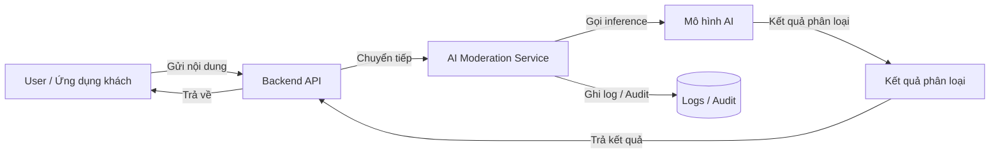

**Sơ đồ tổng quan giải pháp AI kiểm duyệt nội dung**

- **Loại sơ đồ**: Sơ đồ khối (Block Diagram)
- **Thành phần**: `Backend API`, `AI Moderation Service`, `Mô hình AI`, `Kết quả phân loại`



Hướng dẫn nhanh để xem/ xuất:

- Trong VS Code: cài extension `Markdown Preview Mermaid Support` hoặc `Mermaid Markdown Preview` rồi mở file `DOCS/AI_MODERATION_BLOCK_DIAGRAM.md` và chọn "Open Preview".

- Xuất sang PNG (PowerShell): cài `@mermaid-js/mermaid-cli` rồi chạy:

```powershell
npm install -g @mermaid-js/mermaid-cli
mmdc -i .\DOCS\AI_MODERATION_BLOCK_DIAGRAM.mmd -o .\DOCS\AI_MODERATION_BLOCK_DIAGRAM.png
```

File sơ đồ chính (dùng để xuất): `DOCS/AI_MODERATION_BLOCK_DIAGRAM.mmd`

Nếu bạn muốn, tôi có thể:
- Xuất luôn sang PNG trong workspace.
- Thêm các thành phần bổ sung (ví dụ: Datastore, Message Queue, External Moderation API).
- Tạo phiên bản bằng PlantUML hoặc PNG/SVG trực tiếp.
