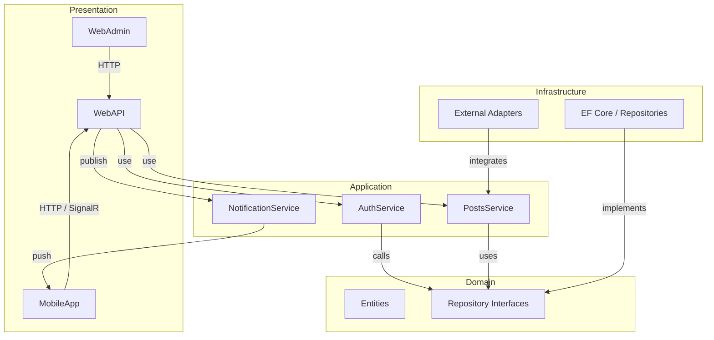
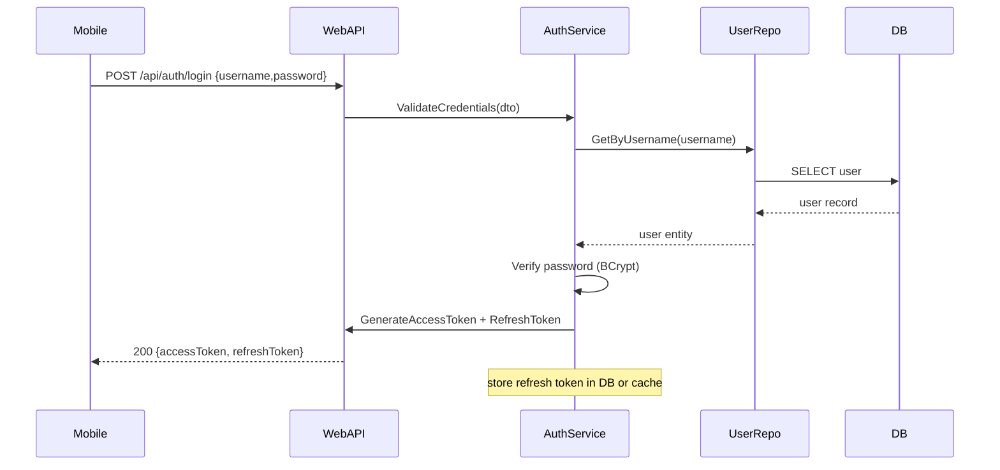
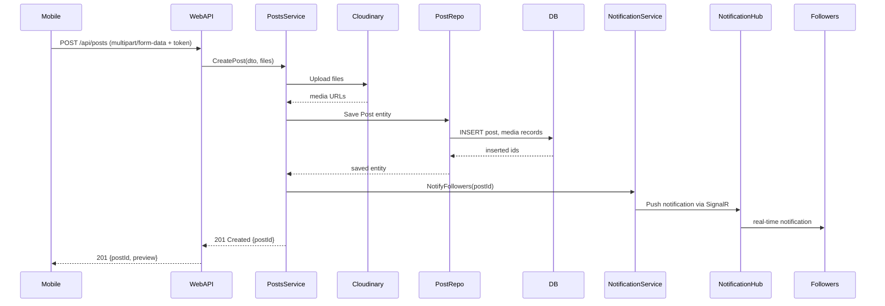
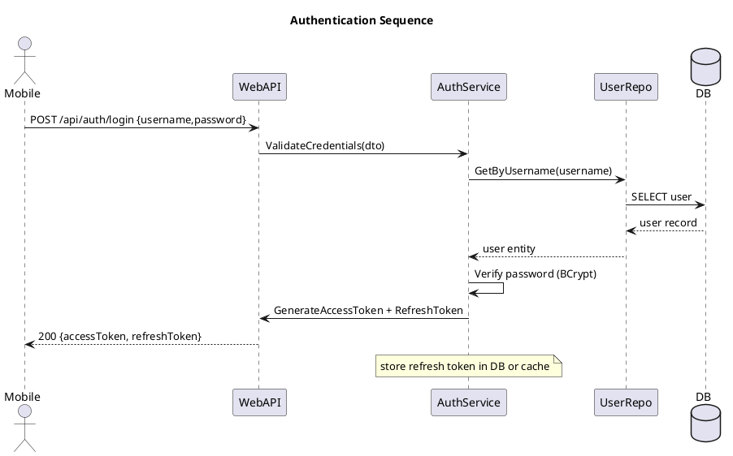
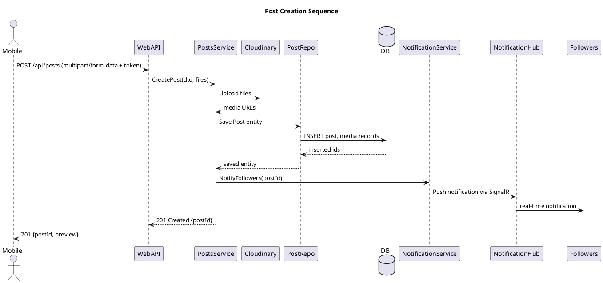

 # Kiến Trúc & Phân Tích (Architecture)

## Mục tiêu

Tài liệu này mô tả sơ đồ kiến trúc phần mềm cho dự án `UngDungMangXaHoi` theo mô hình Clean Architecture, hệ thống bên ngoài, và các luồng chính (sequence diagrams). Mục tiêu là đảm bảo:
- Rõ ràng trách nhiệm giữa các tầng (Domain, Application, Infrastructure, Presentation)
- Dễ mở rộng/scale thành microservices
- Cách các thành phần tương tác với dịch vụ bên ngoài (Cloudinary, MoMo, MLService)

## Mapping codebase vào Clean Architecture

- `Domain/`: Core business models, value objects, domain interfaces (repository contracts). Không chứa dependencies vào framework.
- `Application/`: Use-cases, services, DTOs, validators. Chứa business logic, gọi các interfaces của Domain.
- `Infrastructure/` (hoặc `UngDungMangXaHoi.Infrastructure` project): Cài đặt repository, EF Core DbContext, cấu hình persistence, external service adapters (Cloudinary, Email, MoMo integrator).
- `Presentation/WebAPI/`: ASP.NET Core Web API controllers, middleware, SignalR hubs. Không chứa business logic nặng.
- `Presentation/WebApp` / `MobileApp`: Frontend clients (React Native, Web admin).

## Quy tắc chính

- Dependency Rule: Dependencies chỉ đi vào phía trong (Presentation -> Application -> Domain). Infrastructure triển khai interfaces của Domain/Application.
- DTOs ở tầng Application, Entities ở Domain.
- Cross-cutting concerns (Logging, Caching, Retry/Polly, Validation) đặt tại Application hoặc Infrastructure cho phù hợp.

## System Architecture (High-level)

Tham khảo sơ đồ dưới đây (PlantUML) — bạn có thể copy block PlantUML và render trực tiếp bằng `PlantUML` extension hoặc `plantuml.jar`.

### Component / Clean Architecture



### High-level System Architecture

```mermaid
flowchart LR
	Mobile["Mobile Client"]
	Admin["Web Admin"]
	MoMo["External Payment (MoMo)"]
	API["API Gateway / WebAPI"]
	DB(("SQL Server"))
	Cloud(("Cloudinary (Media)"))
	ML(("MLService (Flask)"))

	Mobile -->|HTTPS / SignalR| API
	Admin -->|HTTPS| API
	API -->|EF Core (CRUD)| DB
	API -->|Upload/Fetch media| Cloud
	API -->|Send content for moderation| ML
	API -->|Create payment / webhook| MoMo
	MoMo -->|Payment callback| API

	subgraph deployment["Deployment note"]
		direction TB
		n1["Deployed as Docker Compose\nCan be split to microservices"]
	end
	API --- n1
```

Key external components:
- SQL Server: Primary relational DB
- Cloudinary: Media storage
- MoMo: Payment gateway
- MLService: Python Flask service cho AI moderation (PhoBERT)
- Clients: Mobile (React Native), WebAdmin, Third-party services (webhooks)

## Luồng chính (Sequence Diagrams)


### Sequence Diagrams (Authentication)



### Sequence Diagrams (Post Creation)



### Sequence Diagrams (Authentication)



### Sequence Diagrams (Post Creation)



## Hướng dẫn tạo ảnh sơ đồ (PlantUML)

1. Cài Java và tải `plantuml.jar` từ https://plantuml.com/download
2. Chạy lệnh (PowerShell):
```
java -jar plantuml.jar -tpng DOCS/diagrams/*.puml -o DOCS/diagrams/output
```
3. Hoặc dùng VSCode extension `PlantUML` để preview và export PNG/SVG.

## Ghi chú khi chỉnh sửa mã

- Đổi/Thêm interface repository trong `Domain/Interfaces`, sau đó cài đặt trong `Infrastructure/Repositories`.
- Khi di chuyển logic sang microservice, tách `Application/Services` theo bounded context.
- MLService (folder `MLService/`) là Flask app tách biệt, giao tiếp qua HTTP.

## Tài liệu liên quan

- Xem `DOCS/README.md` để tài liệu module chi tiết.
