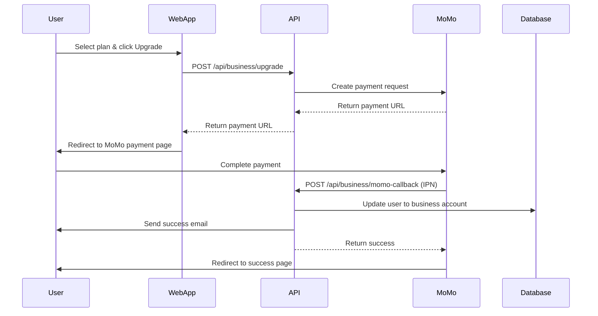

# 💼💳 TÀI LIỆU MODULE BUSINESS

## 📋 Mục Lục
1. [Tổng quan](#tổng-quan)
2. [Business Account Upgrade](#business-account-upgrade)
3. [MoMo Payment Integration](#momo-payment-integration)
4. [Business Post Injection](#business-post-injection)
5. [Subscription Management](#subscription-management)

---

## 🎯 Tổng quan

### Business Features
- ✅ **Account Upgrade** - Nâng cấp từ user thường lên business
- ✅ **MoMo Payment** - Thanh toán qua MoMo e-wallet
- ✅ **Post Injection** - Business posts xuất hiện trong Feed/Reels
- ✅ **Analytics** - Thống kê hiệu suất posts
- ✅ **Pricing Tiers** - Basic, Standard, Premium

### Pricing Plans

| Plan | Price | Duration | Features |
|------|-------|----------|----------|
| **Basic** | 99,000đ | 1 tháng | 10 business posts/tháng |
| **Standard** | 249,000đ | 3 tháng | 30 business posts/tháng |
| **Premium** | 499,000đ | 6 tháng | Unlimited posts |

---

## 📝 Business Account Upgrade

### Upgrade Flow



### Request Upgrade

**Endpoint:** `POST /api/business/upgrade`

**Auth:** Required (JWT)

**Request Body:**
```json
{
  "plan": "standard",  // basic | standard | premium
  "returnUrl": "http://localhost:3000/business/success",
  "cancelUrl": "http://localhost:3000/business/cancel"
}
```

**Response:**
```json
{
  "success": true,
  "message": "Payment request created",
  "data": {
    "order_id": "ORDER-20251214-123456",
    "amount": 249000,
    "plan": "standard",
    "payment_url": "https://test-payment.momo.vn/v2/gateway/pay?partnerCode=...&orderId=...",
    "qr_code_url": "https://test-payment.momo.vn/qrcode/...",
    "expires_at": "2025-12-14T11:30:00Z"  // Payment link valid for 15 mins
  }
}
```

---

## 💳 MoMo Payment Integration

### MoMo Payment Request

**C# Implementation:**
```csharp
public class MoMoPaymentService
{
    private readonly string _partnerCode = "MOMO_PARTNER_CODE";
    private readonly string _accessKey = "MOMO_ACCESS_KEY";
    private readonly string _secretKey = "MOMO_SECRET_KEY";
    private readonly string _endpoint = "https://test-payment.momo.vn/v2/gateway/api/create";
    private readonly string _ipnUrl = "http://localhost:5000/api/business/momo-callback";

    public async Task<MoMoPaymentResponse> CreatePaymentAsync(BusinessUpgradeRequest request)
    {
        var orderId = $"ORDER-{DateTime.UtcNow:yyyyMMdd-HHmmss}";
        var requestId = Guid.NewGuid().ToString();
        var amount = GetPlanAmount(request.Plan);
        var orderInfo = $"Nâng cấp tài khoản Business - {request.Plan}";

        // Create raw signature
        var rawSignature = $"accessKey={_accessKey}" +
                          $"&amount={amount}" +
                          $"&extraData=" +
                          $"&ipnUrl={_ipnUrl}" +
                          $"&orderId={orderId}" +
                          $"&orderInfo={orderInfo}" +
                          $"&partnerCode={_partnerCode}" +
                          $"&redirectUrl={request.ReturnUrl}" +
                          $"&requestId={requestId}" +
                          $"&requestType=captureWallet";

        // Create signature using HMAC SHA256
        var signature = HmacSHA256(rawSignature, _secretKey);

        var paymentRequest = new
        {
            partnerCode = _partnerCode,
            accessKey = _accessKey,
            requestId = requestId,
            amount = amount,
            orderId = orderId,
            orderInfo = orderInfo,
            redirectUrl = request.ReturnUrl,
            ipnUrl = _ipnUrl,
            extraData = "",
            requestType = "captureWallet",
            signature = signature,
            lang = "vi"
        };

        // Send request to MoMo
        using var client = new HttpClient();
        var content = new StringContent(
            JsonSerializer.Serialize(paymentRequest),
            Encoding.UTF8,
            "application/json"
        );

        var response = await client.PostAsync(_endpoint, content);
        var responseString = await response.Content.ReadAsStringAsync();
        var momoResponse = JsonSerializer.Deserialize<MoMoPaymentResponse>(responseString);

        // Save order to database
        await SaveOrderAsync(orderId, request.UserId, request.Plan, amount);

        return momoResponse;
    }

    private string HmacSHA256(string message, string key)
    {
        var keyBytes = Encoding.UTF8.GetBytes(key);
        var messageBytes = Encoding.UTF8.GetBytes(message);
        
        using var hmac = new HMACSHA256(keyBytes);
        var hashBytes = hmac.ComputeHash(messageBytes);
        return BitConverter.ToString(hashBytes).Replace("-", "").ToLower();
    }

    private int GetPlanAmount(string plan)
    {
        return plan switch
        {
            "basic" => 99000,
            "standard" => 249000,
            "premium" => 499000,
            _ => throw new ArgumentException("Invalid plan")
        };
    }
}
```

### MoMo IPN Callback

**Endpoint:** `POST /api/business/momo-callback`

**Auth:** None (verified by signature)

**Request Body (from MoMo):**
```json
{
  "partnerCode": "MOMO_PARTNER_CODE",
  "orderId": "ORDER-20251214-123456",
  "requestId": "abc-123-def",
  "amount": 249000,
  "orderInfo": "Nâng cấp tài khoản Business - standard",
  "orderType": "momo_wallet",
  "transId": 2547896321,
  "resultCode": 0,  // 0 = success, others = error
  "message": "Success",
  "payType": "qr",
  "responseTime": 1734178800000,
  "extraData": "",
  "signature": "abc123def456..."
}
```

**C# Handler:**
```csharp
[HttpPost("momo-callback")]
[AllowAnonymous]
public async Task<IActionResult> MoMoCallback([FromBody] MoMoCallbackRequest callback)
{
    // 1. Verify signature
    var rawSignature = $"accessKey={_accessKey}" +
                      $"&amount={callback.Amount}" +
                      $"&extraData={callback.ExtraData}" +
                      $"&message={callback.Message}" +
                      $"&orderId={callback.OrderId}" +
                      $"&orderInfo={callback.OrderInfo}" +
                      $"&orderType={callback.OrderType}" +
                      $"&partnerCode={callback.PartnerCode}" +
                      $"&payType={callback.PayType}" +
                      $"&requestId={callback.RequestId}" +
                      $"&responseTime={callback.ResponseTime}" +
                      $"&resultCode={callback.ResultCode}" +
                      $"&transId={callback.TransId}";

    var expectedSignature = HmacSHA256(rawSignature, _secretKey);

    if (expectedSignature != callback.Signature)
    {
        _logger.LogWarning($"Invalid MoMo signature for order {callback.OrderId}");
        return BadRequest("Invalid signature");
    }

    // 2. Get order from database
    var order = await _orderRepo.GetOrderByIdAsync(callback.OrderId);
    if (order == null)
    {
        return NotFound("Order not found");
    }

    // 3. Check if already processed
    if (order.Status == "completed")
    {
        return Ok();  // Already processed, return success
    }

    // 4. Process based on result code
    if (callback.ResultCode == 0)  // Success
    {
        // Update order status
        order.Status = "completed";
        order.TransactionId = callback.TransId.ToString();
        order.CompletedAt = DateTime.UtcNow;
        await _orderRepo.UpdateOrderAsync(order);

        // Upgrade user to business account
        var user = await _userRepo.GetUserByIdAsync(order.UserId);
        user.AccountType = "business";
        user.BusinessPlan = order.Plan;
        user.BusinessExpiresAt = DateTime.UtcNow.AddMonths(GetPlanDuration(order.Plan));
        await _userRepo.UpdateUserAsync(user);

        // Send success email
        await _emailService.SendBusinessUpgradeSuccessEmailAsync(user);

        // Send notification
        await _notificationService.SendNotificationAsync(new NotificationDto
        {
            Type = "BusinessUpgrade",
            Message = $"Chúc mừng! Tài khoản của bạn đã được nâng cấp lên Business {order.Plan}",
            ToUserId = user.UserId,
            CreatedAt = DateTime.UtcNow
        });

        _logger.LogInformation($"Business upgrade completed for user {user.UserId}, order {order.OrderId}");
    }
    else  // Payment failed
    {
        order.Status = "failed";
        order.FailureReason = callback.Message;
        await _orderRepo.UpdateOrderAsync(order);

        _logger.LogWarning($"MoMo payment failed for order {order.OrderId}: {callback.Message}");
    }

    return Ok();
}

private int GetPlanDuration(string plan)
{
    return plan switch
    {
        "basic" => 1,
        "standard" => 3,
        "premium" => 6,
        _ => 1
    };
}
```

---

## 📝 Business Post Injection

### Create Business Post

**Endpoint:** `POST /api/business/posts`

**Auth:** Required (JWT - Business account)

**Request Body:**
```json
{
  "caption": "🎉 Special offer! Get 50% off today! #sale",
  "media_url": "http://localhost:5000/Assets/Images/promo.jpg",
  "target_audience": "all",  // all | age_18_25 | age_26_35 | gender_male | gender_female
  "budget": 500000,  // VNĐ
  "duration_days": 7
}
```

**Response:**
```json
{
  "success": true,
  "message": "Business post created",
  "data": {
    "post_id": 789,
    "status": "active",
    "impressions": 0,
    "clicks": 0,
    "budget_spent": 0,
    "ends_at": "2025-12-21T11:00:00Z"
  }
}
```

### Injection Algorithm

**C# Feed Service:**
```csharp
public async Task<List<PostDto>> GetFeedAsync(int userId, int page, int pageSize)
{
    var posts = new List<PostDto>();

    // 1. Get regular posts (following users)
    var regularPosts = await GetRegularPostsAsync(userId, page, pageSize);
    posts.AddRange(regularPosts);

    // 2. Inject business posts (every 5th post)
    var businessPosts = await GetActiveBusinessPostsAsync();
    
    for (int i = 4; i < posts.Count; i += 5)  // Positions 5, 10, 15, 20...
    {
        if (businessPosts.Any())
        {
            var businessPost = SelectBusinessPost(businessPosts, userId);
            posts.Insert(i, businessPost);
            
            // Track impression
            await TrackImpressionAsync(businessPost.PostId, userId);
        }
    }

    return posts;
}

private PostDto SelectBusinessPost(List<PostDto> businessPosts, int userId)
{
    // Weighted random selection based on budget
    var totalBudget = businessPosts.Sum(p => p.RemainingBudget);
    var random = new Random().Next(0, totalBudget);
    
    var cumulative = 0;
    foreach (var post in businessPosts)
    {
        cumulative += post.RemainingBudget;
        if (random < cumulative)
        {
            return post;
        }
    }
    
    return businessPosts.First();
}
```

### Track Impression/Click

**Endpoint:** `POST /api/business/posts/{postId}/track`

**Request Body:**
```json
{
  "action": "impression"  // impression | click
}
```

**Logic:**
```csharp
1. Increment impressions_count or clicks_count
2. Calculate cost:
   - Impression: 100đ per 1000 views
   - Click: 500đ per click
3. Deduct from remaining_budget
4. If budget exhausted → Set status = 'completed'
```

---

## 📝 Subscription Management

### Get Business Status

**Endpoint:** `GET /api/business/status`

**Auth:** Required (JWT)

**Response:**
```json
{
  "data": {
    "is_business": true,
    "plan": "standard",
    "expires_at": "2026-03-14T11:00:00Z",
    "days_remaining": 90,
    "posts_limit": 30,
    "posts_used": 12,
    "auto_renew": false
  }
}
```

### Cancel Subscription

**Endpoint:** `POST /api/business/cancel`

**Auth:** Required (JWT - Business account)

**Description:** Account sẽ tiếp tục hoạt động đến hết hạn, sau đó downgrade về user thường

---

## 📊 Database Schema

```sql
CREATE TABLE BusinessOrders (
    order_id VARCHAR(50) PRIMARY KEY,
    user_id INT NOT NULL,
    plan VARCHAR(20) NOT NULL,  -- basic | standard | premium
    amount INT NOT NULL,
    status VARCHAR(20) DEFAULT 'pending',  -- pending | completed | failed
    transaction_id VARCHAR(100),
    failure_reason NVARCHAR(500),
    created_at DATETIMEOFFSET DEFAULT GETUTCDATE(),
    completed_at DATETIMEOFFSET,
    FOREIGN KEY (user_id) REFERENCES Users(user_id)
);

CREATE TABLE BusinessPosts (
    post_id INT PRIMARY KEY,
    business_user_id INT NOT NULL,
    target_audience VARCHAR(50),
    budget INT NOT NULL,  -- VNĐ
    budget_spent INT DEFAULT 0,
    impressions_count INT DEFAULT 0,
    clicks_count INT DEFAULT 0,
    status VARCHAR(20) DEFAULT 'active',  -- active | completed | paused
    starts_at DATETIMEOFFSET DEFAULT GETUTCDATE(),
    ends_at DATETIMEOFFSET,
    FOREIGN KEY (post_id) REFERENCES Posts(post_id) ON DELETE CASCADE,
    FOREIGN KEY (business_user_id) REFERENCES Users(user_id)
);

CREATE TABLE BusinessPostImpressions (
    impression_id INT PRIMARY KEY IDENTITY,
    post_id INT NOT NULL,
    viewer_user_id INT,
    created_at DATETIMEOFFSET DEFAULT GETUTCDATE(),
    FOREIGN KEY (post_id) REFERENCES BusinessPosts(post_id) ON DELETE CASCADE
);
```

---

## 📡 API Endpoints Summary

| Method | Endpoint | Auth | Description |
|--------|----------|------|-------------|
| POST | `/api/business/upgrade` | ✅ | Request account upgrade |
| POST | `/api/business/momo-callback` | ❌ | MoMo IPN callback |
| GET | `/api/business/status` | ✅ | Get business account status |
| POST | `/api/business/posts` | ✅ | Create business post |
| POST | `/api/business/posts/{id}/track` | ✅ | Track impression/click |
| POST | `/api/business/cancel` | ✅ | Cancel subscription |

---

**📅 Last Updated:** December 14, 2025  
**📌 Version:** 1.0.0
