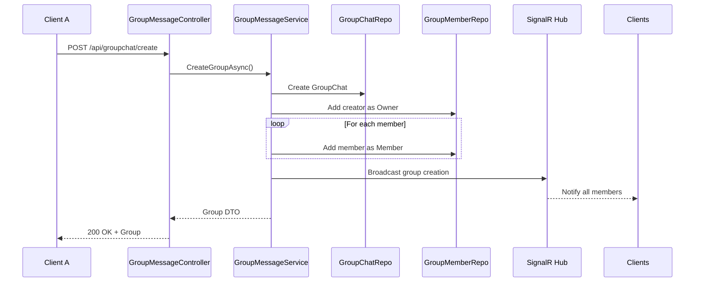
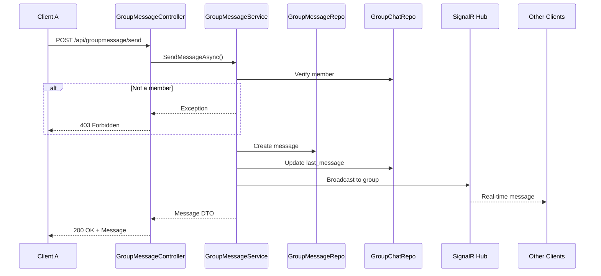

# 👥 TÀI LIỆU MODULE GROUP CHAT

## 📋 Mục Lục
1. [Tổng quan](#tổng-quan)
2. [Tạo & Quản lý Group](#tạo--quản-lý-group)
3. [Gửi tin nhắn trong Group](#gửi-tin-nhắn-trong-group)
4. [Quản lý Members](#quản-lý-members)
5. [Reactions & Pin Messages](#reactions--pin-messages)
6. [Media Sharing (Cloudinary)](#media-sharing)
7. [Real-time với SignalR](#real-time-với-signalr)
8. [API Endpoints](#api-endpoints)

---

## 🎯 Tổng quan

Module Group Chat quản lý chat nhóm với đầy đủ tính năng:
- ✅ Tạo/Xóa group chat
- ✅ Add/Remove members
- ✅ Admin roles (Owner & Admin)
- ✅ Group messages với reactions
- ✅ Read receipts (đã đọc)
- ✅ Pin messages (ghim tin nhắn quan trọng)
- ✅ Media sharing (images, videos, files) qua Cloudinary
- ✅ Message recall (thu hồi tin nhắn)
- ✅ Real-time messaging với SignalR
- ✅ Change group name & avatar

### 🏗️ Kiến trúc

```
┌────────────────────────────┐
│  GroupMessageController    │  ← API Layer (REST)
└────────┬───────────────────┘
         │
         ↓
┌────────────────────────────┐
│  GroupMessageService       │  ← Business Logic
└────────┬───────────────────┘
         │
         ↓
┌──────────────────────────────────────────┐
│  Repositories                            │
│  - GroupChatRepository                   │
│  - GroupChatMemberRepository             │
│  - GroupMessageRepository                │
│  - GroupMessageReactionRepository        │
└────────┬─────────────────────────────────┘
         │
         ↓
┌────────────────────────────┐
│  SignalR GroupChatHub      │  ← Real-time Communication
└────────────────────────────┘
         │
         ↓
┌────────────────────────────┐
│  Cloudinary Service        │  ← Cloud Media Storage
└────────────────────────────┘
```

---

## 🔨 Tạo & Quản Lý Group

### 📊 Sơ đồ Create Group Flow



### 📝 Chi tiết Create Group

**Endpoint:** `POST /api/groupchat/create`

**Auth:** Required (JWT)

**Request Body:**
```json
{
  "groupName": "Team Project Discussion",
  "memberUserIds": [5, 10, 15, 20]  // User IDs to add (không bao gồm creator)
}
```

**Logic xử lý:**
```csharp
1. Lấy creatorUserId từ JWT token
2. Validate groupName (không rỗng, max 100 ký tự)
3. Validate memberUserIds (ít nhất 2 người bao gồm creator)

4. Tạo GroupChat:
   - group_name
   - created_by = creatorUserId
   - created_at = UtcNow
   - is_active = true

5. Tạo GroupChatMember cho creator:
   - user_id = creatorUserId
   - role = "Owner"
   - joined_at = UtcNow

6. Tạo GroupChatMember cho mỗi member:
   - user_id = memberId
   - role = "Member"
   - joined_at = UtcNow

7. Real-time Broadcast (SignalR):
   - Event: "GroupCreated"
   - Gửi đến tất cả members

8. Return Group DTO với danh sách members
```

**Response:**
```json
{
  "success": true,
  "message": "Group created successfully",
  "data": {
    "group_chat_id": 45,
    "group_name": "Team Project Discussion",
    "created_by": 5,
    "created_at": "2025-12-14T10:30:00Z",
    "members": [
      {
        "user_id": 5,
        "username": "nguyenvana",
        "full_name": "Nguyễn Văn A",
        "role": "Owner",
        "joined_at": "2025-12-14T10:30:00Z"
      },
      {
        "user_id": 10,
        "username": "tranthib",
        "full_name": "Trần Thị B",
        "role": "Member",
        "joined_at": "2025-12-14T10:30:00Z"
      }
    ],
    "total_members": 5
  }
}
```

### 📝 Get User's Groups

**Endpoint:** `GET /api/groupchat/my-groups`

**Auth:** Required (JWT)

**Description:** Lấy danh sách tất cả groups mà user là member

**Response:**
```json
{
  "success": true,
  "data": [
    {
      "group_chat_id": 45,
      "group_name": "Team Project Discussion",
      "group_avatar_url": "https://res.cloudinary.com/.../group_avatar.jpg",
      "total_members": 5,
      "last_message": {
        "message_content": "Meeting at 3pm tomorrow",
        "sent_at": "2025-12-14T10:45:00Z",
        "sender_username": "tranthib"
      },
      "unread_count": 3,
      "my_role": "Owner"
    }
  ]
}
```

### 📝 Delete Group

**Endpoint:** `DELETE /api/groupchat/{groupId}`

**Auth:** Required (JWT)

**Permission:** Chỉ Owner mới có quyền xóa group

**Logic:**
```csharp
1. Lấy userId từ JWT
2. Tìm group theo groupId
3. Kiểm tra quyền:
   - User phải là Owner của group
   - Nếu không → 403 Forbidden
4. Soft delete:
   - SET is_active = false
   - KHÔNG xóa khỏi database
5. Real-time Broadcast:
   - Event: "GroupDeleted"
   - Kick tất cả members khỏi SignalR group
6. Return success
```

**Response:**
```json
{
  "success": true,
  "message": "Group deleted successfully"
}
```

---

## 💬 Gửi Tin Nhắn Trong Group

### 📊 Sơ đồ Send Group Message Flow



### 📝 Chi tiết Send Group Message

**Endpoint:** `POST /api/groupmessage/send`

**Auth:** Required (JWT)

**Request Body:**
```json
{
  "conversationId": 45,
  "messageContent": "Hello everyone! 👋",
  "messageType": "text",  // text | image | video | file
  "mediaUrl": null  // URL nếu type là image/video/file
}
```

**Message Types:**
- `text`: Tin nhắn text thuần
- `image`: Hình ảnh (upload qua `/api/groupmessage/upload` trước)
- `video`: Video
- `file`: File đính kèm (PDF, DOCX, etc.)

**Logic xử lý:**
```csharp
1. Lấy userId từ JWT token
2. Kiểm tra user có phải member của group không:
   - Query GroupChatMembers
   - Nếu không → throw Exception
3. Tạo GroupMessage:
   - conversation_id
   - sender_user_id
   - message_content
   - message_type
   - media_url (nếu có)
   - is_recalled = false
   - sent_at = UtcNow
4. Update GroupChat:
   - last_message_content
   - last_message_sent_at
   - updated_at
5. Real-time Broadcast (SignalR):
   - Event: "ReceiveGroupMessage"
   - Group: "group_{conversationId}"
6. Return Message DTO
```

**Response:**
```json
{
  "success": true,
  "message": "Message sent successfully",
  "data": {
    "group_message_id": 789,
    "conversation_id": 45,
    "sender_user_id": 5,
    "sender_username": "nguyenvana",
    "sender_avatar": "http://localhost:5000/Assets/Images/avatar.jpg",
    "message_content": "Hello everyone! 👋",
    "message_type": "text",
    "media_url": null,
    "is_recalled": false,
    "sent_at": "2025-12-14T10:50:00Z",
    "reactions": []
  }
}
```

### 📝 Get Group Messages

**Endpoint:** `GET /api/groupmessage/{conversationId}?page=1&pageSize=50`

**Auth:** Required (JWT)

**Query Parameters:**
- `page`: Trang hiện tại (default: 1)
- `pageSize`: Số message/trang (max: 100, default: 50)

**Response:**
```json
{
  "success": true,
  "data": {
    "group_chat_id": 45,
    "group_name": "Team Project Discussion",
    "messages": [
      {
        "group_message_id": 789,
        "sender_user_id": 5,
        "sender_username": "nguyenvana",
        "message_content": "Hello everyone! 👋",
        "message_type": "text",
        "sent_at": "2025-12-14T10:50:00Z",
        "reactions": [
          {
            "user_id": 10,
            "username": "tranthib",
            "emoji": "👍"
          }
        ],
        "is_pinned": false,
        "is_recalled": false
      }
    ],
    "total_messages": 234,
    "current_page": 1,
    "page_size": 50,
    "has_more": true
  }
}
```

---

## 👤 Quản Lý Members

### 📝 Add Members

**Endpoint:** `POST /api/groupchat/{groupId}/members`

**Auth:** Required (JWT)

**Permission:** Owner hoặc Admin

**Request Body:**
```json
{
  "userIds": [25, 30, 35]
}
```

**Logic:**
```csharp
1. Lấy userId từ JWT
2. Kiểm tra quyền:
   - User phải là Owner hoặc Admin
   - Nếu không → 403 Forbidden
3. Kiểm tra members chưa tồn tại trong group
4. Với mỗi userId:
   - Tạo GroupChatMember
   - role = "Member"
5. Real-time Broadcast:
   - Event: "MembersAdded"
6. Return success
```

**Response:**
```json
{
  "success": true,
  "message": "3 members added successfully"
}
```

### 📝 Remove Member

**Endpoint:** `DELETE /api/groupchat/{groupId}/members/{userId}`

**Auth:** Required (JWT)

**Permission:** 
- Owner có thể kick bất kỳ ai (trừ chính mình)
- Admin có thể kick Member (không kick được Owner/Admin khác)
- Member có thể tự leave group

**Logic:**
```csharp
1. Lấy currentUserId từ JWT
2. Lấy role của current user
3. Lấy role của target user

4. Kiểm tra quyền:
   - Nếu target = Owner → Không thể kick
   - Nếu current = Owner → Có thể kick bất kỳ ai
   - Nếu current = Admin → Chỉ kick Member
   - Nếu current = Member → Chỉ tự leave (userId = currentUserId)

5. Xóa GroupChatMember record (hard delete)
6. Nếu là Owner leave → Auto assign Owner cho Admin khác
7. Real-time Broadcast:
   - Event: "MemberRemoved"
8. Return success
```

### 📝 Promote to Admin

**Endpoint:** `PUT /api/groupchat/{groupId}/members/{userId}/promote`

**Auth:** Required (JWT)

**Permission:** Chỉ Owner

**Logic:**
```csharp
1. Kiểm tra current user là Owner
2. Update GroupChatMember:
   - role = "Admin"
3. Real-time Broadcast:
   - Event: "MemberPromoted"
4. Return success
```

### 📝 Demote from Admin

**Endpoint:** `PUT /api/groupchat/{groupId}/members/{userId}/demote`

**Auth:** Required (JWT)

**Permission:** Chỉ Owner

**Logic:**
```csharp
1. Kiểm tra current user là Owner
2. Kiểm tra target user là Admin (không phải Owner)
3. Update GroupChatMember:
   - role = "Member"
4. Real-time Broadcast:
   - Event: "MemberDemoted"
5. Return success
```

---

## ❤️ Reactions & Pin Messages

### 📝 Add Reaction

**Endpoint:** `POST /api/groupmessage/{messageId}/reaction`

**Auth:** Required (JWT)

**Request Body:**
```json
{
  "emoji": "❤️"  // Bất kỳ emoji nào: ❤️, 👍, 😂, 😮, 😢, 😡
}
```

**Logic:**
```csharp
1. Lấy userId từ JWT
2. Kiểm tra user là member của group
3. Tìm reaction cũ (nếu có):
   - Nếu cùng emoji → Không làm gì
   - Nếu khác emoji → Update emoji mới
4. Nếu chưa có reaction → Tạo mới
5. Real-time Broadcast:
   - Event: "ReactionAdded"
6. Return message DTO với reactions
```

**Response:**
```json
{
  "success": true,
  "message": "Reaction added",
  "data": {
    "group_message_id": 789,
    "reactions": [
      {
        "user_id": 5,
        "username": "nguyenvana",
        "emoji": "❤️"
      },
      {
        "user_id": 10,
        "username": "tranthib",
        "emoji": "👍"
      }
    ]
  }
}
```

### 📝 Remove Reaction

**Endpoint:** `DELETE /api/groupmessage/{messageId}/reaction`

**Auth:** Required (JWT)

**Request Body:**
```json
{
  "emoji": "❤️"
}
```

**Logic:**
```csharp
1. Tìm reaction của user với emoji
2. Xóa reaction (hard delete)
3. Real-time Broadcast:
   - Event: "ReactionRemoved"
4. Return success
```

### 📝 Pin Message

**Endpoint:** `POST /api/groupmessage/{messageId}/pin`

**Auth:** Required (JWT)

**Permission:** Owner hoặc Admin

**Description:** Ghim tin nhắn quan trọng lên đầu chat

**Logic:**
```csharp
1. Kiểm tra quyền (Owner/Admin)
2. Update GroupMessage:
   - is_pinned = true
   - pinned_by = userId
   - pinned_at = UtcNow
3. Real-time Broadcast:
   - Event: "MessagePinned"
4. Return success
```

### 📝 Unpin Message

**Endpoint:** `DELETE /api/groupmessage/{messageId}/pin`

**Auth:** Required (JWT)

**Permission:** Owner hoặc Admin

**Logic:**
```csharp
1. Kiểm tra quyền (Owner/Admin)
2. Update GroupMessage:
   - is_pinned = false
3. Real-time Broadcast:
   - Event: "MessageUnpinned"
4. Return success
```

### 📝 Get Pinned Messages

**Endpoint:** `GET /api/groupmessage/{conversationId}/pinned`

**Auth:** Required (JWT)

**Response:**
```json
{
  "success": true,
  "data": [
    {
      "group_message_id": 456,
      "message_content": "Meeting room link: https://meet.google.com/xyz",
      "sender_username": "nguyenvana",
      "sent_at": "2025-12-14T09:00:00Z",
      "pinned_by": "tranthib",
      "pinned_at": "2025-12-14T09:05:00Z"
    }
  ]
}
```

---

## 📎 Media Sharing (Cloudinary)

### 🌩️ Cloudinary Integration

**Service:** Cloudinary Cloud Storage

**Features:**
- Upload images, videos, files
- Auto-resize và optimize
- CDN delivery
- Public URLs

### 📝 Upload Media

**Endpoint:** `POST /api/groupmessage/upload`

**Auth:** Required (JWT)

**Content-Type:** `multipart/form-data`

**Form Data:**
```
file: [Binary file]
mediaType: "image"  // image | video | file
```

**Logic:**
```csharp
1. Validate file (max 50MB)
2. Upload to Cloudinary:
   - Folder: "group_chat_media/{groupId}/"
   - Auto-optimize
3. Return public URL
```

**Response:**
```json
{
  "success": true,
  "data": {
    "url": "https://res.cloudinary.com/demo/image/upload/v1234567890/group_chat_media/45/photo.jpg"
  }
}
```

**Usage Flow:**
```
1. Client upload file → GET url
2. Client gửi message với mediaUrl
```

**Example:**
```javascript
// Step 1: Upload file
const formData = new FormData();
formData.append('file', imageFile);
formData.append('mediaType', 'image');

const uploadResponse = await fetch('/api/groupmessage/upload', {
  method: 'POST',
  headers: { 'Authorization': `Bearer ${token}` },
  body: formData
});
const { data } = await uploadResponse.json();
const mediaUrl = data.url;

// Step 2: Send message with mediaUrl
await fetch('/api/groupmessage/send', {
  method: 'POST',
  headers: {
    'Authorization': `Bearer ${token}`,
    'Content-Type': 'application/json'
  },
  body: JSON.stringify({
    conversationId: 45,
    messageContent: 'Check this photo!',
    messageType: 'image',
    mediaUrl: mediaUrl
  })
});
```

---

## 🔄 Real-time với SignalR

### 🔌 SignalR GroupChatHub

**Hub URL:** `ws://localhost:5000/groupChatHub`

**Connection:**
```javascript
import * as signalR from '@microsoft/signalr';

const connection = new signalR.HubConnectionBuilder()
  .withUrl('http://localhost:5000/groupChatHub', {
    accessTokenFactory: () => accessToken
  })
  .withAutomaticReconnect()
  .build();

// Connect
await connection.start();
console.log('GroupChatHub connected');

// Join group rooms
myGroups.forEach(group => {
  connection.invoke('JoinGroup', group.group_chat_id.toString());
});
```

### 📡 Events

#### 1. ReceiveGroupMessage

**Server → Client**

```javascript
connection.on('ReceiveGroupMessage', (message) => {
  console.log('New group message:', message);
  
  // {
  //   group_message_id: 789,
  //   conversation_id: 45,
  //   sender_user_id: 10,
  //   sender_username: "tranthib",
  //   message_content: "Hello!",
  //   message_type: "text",
  //   sent_at: "2025-12-14T10:50:00Z"
  // }
  
  addMessageToGroupChat(message);
  updateGroupList(message);
  showNotification(message);
});
```

#### 2. ReactionAdded / ReactionRemoved

**Server → Client**

```javascript
connection.on('ReactionAdded', (data) => {
  // {
  //   messageId: 789,
  //   userId: 10,
  //   emoji: "❤️",
  //   reactions: [{ user_id: 10, emoji: "❤️" }]
  // }
  updateMessageReactions(data.messageId, data.reactions);
});

connection.on('ReactionRemoved', (data) => {
  updateMessageReactions(data.messageId, data.reactions);
});
```

#### 3. MessageRead

**Server → Client**

```javascript
connection.on('MessageRead', (data) => {
  // {
  //   messageId: 789,
  //   userId: 10,
  //   readAt: "2025-12-14T10:55:00Z"
  // }
  markMessageAsRead(data.messageId, data.userId);
});
```

#### 4. MessagePinned / MessageUnpinned

**Server → Client**

```javascript
connection.on('MessagePinned', (data) => {
  // { messageId: 789, pinnedBy: "nguyenvana" }
  showPinnedMessage(data.messageId);
});

connection.on('MessageUnpinned', (data) => {
  hidePinnedMessage(data.messageId);
});
```

#### 5. MembersAdded / MemberRemoved

**Server → Client**

```javascript
connection.on('MembersAdded', (data) => {
  // { groupId: 45, userIds: [25, 30], addedBy: "nguyenvana" }
  refreshGroupMembers(data.groupId);
});

connection.on('MemberRemoved', (data) => {
  // { groupId: 45, userId: 25, removedBy: "nguyenvana" }
  refreshGroupMembers(data.groupId);
  
  if (data.userId === myUserId) {
    // Bị kick khỏi group
    leaveGroupRoom(data.groupId);
    showNotification('You have been removed from the group');
  }
});
```

---

## 📡 API Endpoints

### Group Management

| Method | Endpoint | Auth | Permission | Description |
|--------|----------|------|------------|-------------|
| POST | `/api/groupchat/create` | ✅ | Any | Tạo group mới |
| GET | `/api/groupchat/my-groups` | ✅ | Any | Lấy danh sách groups |
| GET | `/api/groupchat/{groupId}` | ✅ | Member | Lấy thông tin group |
| PUT | `/api/groupchat/{groupId}/name` | ✅ | Owner/Admin | Đổi tên group |
| PUT | `/api/groupchat/{groupId}/avatar` | ✅ | Owner/Admin | Đổi avatar group |
| DELETE | `/api/groupchat/{groupId}` | ✅ | Owner | Xóa group |

### Member Management

| Method | Endpoint | Auth | Permission | Description |
|--------|----------|------|------------|-------------|
| GET | `/api/groupchat/{groupId}/members` | ✅ | Member | Lấy danh sách members |
| POST | `/api/groupchat/{groupId}/members` | ✅ | Owner/Admin | Thêm members |
| DELETE | `/api/groupchat/{groupId}/members/{userId}` | ✅ | Owner/Admin | Kick member |
| PUT | `/api/groupchat/{groupId}/members/{userId}/promote` | ✅ | Owner | Promote to Admin |
| PUT | `/api/groupchat/{groupId}/members/{userId}/demote` | ✅ | Owner | Demote to Member |

### Messages

| Method | Endpoint | Auth | Permission | Description |
|--------|----------|------|------------|-------------|
| POST | `/api/groupmessage/send` | ✅ | Member | Gửi tin nhắn |
| GET | `/api/groupmessage/{conversationId}` | ✅ | Member | Lấy lịch sử messages |
| PUT | `/api/groupmessage/{messageId}/read` | ✅ | Member | Đánh dấu đã đọc |
| POST | `/api/groupmessage/{messageId}/recall` | ✅ | Sender | Thu hồi tin nhắn |

### Reactions & Pins

| Method | Endpoint | Auth | Permission | Description |
|--------|----------|------|------------|-------------|
| POST | `/api/groupmessage/{messageId}/reaction` | ✅ | Member | Thêm reaction |
| DELETE | `/api/groupmessage/{messageId}/reaction` | ✅ | Member | Xóa reaction |
| POST | `/api/groupmessage/{messageId}/pin` | ✅ | Owner/Admin | Ghim tin nhắn |
| DELETE | `/api/groupmessage/{messageId}/pin` | ✅ | Owner/Admin | Bỏ ghim |
| GET | `/api/groupmessage/{conversationId}/pinned` | ✅ | Member | Lấy messages đã ghim |

### Media

| Method | Endpoint | Auth | Permission | Description |
|--------|----------|------|------------|-------------|
| POST | `/api/groupmessage/upload` | ✅ | Any | Upload media lên Cloudinary |

---

## 🚨 Lỗi Thường Gặp

### 1. "You are not a member of this group"
**Nguyên nhân:** Không phải member của group.
**Giải pháp:** Được add vào group trước.

### 2. "Permission denied"
**Nguyên nhân:** Không đủ quyền (cần Owner/Admin).
**Giải pháp:** Liên hệ Owner/Admin.

### 3. "Group not found or inactive"
**Nguyên nhân:** Group đã bị xóa.
**Giải pháp:** Không thể khôi phục.

### 4. "File too large"
**Nguyên nhân:** File > 50MB.
**Giải pháp:** Nén file hoặc upload file nhỏ hơn.

---

## 📊 Database Schema

### GroupChats Table
```sql
CREATE TABLE GroupChats (
    group_chat_id INT PRIMARY KEY IDENTITY,
    group_name NVARCHAR(100) NOT NULL,
    group_avatar_url VARCHAR(500),
    created_by INT NOT NULL,
    last_message_content NVARCHAR(2000),
    last_message_sent_at DATETIMEOFFSET,
    is_active BIT DEFAULT 1,
    created_at DATETIMEOFFSET DEFAULT GETUTCDATE(),
    updated_at DATETIMEOFFSET DEFAULT GETUTCDATE(),
    FOREIGN KEY (created_by) REFERENCES Users(user_id)
);
```

### GroupChatMembers Table
```sql
CREATE TABLE GroupChatMembers (
    member_id INT PRIMARY KEY IDENTITY,
    group_chat_id INT NOT NULL,
    user_id INT NOT NULL,
    role VARCHAR(20) DEFAULT 'Member',  -- Owner | Admin | Member
    joined_at DATETIMEOFFSET DEFAULT GETUTCDATE(),
    FOREIGN KEY (group_chat_id) REFERENCES GroupChats(group_chat_id) ON DELETE CASCADE,
    FOREIGN KEY (user_id) REFERENCES Users(user_id)
);
```

### GroupMessages Table
```sql
CREATE TABLE GroupMessages (
    group_message_id INT PRIMARY KEY IDENTITY,
    conversation_id INT NOT NULL,
    sender_user_id INT NOT NULL,
    message_content NVARCHAR(2000),
    message_type VARCHAR(20) DEFAULT 'text',  -- text | image | video | file
    media_url VARCHAR(1000),
    is_pinned BIT DEFAULT 0,
    pinned_by INT,
    pinned_at DATETIMEOFFSET,
    is_recalled BIT DEFAULT 0,
    sent_at DATETIMEOFFSET DEFAULT GETUTCDATE(),
    FOREIGN KEY (conversation_id) REFERENCES GroupChats(group_chat_id) ON DELETE CASCADE,
    FOREIGN KEY (sender_user_id) REFERENCES Users(user_id)
);
```

### GroupMessageReactions Table
```sql
CREATE TABLE GroupMessageReactions (
    reaction_id INT PRIMARY KEY IDENTITY,
    group_message_id INT NOT NULL,
    user_id INT NOT NULL,
    emoji NVARCHAR(10) NOT NULL,
    created_at DATETIMEOFFSET DEFAULT GETUTCDATE(),
    FOREIGN KEY (group_message_id) REFERENCES GroupMessages(group_message_id) ON DELETE CASCADE,
    FOREIGN KEY (user_id) REFERENCES Users(user_id),
    UNIQUE (group_message_id, user_id, emoji)
);
```

---

**📅 Last Updated:** December 14, 2025  
**📌 Version:** 1.0.0
