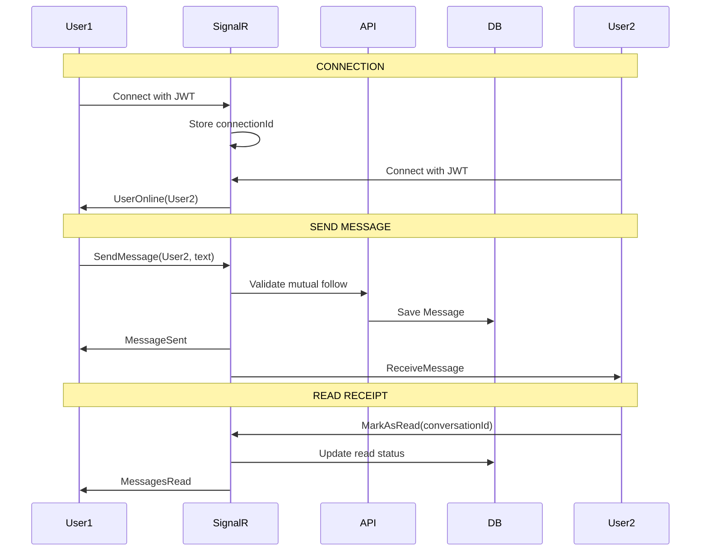
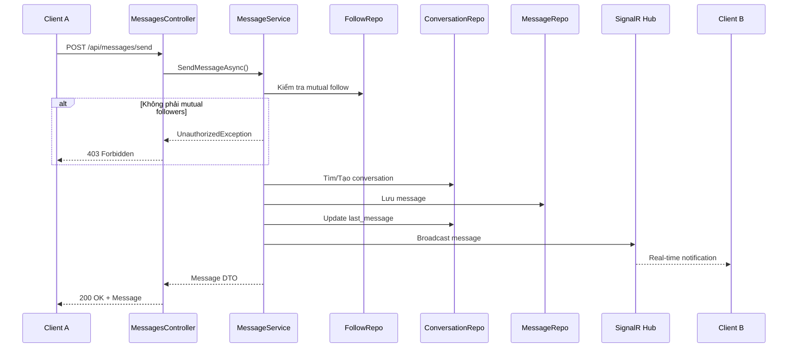
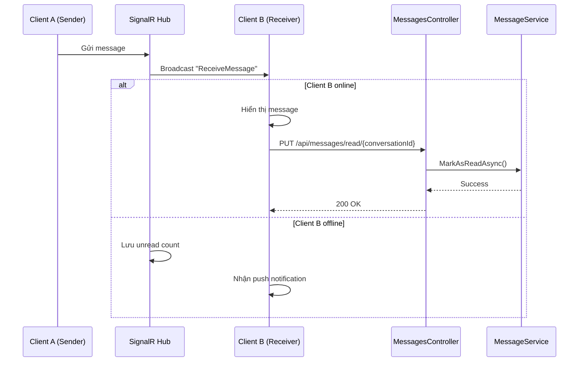

# 💬 TÀI LIỆU MODULE MESSAGES (1-1 CHAT)

## 📋 Mục Lục
1. [Tổng quan](#tổng-quan)
2. [Luồng gửi tin nhắn](#luồng-gửi-tin-nhắn)
3. [Luồng nhận tin nhắn](#luồng-nhận-tin-nhắn)
4. [Quản lý Conversation](#quản-lý-conversation)
5. [Real-time với SignalR](#real-time-với-signalr)
6. [Tính năng nâng cao](#tính-năng-nâng-cao)
7. [API Endpoints](#api-endpoints)

---

## 🎯 Tổng quan

Module Messages quản lý chat 1-1 giữa 2 user:
- ✅ Gửi tin nhắn text
- ✅ Real-time messaging với SignalR
- ✅ Đọc/chưa đọc (Read receipts)
- ✅ Xóa tin nhắn
- ✅ Thu hồi tin nhắn (Recall)
- ✅ Chỉ chat với mutual followers (bảo mật)
- ✅ Conversation list với unread count
- ✅ Message history với pagination

### 🏗️ Kiến trúc

```
┌──────────────────────┐
│  MessagesController  │  ← API Layer (REST)
└────────┬─────────────┘
         │
         ↓
┌──────────────────────┐
│   MessageService     │  ← Business Logic
└────────┬─────────────┘
         │
         ↓
┌──────────────────────────────────────┐
│  Repositories                        │
│  - MessageRepository                 │
│  - ConversationRepository            │
│  - ConversationMemberRepository      │
│  - FollowRepository                  │
└──────────────────────────────────────┘
         │
         ↓
┌──────────────────────┐
│   SignalR ChatHub    │  ← Real-time Communication
└──────────────────────┘
```

### 📊 Sơ Đồ Real-time Messaging



---
```

---

## 📤 Luồng Gửi Tin Nhắn

### 📊 Sơ đồ Send Message Flow



### 📝 Chi tiết Send Message

**Endpoint:** `POST /api/messages/send`

**Auth:** Required (JWT)

**Request Body:**
```json
{
  "receiverUserId": 10,
  "messageContent": "Hello! How are you? 👋",
  "messageType": "text"  // text | image | video | file
}
```

**Logic xử lý:**
```csharp
1. Lấy senderUserId từ JWT token (ClaimTypes.NameIdentifier)

2. Kiểm tra mutual follow:
   - User A follow User B?
   - User B follow User A?
   - Nếu KHÔNG → throw UnauthorizedException
   - Lý do: Chống spam, chỉ chat với người quen

3. Tìm hoặc tạo Conversation:
   - Query: (member1 = A AND member2 = B) OR (member1 = B AND member2 = A)
   - Nếu không tồn tại:
     * Tạo Conversation mới
     * Tạo 2 ConversationMember records

4. Tạo Message:
   - conversation_id
   - sender_user_id = A
   - message_content
   - message_type = "text"
   - is_read = false
   - is_deleted = false
   - is_recalled = false
   - sent_at = UtcNow

5. Update Conversation:
   - last_message_content = message_content
   - last_message_sent_at = sent_at
   - updated_at = UtcNow

6. Real-time Broadcast (SignalR):
   - Gửi message đến User B nếu đang online
   - Event: "ReceiveMessage"

7. Gửi notification:
   - Tạo Notification record
   - Type = "message"
   - Push notification (nếu offline)

8. Return Message DTO
```

**Response:**
```json
{
  "success": true,
  "message": "Message sent successfully",
  "data": {
    "message_id": 123,
    "conversation_id": 45,
    "sender_user_id": 5,
    "sender_username": "nguyenvana",
    "sender_avatar": "http://localhost:5000/Assets/Images/avatar.jpg",
    "message_content": "Hello! How are you? 👋",
    "message_type": "text",
    "is_read": false,
    "is_deleted": false,
    "is_recalled": false,
    "sent_at": "2025-12-14T10:30:00Z"
  }
}
```

**Error Responses:**
```json
// 403 - Không phải mutual followers
{
  "message": "You can only send messages to mutual followers"
}

// 404 - Receiver không tồn tại
{
  "success": false,
  "message": "Receiver not found"
}

// 401 - Token không hợp lệ
{
  "message": "Invalid token"
}
```

---

## 📥 Luồng Nhận Tin Nhắn

### 📊 Sơ đồ Receive Message Flow



### 📝 Chi tiết Get Conversations

**Endpoint:** `GET /api/messages/conversations`

**Auth:** Required (JWT)

**Description:** Lấy danh sách tất cả conversations của user (giống WhatsApp/Messenger)

**Response:**
```json
{
  "success": true,
  "message": "Conversations retrieved successfully",
  "data": [
    {
      "conversation_id": 45,
      "other_user": {
        "user_id": 10,
        "username": "tranthib",
        "full_name": "Trần Thị B",
        "avatar_url": "http://localhost:5000/Assets/Images/tranthib_avatar.jpg",
        "is_online": true
      },
      "last_message": {
        "message_content": "See you tomorrow! 👋",
        "sent_at": "2025-12-14T10:45:00Z",
        "is_read": true
      },
      "unread_count": 0,
      "updated_at": "2025-12-14T10:45:00Z"
    },
    {
      "conversation_id": 38,
      "other_user": {
        "user_id": 7,
        "username": "lequocc",
        "full_name": "Lê Quốc C",
        "avatar_url": null,
        "is_online": false
      },
      "last_message": {
        "message_content": "Thanks for the help!",
        "sent_at": "2025-12-13T20:30:00Z",
        "is_read": true
      },
      "unread_count": 3,
      "updated_at": "2025-12-14T08:15:00Z"
    }
  ]
}
```

**Logic:**
```csharp
1. Lấy userId từ JWT token
2. Query tất cả conversations mà user là member
3. Với mỗi conversation:
   - Lấy thông tin other user (không phải current user)
   - Lấy last message
   - Đếm unread messages (is_read = false, receiver = current user)
   - Kiểm tra is_online (nếu có SignalR connection)
4. Sắp xếp theo updated_at DESC
5. Return JSON array
```

### 📝 Chi tiết Get Conversation Detail

**Endpoint:** `GET /api/messages/conversations/{otherUserId}?page=1&pageSize=50`

**Auth:** Required (JWT)

**Description:** Lấy lịch sử chat với 1 user cụ thể

**Query Parameters:**
- `page`: Trang hiện tại (default: 1)
- `pageSize`: Số message/trang (min: 1, max: 100, default: 50)

**Response:**
```json
{
  "success": true,
  "message": "Conversation retrieved successfully",
  "data": {
    "conversation_id": 45,
    "other_user": {
      "user_id": 10,
      "username": "tranthib",
      "full_name": "Trần Thị B",
      "avatar_url": "http://localhost:5000/Assets/Images/tranthib_avatar.jpg",
      "is_online": true
    },
    "messages": [
      {
        "message_id": 125,
        "sender_user_id": 5,
        "sender_username": "nguyenvana",
        "message_content": "How about lunch tomorrow?",
        "message_type": "text",
        "is_read": true,
        "is_deleted": false,
        "is_recalled": false,
        "sent_at": "2025-12-14T10:45:00Z"
      },
      {
        "message_id": 124,
        "sender_user_id": 10,
        "sender_username": "tranthib",
        "message_content": "Great! Thanks! 😊",
        "message_type": "text",
        "is_read": true,
        "is_deleted": false,
        "is_recalled": false,
        "sent_at": "2025-12-14T10:40:00Z"
      }
    ],
    "total_messages": 48,
    "current_page": 1,
    "page_size": 50,
    "has_more": false
  }
}
```

**Logic:**
```csharp
1. Lấy currentUserId từ JWT
2. Kiểm tra mutual follow với otherUserId
3. Tìm conversation giữa 2 users
4. Nếu không tồn tại → 404 Not Found
5. Get messages với pagination:
   - Sắp xếp theo sent_at DESC (mới nhất ở trên)
   - Skip ((page - 1) * pageSize)
   - Take (pageSize)
6. Đếm total messages
7. Return conversation DTO với messages
```

---

## 📖 Quản Lý Conversation

### 1. Mark As Read

**Endpoint:** `PUT /api/messages/read/{conversationId}`

**Auth:** Required (JWT)

**Description:** Đánh dấu TẤT CẢ tin nhắn trong conversation là đã đọc

**Logic:**
```csharp
1. Lấy userId từ JWT
2. Tìm conversation_id
3. Update tất cả messages:
   - WHERE conversation_id = {id}
   - AND sender_user_id != {userId}  // Không phải của mình
   - AND is_read = false
   - SET is_read = true
4. Return success
```

**Response:**
```json
{
  "success": true,
  "message": "Messages marked as read"
}
```

### 2. Delete Message

**Endpoint:** `DELETE /api/messages/{messageId}`

**Auth:** Required (JWT)

**Description:** Xóa tin nhắn (chỉ ẩn ở phía mình, không xóa hẳn)

**Logic:**
```csharp
1. Lấy userId từ JWT
2. Tìm message theo messageId
3. Kiểm tra quyền:
   - sender_user_id == userId → OK
   - Nếu không → 403 Forbidden
4. Soft delete:
   - SET is_deleted = true
   - KHÔNG xóa khỏi database
5. Return success
```

**⚠️ Lưu ý:**
- Tin nhắn vẫn còn trong database
- User khác vẫn thấy tin nhắn
- Chỉ ẩn ở phía người xóa

**Response:**
```json
{
  "success": true,
  "message": "Message deleted successfully"
}
```

### 3. Recall Message

**Endpoint:** `POST /api/messages/recall/{messageId}`

**Auth:** Required (JWT)

**Description:** Thu hồi tin nhắn (xóa hẳn ở cả 2 bên, giống Messenger)

**Logic:**
```csharp
1. Lấy userId từ JWT
2. Tìm message theo messageId
3. Kiểm tra quyền:
   - sender_user_id == userId → OK
   - Nếu không → 400 Bad Request
4. Kiểm tra thời gian:
   - Chỉ recall trong vòng 15 phút sau khi gửi
   - Nếu quá 15 phút → 400 Bad Request
5. Update message:
   - SET is_recalled = true
   - SET message_content = "Tin nhắn đã được thu hồi"
6. Real-time Broadcast (SignalR):
   - Event: "MessageRecalled"
   - Payload: { message_id, conversation_id }
7. Return recalled message DTO
```

**Response:**
```json
{
  "success": true,
  "message": "Message recalled successfully",
  "data": {
    "message_id": 123,
    "conversation_id": 45,
    "sender_user_id": 5,
    "message_content": "Tin nhắn đã được thu hồi",
    "message_type": "text",
    "is_read": true,
    "is_deleted": false,
    "is_recalled": true,
    "sent_at": "2025-12-14T10:30:00Z"
  }
}
```

**⚠️ Lưu ý:**
- Chỉ recall được trong 15 phút
- Cả 2 bên đều thấy "Tin nhắn đã được thu hồi"
- Không thể undo recall

---

## 🔄 Real-time với SignalR

### 🔌 SignalR ChatHub

**Hub URL:** `ws://localhost:5000/chatHub`

**Connection:**
```javascript
// JavaScript/TypeScript example
import * as signalR from '@microsoft/signalr';

const connection = new signalR.HubConnectionBuilder()
  .withUrl('http://localhost:5000/chatHub', {
    accessTokenFactory: () => accessToken
  })
  .withAutomaticReconnect()
  .build();

// Connect
await connection.start();
console.log('SignalR connected');
```

### 📡 Events

#### 1. ReceiveMessage (Nhận tin nhắn mới)

**Server → Client**

```javascript
connection.on('ReceiveMessage', (message) => {
  console.log('New message:', message);
  
  // {
  //   message_id: 123,
  //   conversation_id: 45,
  //   sender_user_id: 10,
  //   sender_username: "tranthib",
  //   message_content: "Hello!",
  //   sent_at: "2025-12-14T10:30:00Z"
  // }
  
  // Update UI
  addMessageToChat(message);
  updateConversationList(message);
  showNotification(message);
});
```

#### 2. MessageRecalled (Tin nhắn bị thu hồi)

**Server → Client**

```javascript
connection.on('MessageRecalled', (data) => {
  console.log('Message recalled:', data);
  
  // {
  //   message_id: 123,
  //   conversation_id: 45
  // }
  
  // Update UI: thay thế message content
  updateMessageInChat(data.message_id, 'Tin nhắn đã được thu hồi');
});
```

#### 3. MessageRead (Tin nhắn đã được đọc)

**Server → Client**

```javascript
connection.on('MessageRead', (data) => {
  console.log('Messages read:', data);
  
  // {
  //   conversation_id: 45,
  //   read_by_user_id: 10
  // }
  
  // Update UI: hiển thị checkmark xanh (giống Zalo)
  markMessagesAsRead(data.conversation_id);
});
```

#### 4. UserOnline/UserOffline (Online status)

**Server → Client**

```javascript
connection.on('UserOnline', (userId) => {
  console.log(`User ${userId} is now online`);
  updateUserStatus(userId, true);
});

connection.on('UserOffline', (userId) => {
  console.log(`User ${userId} is now offline`);
  updateUserStatus(userId, false);
});
```

### 🔐 SignalR Authentication

**Server-side (C#):**
```csharp
// ChatHub.cs
[Authorize]
public class ChatHub : Hub
{
    public override async Task OnConnectedAsync()
    {
        // Lấy userId từ JWT token
        var userId = Context.User?.FindFirst(ClaimTypes.NameIdentifier)?.Value;
        
        if (!string.IsNullOrEmpty(userId))
        {
            // Thêm user vào group theo userId (để broadcast dễ dàng)
            await Groups.AddToGroupAsync(Context.ConnectionId, $"user_{userId}");
            
            // Broadcast user online
            await Clients.Others.SendAsync("UserOnline", userId);
        }
        
        await base.OnConnectedAsync();
    }
    
    public override async Task OnDisconnectedAsync(Exception? exception)
    {
        var userId = Context.User?.FindFirst(ClaimTypes.NameIdentifier)?.Value;
        
        if (!string.IsNullOrEmpty(userId))
        {
            await Clients.Others.SendAsync("UserOffline", userId);
        }
        
        await base.OnDisconnectedAsync(exception);
    }
}
```

**Client-side (JavaScript):**
```javascript
const connection = new signalR.HubConnectionBuilder()
  .withUrl('http://localhost:5000/chatHub', {
    accessTokenFactory: () => localStorage.getItem('accessToken')
  })
  .build();
```

---

## 🎯 Tính Năng Nâng Cao

### 1. Get Mutual Followers

**Endpoint:** `GET /api/messages/mutual-followers`

**Auth:** Required (JWT)

**Description:** Lấy danh sách người có thể chat (mutual followers)

**Response:**
```json
{
  "success": true,
  "message": "Mutual followers retrieved successfully",
  "data": [
    {
      "user_id": 10,
      "username": "tranthib",
      "full_name": "Trần Thị B",
      "avatar_url": "http://localhost:5000/Assets/Images/tranthib_avatar.jpg",
      "is_online": true
    },
    {
      "user_id": 7,
      "username": "lequocc",
      "full_name": "Lê Quốc C",
      "avatar_url": null,
      "is_online": false
    }
  ]
}
```

**Logic:**
```csharp
1. Lấy userId từ JWT
2. Query Users WHERE:
   - userId IN (SELECT followed_user_id FROM Follows WHERE follower_user_id = {userId})
   - AND userId IN (SELECT follower_user_id FROM Follows WHERE followed_user_id = {userId})
   - (Tức là: A follow B AND B follow A)
3. Exclude chính mình
4. Load avatar URLs
5. Check is_online từ SignalR connections
6. Return JSON array
```

### 2. Typing Indicator

**SignalR Event:** `UserTyping`

**Client → Server:**
```javascript
// User A đang gõ
connection.invoke('SendTypingIndicator', conversationId, true);

// User A dừng gõ (sau 2 giây không gõ)
setTimeout(() => {
  connection.invoke('SendTypingIndicator', conversationId, false);
}, 2000);
```

**Server → Client:**
```javascript
connection.on('UserTyping', (data) => {
  // {
  //   conversation_id: 45,
  //   user_id: 10,
  //   username: "tranthib",
  //   is_typing: true
  // }
  
  if (data.is_typing) {
    showTypingIndicator(data.username);
  } else {
    hideTypingIndicator();
  }
});
```

### 3. Message Delivery Status

**Status Levels:**
- ✓ Sent (màu xám)
- ✓✓ Delivered (màu xám)
- ✓✓ Read (màu xanh)

**Implementation:**
```javascript
function getMessageStatus(message) {
  if (message.is_read) {
    return '✓✓ Read';  // Màu xanh
  } else if (message.is_delivered) {
    return '✓✓ Delivered';  // Màu xám
  } else {
    return '✓ Sent';  // Màu xám
  }
}
```

### 4. Search Messages

**Endpoint:** `GET /api/messages/search?query=hello&conversationId=45`

**Auth:** Required (JWT)

**Query Parameters:**
- `query`: Từ khóa tìm kiếm
- `conversationId`: (Optional) Tìm trong conversation cụ thể

**Response:**
```json
{
  "success": true,
  "data": [
    {
      "message_id": 123,
      "conversation_id": 45,
      "sender_username": "tranthib",
      "message_content": "Hello! How are you?",
      "sent_at": "2025-12-14T10:30:00Z"
    }
  ]
}
```

---

## 📡 API Endpoints

### Conversation Management

| Method | Endpoint | Auth | Description |
|--------|----------|------|-------------|
| GET | `/api/messages/conversations` | ✅ | Lấy danh sách conversations |
| GET | `/api/messages/conversations/{otherUserId}` | ✅ | Lấy lịch sử chat với 1 user |
| GET | `/api/messages/mutual-followers` | ✅ | Lấy danh sách người có thể chat |

### Message Operations

| Method | Endpoint | Auth | Description |
|--------|----------|------|-------------|
| POST | `/api/messages/send` | ✅ | Gửi tin nhắn mới |
| DELETE | `/api/messages/{messageId}` | ✅ | Xóa tin nhắn (soft delete) |
| POST | `/api/messages/recall/{messageId}` | ✅ | Thu hồi tin nhắn (trong 15 phút) |
| PUT | `/api/messages/read/{conversationId}` | ✅ | Đánh dấu đã đọc |
| GET | `/api/messages/search` | ✅ | Tìm kiếm tin nhắn |

---

## 🚨 Lỗi Thường Gặp

### 1. "You can only send messages to mutual followers"
**Nguyên nhân:** Không phải mutual followers (A follow B và B follow A).
**Giải pháp:** Follow nhau trước khi chat.

### 2. "Conversation not found"
**Nguyên nhân:** Chưa có conversation giữa 2 users.
**Giải pháp:** Gửi tin nhắn đầu tiên để tạo conversation.

### 3. "Cannot recall message"
**Nguyên nhân:** Quá 15 phút hoặc không phải người gửi.
**Giải pháp:** Chỉ thu hồi trong 15 phút sau khi gửi.

### 4. "SignalR connection failed"
**Nguyên nhân:** Token không hợp lệ hoặc Hub URL sai.
**Giải pháp:** 
- Kiểm tra accessToken
- Verify Hub URL: `http://localhost:5000/chatHub`

---

## 🎨 Frontend Integration

### React Chat Component

```jsx
import React, { useState, useEffect } from 'react';
import * as signalR from '@microsoft/signalr';

function ChatWindow({ otherUserId, accessToken }) {
  const [messages, setMessages] = useState([]);
  const [connection, setConnection] = useState(null);
  const [inputText, setInputText] = useState('');

  useEffect(() => {
    // Kết nối SignalR
    const newConnection = new signalR.HubConnectionBuilder()
      .withUrl('http://localhost:5000/chatHub', {
        accessTokenFactory: () => accessToken
      })
      .withAutomaticReconnect()
      .build();

    setConnection(newConnection);
  }, []);

  useEffect(() => {
    if (connection) {
      connection.start()
        .then(() => {
          console.log('SignalR connected');
          
          // Lắng nghe tin nhắn mới
          connection.on('ReceiveMessage', (message) => {
            if (message.conversation_id === currentConversationId) {
              setMessages(prev => [...prev, message]);
              markAsRead();
            }
          });
        })
        .catch(e => console.log('Connection failed: ', e));
    }
  }, [connection]);

  const sendMessage = async () => {
    const response = await fetch('http://localhost:5000/api/messages/send', {
      method: 'POST',
      headers: {
        'Authorization': `Bearer ${accessToken}`,
        'Content-Type': 'application/json'
      },
      body: JSON.stringify({
        receiverUserId: otherUserId,
        messageContent: inputText,
        messageType: 'text'
      })
    });

    const result = await response.json();
    if (result.success) {
      setMessages(prev => [...prev, result.data]);
      setInputText('');
    }
  };

  const markAsRead = async () => {
    await fetch(`http://localhost:5000/api/messages/read/${currentConversationId}`, {
      method: 'PUT',
      headers: {
        'Authorization': `Bearer ${accessToken}`
      }
    });
  };

  return (
    <div className="chat-window">
      <div className="messages">
        {messages.map(msg => (
          <div key={msg.message_id} className={msg.sender_user_id === myUserId ? 'sent' : 'received'}>
            <p>{msg.message_content}</p>
            <span>{new Date(msg.sent_at).toLocaleTimeString()}</span>
          </div>
        ))}
      </div>
      
      <div className="input-area">
        <input 
          value={inputText}
          onChange={(e) => setInputText(e.target.value)}
          onKeyPress={(e) => e.key === 'Enter' && sendMessage()}
          placeholder="Type a message..."
        />
        <button onClick={sendMessage}>Send</button>
      </div>
    </div>
  );
}
```

---

## 🔧 Best Practices

### 1. Performance
- Pagination cho message history (50 messages/page)
- Cache conversation list (refresh khi có message mới)
- Debounce typing indicator (2 seconds)
- Lazy load images trong chat

### 2. Security
- Chỉ chat với mutual followers
- Validate message content (max 2000 ký tự)
- Rate limiting: 50 messages/minute
- Encrypt sensitive data nếu cần

### 3. User Experience
- Auto-scroll to bottom khi có message mới
- Hiển thị typing indicator
- Mark as read tự động khi mở chat
- Notification sound cho message mới
- Unread badge trên conversation list

### 4. Real-time
- Automatic reconnection nếu mất kết nối
- Queue messages khi offline
- Sync khi reconnect
- Heartbeat để check connection status

---

## 📊 Database Schema

### Conversations Table
```sql
CREATE TABLE Conversations (
    conversation_id INT PRIMARY KEY IDENTITY,
    last_message_content NVARCHAR(2000),
    last_message_sent_at DATETIMEOFFSET,
    created_at DATETIMEOFFSET DEFAULT GETUTCDATE(),
    updated_at DATETIMEOFFSET DEFAULT GETUTCDATE()
);
```

### ConversationMembers Table
```sql
CREATE TABLE ConversationMembers (
    member_id INT PRIMARY KEY IDENTITY,
    conversation_id INT NOT NULL,
    user_id INT NOT NULL,
    joined_at DATETIMEOFFSET DEFAULT GETUTCDATE(),
    FOREIGN KEY (conversation_id) REFERENCES Conversations(conversation_id) ON DELETE CASCADE,
    FOREIGN KEY (user_id) REFERENCES Users(user_id)
);
```

### Messages Table
```sql
CREATE TABLE Messages (
    message_id INT PRIMARY KEY IDENTITY,
    conversation_id INT NOT NULL,
    sender_user_id INT NOT NULL,
    message_content NVARCHAR(2000) NOT NULL,
    message_type VARCHAR(20) DEFAULT 'text',  -- text | image | video | file
    is_read BIT DEFAULT 0,
    is_deleted BIT DEFAULT 0,
    is_recalled BIT DEFAULT 0,
    sent_at DATETIMEOFFSET DEFAULT GETUTCDATE(),
    FOREIGN KEY (conversation_id) REFERENCES Conversations(conversation_id) ON DELETE CASCADE,
    FOREIGN KEY (sender_user_id) REFERENCES Users(user_id)
);
```

---

## 📚 Tài Liệu Liên Quan

- [Authentication Module](./AUTHENTICATION_MODULE.md) - Đăng nhập/đăng ký
- [Posts Module](./POSTS_MODULE.md) - Đăng bài/Feed
- [Group Chat Module](./GROUP_CHAT_MODULE.md) - Chat nhóm
- [Profile Module](./PROFILE_MODULE.md) - Quản lý profile

---

**📅 Last Updated:** December 14, 2025  
**📌 Version:** 1.0.0
