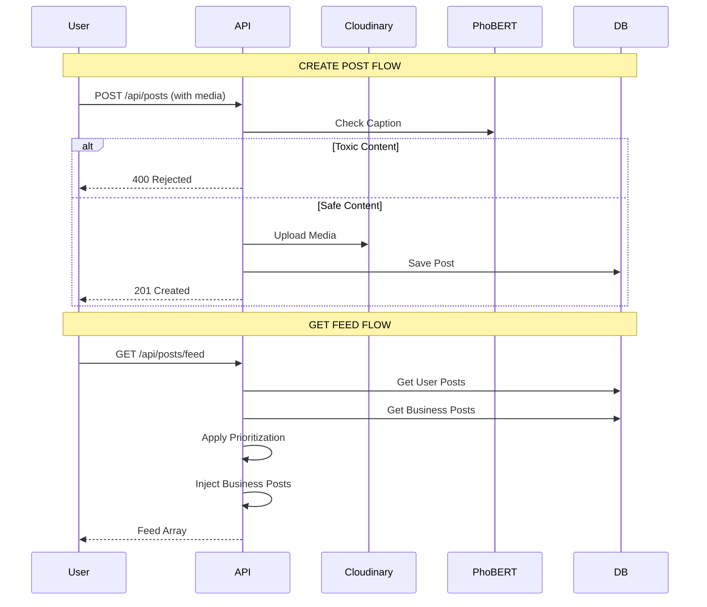
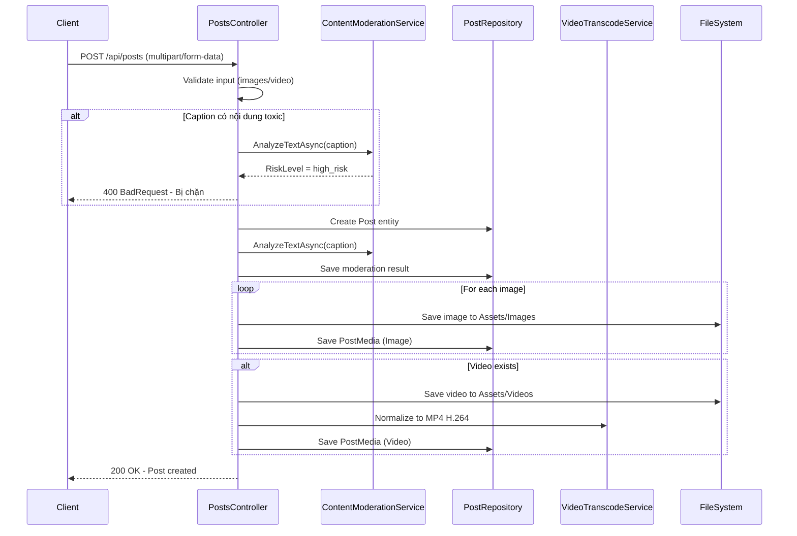
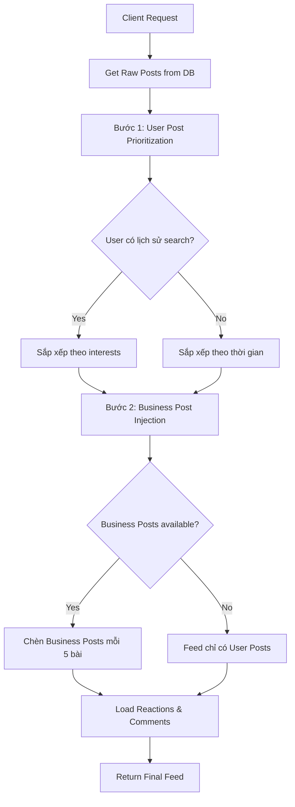
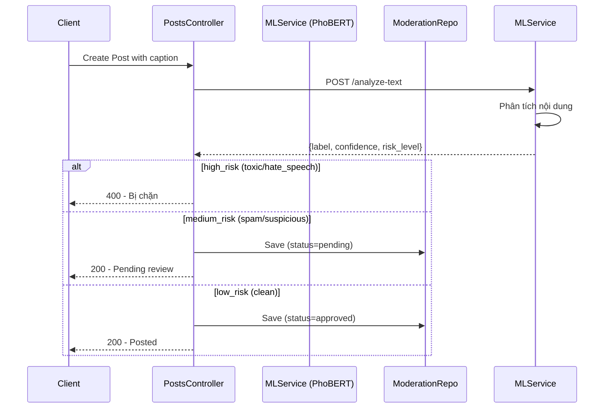
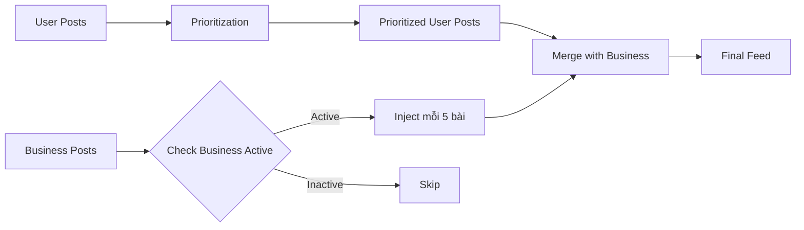

# 📸 TÀI LIỆU MODULE POSTS, FEED & REELS

## 📋 Mục Lục
1. [Tổng quan](#tổng-quan)
2. [Tạo bài đăng (Post)](#tạo-bài-đăng)
3. [Xem Feed](#xem-feed)
4. [Xem Reels (Video)](#xem-reels)
5. [Tương tác với Post](#tương-tác-với-post)
6. [Content Moderation (AI)](#content-moderation)
7. [Business Post Injection](#business-post-injection)
8. [API Endpoints](#api-endpoints)
  
---

## 🎯 Tổng quan

Module Posts quản lý toàn bộ quy trình đăng bài, xem feed và reels:
- ✅ Tạo bài đăng (hình ảnh/video)
- ✅ Feed (bài đăng từ người theo dõi)
- ✅ Reels (video ngắn TikTok-style)
- ✅ Content Moderation với PhoBERT AI
- ✅ Business Post Injection (quảng cáo)
- ✅ User Post Prioritization (cá nhân hóa)
- ✅ Reactions (Like, Love, Haha, Wow, Sad, Angry)
- ✅ Comments & Shares
- ✅ Tag & Mention users

### 🏗️ Kiến trúc

```
┌──────────────────┐
│  PostsController │  ← API Layer
└────────┬─────────┘
         │
         ↓
┌────────────────────────────────────────────┐
│  Business Logic Services                   │
│  - PostsService                            │
│  - BusinessPostInjectionService            │
│  - UserPostPrioritizationService           │
│  - ContentModerationService (PhoBERT ML)   │
└────────┬───────────────────────────────────┘
         │
         ↓
┌────────────────────────────────────────────┐
│  Repositories (Infrastructure)             │
│  - PostRepository                          │
│  - PostMediaRepository                     │
│  - ReactionRepository                      │
│  - CommentRepository                       │
└────────────────────────────────────────────┘
```

### 📊 Sơ Đồ Luồng Chính



---
│  - ShareRepository                         │
│  - ContentModerationRepository             │
└────────────────────────────────────────────┘
```

---

## 📝 Tạo Bài Đăng (Post)

### 📊 Sơ đồ luồng Create Post



### 📝 Chi tiết Create Post

**Endpoint:** `POST /api/posts`

**Content-Type:** `multipart/form-data`

**Request Body:**
```
caption: "Đây là bài đăng mới của tôi! 🎉"
location: "Hà Nội, Việt Nam"
privacy: "public"  // public | private | followers
mentions: "[1, 5, 10]"  // JSON array of user IDs
tags: "[2, 7]"  // JSON array of user IDs
images: [file1.jpg, file2.png]  // Multiple files
video: video.mp4  // Single file (max 100MB)
```

**Validation Rules:**
- ✅ Privacy: phải là `public`, `private`, hoặc `followers`
- ✅ Media: Bắt buộc có ít nhất 1 ảnh HOẶC 1 video
- ✅ Images: JPG, JPEG, PNG, GIF, WEBP (không giới hạn số lượng)
- ✅ Video: MP4, MOV, M4V, AVI, WMV, MKV (max 100MB)
- ✅ Caption: Tối đa 2000 ký tự (optional)

**Logic xử lý:**
```csharp
1. Validate JWT token → lấy user_id
2. Validate privacy value
3. Kiểm tra ít nhất có 1 ảnh hoặc 1 video
4. Kiểm tra dung lượng video (<= 100MB)
5. Validate file extensions (ảnh & video)
6. Parse mentions & tags từ JSON string

// ⚠️ BƯỚC BẢO MẬT: Content Moderation
7. Gọi PhoBERT AI để kiểm tra caption:
   - high_risk → CHẶN ngay, return 400
   - medium_risk → Cho post nhưng đánh dấu "pending"
   - low_risk → Approved

8. Tạo Post entity:
   - user_id
   - caption
   - location
   - privacy
   - is_visible = true
   - MentionedUserIds (CSV: "1,5,10")
   - TaggedUserIds (CSV: "2,7")

9. Lưu kết quả Moderation vào database:
   - ContentType = "Post"
   - ContentID = post_id
   - AIConfidence (0-1)
   - ToxicLabel (clean/toxic/spam/hate_speech)
   - Status (approved/pending/blocked)

10. Lưu images:
    - Tạo tên file: {username}_{guid}.{ext}
    - Lưu vào Assets/Images/
    - Tạo PostMedia record: media_type="Image", media_order

11. Lưu video (nếu có):
    - Tạo tên file: {username}_{guid}.{ext}
    - Lưu vào Assets/Videos/
    - Transcode sang MP4 H.264 (compatibility)
    - Tạo PostMedia record: media_type="Video"

12. Return success với post_id
```

**Response:**
```json
{
  "message": "Đăng bài thành công",
  "PostId": 123
}
```

**Error Responses:**
```json
// 400 - Nội dung toxic
{
  "message": "Bài đăng bị chặn do vi phạm: hate_speech"
}

// 400 - Thiếu media
{
  "message": "Bài đăng phải có ít nhất 1 ảnh hoặc 1 video."
}

// 400 - Video quá lớn
{
  "message": "Video vượt quá dung lượng tối đa 100MB."
}
```

---

## 📰 Xem Feed

### 📊 Sơ đồ Feed Algorithm



### 📝 Chi tiết Feed Endpoints

#### 1. Get Feed (Trang chủ)
**Endpoint:** `GET /api/posts/feed?page=1&pageSize=20`

**Auth:** Optional (nếu không login thì xem bài public)

**Query Parameters:**
- `page`: Trang hiện tại (default: 1)
- `pageSize`: Số bài/trang (min: 1, max: 50, default: 20)

**Logic:**
```csharp
1. Lấy current user (nếu authenticated)
2. Get raw posts từ DB:
   - Bài của những người user đang follow
   - Bài public (nếu không login)
   - Sắp xếp theo created_at DESC

3. BƯỚC 1: User Post Prioritization
   - Nếu user có lịch sử search:
     * Tìm những posts từ users trong search history
     * Đưa lên đầu feed
   - Nếu không có lịch sử: giữ nguyên thứ tự

4. BƯỚC 2: Business Post Injection
   - Lấy Business Posts (tài khoản đã upgrade)
   - Chèn vào feed mỗi 5 bài User Post
   - Ví dụ: [User1, User2, User3, User4, User5, Business1, User6, ...]

5. Load thông tin bổ sung cho mỗi post:
   - Reactions count (Like, Love, Haha, Wow, Sad, Angry)
   - Comments count
   - Shares count
   - Media URLs (images/videos)
   - Author info (username, avatar, full_name)

6. Return JSON array
```

**Response:**
```json
[
  {
    "post_id": 123,
    "user_id": 5,
    "username": "nguyenvana",
    "full_name": "Nguyễn Văn A",
    "avatar_url": "http://localhost:5000/Assets/Images/avatar.jpg",
    "caption": "Beautiful sunset 🌅",
    "location": "Hà Nội",
    "privacy": "public",
    "created_at": "2025-12-14T10:30:00Z",
    "media": [
      {
        "type": "Image",
        "url": "http://localhost:5000/Assets/Images/nguyenvana_abc123.jpg",
        "altUrl": null
      }
    ],
    "reactions": {
      "Like": 150,
      "Love": 30,
      "Haha": 5,
      "Wow": 2,
      "Sad": 0,
      "Angry": 0,
      "total": 187
    },
    "current_user_reaction": "Like",
    "comments_count": 24,
    "shares_count": 8,
    "mentioned_users": [1, 5, 10],
    "tagged_users": [2, 7]
  }
]
```

#### 2. Get My Posts
**Endpoint:** `GET /api/posts/me?page=1&pageSize=20`

**Auth:** Required (JWT)

**Logic:**
```csharp
1. Lấy user_id từ JWT token
2. Get tất cả posts của user (bao gồm cả private)
3. Sắp xếp theo created_at DESC
4. Load reactions & comments
5. Return JSON array
```

#### 3. Get User Posts
**Endpoint:** `GET /api/posts/user/{userId}?page=1&pageSize=20`

**Auth:** Optional

**Logic:**
```csharp
1. Lấy current_user_id (nếu authenticated)
2. Get posts của {userId}:
   - Nếu current_user == target_user: hiện tất cả
   - Nếu khác: chỉ hiện public & followers (nếu đang follow)
3. Kiểm tra privacy rules
4. Return JSON array
```

#### 4. Get Single Post
**Endpoint:** `GET /api/posts/{postId}`

**Auth:** Optional

**Logic:**
```csharp
1. Get post by ID
2. Kiểm tra privacy:
   - public: ai cũng xem được
   - private: chỉ author xem được
   - followers: chỉ followers xem được
3. Nếu không có quyền → 403 Forbidden
4. Return post DTO
```

---

## 🎬 Xem Reels (Video)

### 📝 Reels Endpoints

#### 1. Get Reels (TikTok-style)
**Endpoint:** `GET /api/posts/reels?page=1&pageSize=20`

**Auth:** Optional

**Description:** Chỉ lấy bài đăng CÓ VIDEO (không có ảnh)

**Logic:**
```csharp
1. Get video posts từ DB (has Video media)
2. BƯỚC 1: User Post Prioritization (giống Feed)
3. BƯỚC 2: Business VIDEO Injection
   - CHỈ chèn Business posts có video
   - KHÔNG chèn Business posts chỉ có ảnh
4. Load reactions & comments
5. Return JSON array
```

#### 2. Get All Reels
**Endpoint:** `GET /api/posts/reels/all`

**Auth:** Optional

**Description:** Lấy TẤT CẢ video posts (không phân trang)

**Logic:**
```csharp
1. Get ALL video posts từ DB
2. User Post Prioritization
3. Business VIDEO Injection
4. Return JSON array
```

#### 3. Get Following Reels
**Endpoint:** `GET /api/posts/reels/following?page=1&pageSize=20`

**Auth:** Required (JWT)

**Description:** Chỉ lấy video từ những người user đang follow

**Logic:**
```csharp
1. Lấy user_id từ JWT
2. Get video posts từ following users
3. Sắp xếp theo created_at DESC
4. KHÔNG có Business Injection (chỉ từ following)
5. Return JSON array
```

**Video Response Format:**
```json
{
  "post_id": 456,
  "user_id": 10,
  "username": "travel_vlogger",
  "caption": "Exploring Ha Long Bay! 🚤",
  "created_at": "2025-12-14T15:20:00Z",
  "media": [
    {
      "type": "Video",
      "url": "http://localhost:5000/Assets/Videos/travel_vlogger_xyz789.mp4",
      "altUrl": "http://localhost:5000/Assets/Videos/travel_vlogger_xyz789_compat.mp4"
    }
  ],
  "reactions": {
    "Like": 500,
    "Love": 120,
    "Haha": 30,
    "total": 650
  },
  "comments_count": 87,
  "shares_count": 45
}
```

**⚠️ Video Transcoding:**
- Original video: `travel_vlogger_xyz789.mp4`
- Transcoded video: `travel_vlogger_xyz789_compat.mp4` (H.264 codec)
- Client nên ưu tiên dùng `altUrl` nếu có (better compatibility)

---

## 💬 Tương Tác Với Post

### 1. Reactions (Like, Love, etc.)

**Endpoint:** `POST /api/posts/{postId}/react`

**Auth:** Required (JWT)

**Request Body:**
```json
{
  "reactionType": "Like"  // Like | Love | Haha | Wow | Sad | Angry
}
```

**Logic:**
```csharp
1. Validate reactionType
2. Kiểm tra user đã react chưa:
   - Nếu chưa → Tạo reaction mới
   - Nếu rồi → Update reaction type
3. Gửi notification cho post owner (nếu khác user)
4. Return success
```

**Response:**
```json
{
  "message": "Reaction updated successfully",
  "reaction": {
    "user_id": 5,
    "post_id": 123,
    "reaction_type": "Like",
    "created_at": "2025-12-14T10:45:00Z"
  }
}
```

### 2. Remove Reaction

**Endpoint:** `DELETE /api/posts/{postId}/react`

**Auth:** Required (JWT)

**Logic:**
```csharp
1. Tìm reaction của user cho post
2. Xóa reaction
3. Return success
```

### 3. Get Post Reactions

**Endpoint:** `GET /api/posts/{postId}/reactions`

**Auth:** Optional

**Response:**
```json
{
  "post_id": 123,
  "reactions": {
    "Like": 150,
    "Love": 30,
    "Haha": 5,
    "Wow": 2,
    "Sad": 0,
    "Angry": 0
  },
  "total": 187,
  "details": [
    {
      "user_id": 5,
      "username": "nguyenvana",
      "full_name": "Nguyễn Văn A",
      "reaction_type": "Like",
      "created_at": "2025-12-14T10:45:00Z"
    }
  ]
}
```

### 4. Comments

**Endpoint:** `POST /api/posts/{postId}/comments`

**Auth:** Required (JWT)

**Request Body:**
```json
{
  "content": "Great photo! 👍",
  "parent_comment_id": null,  // null = top-level, hoặc ID để reply
  "mentions": [1, 5, 10]  // Tag users trong comment
}
```

**⚠️ Content Moderation:** Comment cũng được kiểm tra bằng PhoBERT AI!

**Logic:**
```csharp
1. Validate content không rỗng
2. Kiểm tra content với PhoBERT AI:
   - high_risk → CHẶN comment
   - medium_risk → Pending review
   - low_risk → Approved
3. Tạo Comment entity
4. Lưu kết quả Moderation
5. Gửi notification cho:
   - Post owner (nếu top-level comment)
   - Parent comment owner (nếu reply)
   - Mentioned users
6. Return comment DTO
```

### 5. Shares

**Endpoint:** `POST /api/posts/{postId}/share`

**Auth:** Required (JWT)

**Request Body:**
```json
{
  "message": "Check this out! 🔥"  // Optional caption khi share
}
```

**Logic:**
```csharp
1. Kiểm tra post tồn tại và có quyền xem
2. Tạo Share record
3. Tạo bài post mới (share post):
   - Giữ nguyên media từ original post
   - Thêm caption từ user
   - Link về original post
4. Gửi notification cho original post owner
5. Return share_id
```

---

## 🤖 Content Moderation (PhoBERT AI)

### 🧠 PhoBERT ML Service

**Technology:**
- Model: PhoBERT (Vietnamese BERT)
- Framework: FastAPI (Python)
- Port: 5001
- Endpoint: `http://localhost:5001/analyze-text`

### 📊 Sơ đồ Moderation Flow



### 🔍 Phân loại Content

**Labels:**
- `clean`: Nội dung sạch, không vi phạm
- `toxic`: Nội dung độc hại, xúc phạm
- `spam`: Quảng cáo spam
- `hate_speech`: Phát ngôn thù địch
- `sexual_content`: Nội dung nhạy cảm
- `violence`: Bạo lực

**Risk Levels:**
- `low_risk` (confidence < 0.6): Approved tự động
- `medium_risk` (0.6 ≤ confidence < 0.85): Pending review
- `high_risk` (confidence ≥ 0.85): Blocked tự động

**ML Request:**
```json
POST http://localhost:5001/analyze-text
Content-Type: application/json

{
  "text": "Đây là nội dung cần kiểm tra"
}
```

**ML Response:**
```json
{
  "label": "clean",
  "confidence": 0.92,
  "risk_level": "low_risk",
  "details": {
    "clean": 0.92,
    "toxic": 0.05,
    "spam": 0.03
  }
}
```

### 💾 Moderation Database Record

```csharp
ContentModeration {
    ContentModerationId: 1
    ContentType: "Post"  // hoặc "Comment"
    ContentID: 123
    AccountId: 5
    PostId: 123
    CommentId: null
    AIConfidence: 0.92
    ToxicLabel: "clean"
    Status: "approved"  // approved | pending | blocked
    CreatedAt: 2025-12-14T10:30:00Z
}
```

**Admin Review:**
- Admin có thể xem tất cả posts có `Status = "pending"`
- Quyết định Approve hoặc Block thủ công
- Update Status trong database

---

## 💼 Business Post Injection

### 🎯 Mục đích

Chèn bài đăng từ Business Accounts (tài khoản đã trả phí) vào Feed/Reels để tăng tương tác và doanh thu.

### 📊 Sơ đồ Business Injection



### 📝 Chi tiết Business Injection

**Service:** `BusinessPostInjectionService`

**Logic:**
```csharp
public async Task<List<Post>> InjectBusinessPostsIntoFeedAsync(
    List<Post> userPosts, 
    int? currentUserId)
{
    // 1. Get Business Posts
    var businessPosts = await GetActiveBusinessPostsAsync();
    
    // 2. Filter: Không hiện Business posts của chính mình
    if (currentUserId.HasValue)
    {
        businessPosts = businessPosts
            .Where(p => p.user_id != currentUserId.Value)
            .ToList();
    }
    
    // 3. Shuffle Business posts để random
    businessPosts = businessPosts.OrderBy(x => Guid.NewGuid()).ToList();
    
    // 4. Chèn vào Feed mỗi 5 bài
    var merged = new List<Post>();
    int businessIndex = 0;
    
    for (int i = 0; i < userPosts.Count; i++)
    {
        merged.Add(userPosts[i]);
        
        // Mỗi 5 bài User Post → chèn 1 Business Post
        if ((i + 1) % 5 == 0 && businessIndex < businessPosts.Count)
        {
            merged.Add(businessPosts[businessIndex]);
            businessIndex++;
        }
    }
    
    // 5. Thêm Business posts còn lại vào cuối
    while (businessIndex < businessPosts.Count)
    {
        merged.Add(businessPosts[businessIndex]);
        businessIndex++;
    }
    
    return merged;
}
```

**Ví dụ Feed:**
```
Position 0: User Post 1
Position 1: User Post 2
Position 2: User Post 3
Position 3: User Post 4
Position 4: User Post 5
Position 5: 💼 Business Post 1  ← Chèn vào
Position 6: User Post 6
Position 7: User Post 7
Position 8: User Post 8
Position 9: User Post 9
Position 10: User Post 10
Position 11: 💼 Business Post 2  ← Chèn vào
...
```

**Business Video Injection (Reels):**
```csharp
public async Task<List<Post>> InjectBusinessVideoPostsIntoReelsAsync(
    List<Post> userPosts, 
    int? currentUserId)
{
    // CHỈ lấy Business posts có VIDEO
    var businessVideos = await GetActiveBusinessVideoPostsAsync();
    
    // Tương tự logic trên nhưng chỉ cho video
    // ...
}
```

**⚠️ Lưu ý:**
- Business Posts được shuffle random để công bằng
- Không hiển thị Business posts của chính mình
- Business accounts phải có `business_account.status = 'active'`
- Tính phí dựa trên số lượt hiển thị (impressions)

---

## 🎯 User Post Prioritization

### 🧠 Cá nhân hóa Feed

**Service:** `UserPostPrioritizationService`

**Logic:**
```csharp
public async Task<List<Post>> PrioritizeAndMixUserPostsAsync(
    List<Post> posts, 
    int? currentUserId)
{
    if (!currentUserId.HasValue || posts.Count == 0)
        return posts;
    
    // 1. Lấy lịch sử tìm kiếm của user
    var searchHistory = await _searchHistoryRepo
        .GetRecentSearchesByUserIdAsync(currentUserId.Value, limit: 50);
    
    if (searchHistory.Count == 0)
        return posts;  // Không có lịch sử → giữ nguyên
    
    // 2. Tạo set user IDs từ search history
    var searchedUserIds = searchHistory
        .Select(s => s.searched_user_id)
        .Where(id => id.HasValue)
        .Select(id => id.Value)
        .ToHashSet();
    
    // 3. Chia posts thành 2 nhóm:
    var priorityPosts = posts
        .Where(p => searchedUserIds.Contains(p.user_id))
        .ToList();
        
    var otherPosts = posts
        .Where(p => !searchedUserIds.Contains(p.user_id))
        .ToList();
    
    // 4. Merge: Priority posts đầu, sau đó other posts
    var result = new List<Post>();
    result.AddRange(priorityPosts);
    result.AddRange(otherPosts);
    
    return result;
}
```

**Ví dụ:**
```
User A đã search: User B, User C, User D

Feed trước khi prioritize:
1. Post của User E
2. Post của User B  ← Trong search history
3. Post của User F
4. Post của User C  ← Trong search history
5. Post của User G

Feed sau khi prioritize:
1. Post của User B  ← Đưa lên đầu
2. Post của User C  ← Đưa lên đầu
3. Post của User E
4. Post của User F
5. Post của User G
```

**⚠️ Lưu ý:**
- Chỉ áp dụng nếu user có lịch sử tìm kiếm
- Giữ nguyên thứ tự trong mỗi nhóm (priority & other)
- Kết hợp với Business Injection sau bước này

---

## 📡 API Endpoints

### Post Management

| Method | Endpoint | Auth | Description |
|--------|----------|------|-------------|
| POST | `/api/posts` | ✅ | Tạo bài đăng mới (multipart/form-data) |
| GET | `/api/posts/feed` | ❌ | Lấy Feed (trang chủ) với pagination |
| GET | `/api/posts/reels` | ❌ | Lấy Reels (video posts) với pagination |
| GET | `/api/posts/reels/all` | ❌ | Lấy tất cả Reels (không phân trang) |
| GET | `/api/posts/reels/following` | ✅ | Lấy Reels từ following users |
| GET | `/api/posts/me` | ✅ | Lấy bài đăng của mình |
| GET | `/api/posts/{id}` | ❌ | Lấy 1 post theo ID |
| GET | `/api/posts/user/{userId}` | ❌ | Lấy posts của user khác |
| PUT | `/api/posts/{id}/privacy` | ✅ | Cập nhật privacy (public/private/followers) |
| PUT | `/api/posts/{id}/caption` | ✅ | Cập nhật caption |
| DELETE | `/api/posts/{id}` | ✅ | Xóa bài đăng |

### Reactions

| Method | Endpoint | Auth | Description |
|--------|----------|------|-------------|
| POST | `/api/posts/{id}/react` | ✅ | React vào post (Like, Love, etc.) |
| DELETE | `/api/posts/{id}/react` | ✅ | Bỏ reaction |
| GET | `/api/posts/{id}/reactions` | ❌ | Xem danh sách reactions |

### Comments

| Method | Endpoint | Auth | Description |
|--------|----------|------|-------------|
| POST | `/api/posts/{id}/comments` | ✅ | Bình luận vào post |
| GET | `/api/posts/{id}/comments` | ❌ | Lấy danh sách comments |
| POST | `/api/comments/{id}/react` | ✅ | React vào comment |
| POST | `/api/comments/{id}/reply` | ✅ | Reply comment |
| DELETE | `/api/comments/{id}` | ✅ | Xóa comment |

### Shares

| Method | Endpoint | Auth | Description |
|--------|----------|------|-------------|
| POST | `/api/posts/{id}/share` | ✅ | Chia sẻ bài đăng |
| GET | `/api/posts/{id}/shares` | ❌ | Xem danh sách shares |

---

## 🚨 Lỗi Thường Gặp

### 1. "Bài đăng bị chặn do vi phạm"
**Nguyên nhân:** Caption/Comment chứa nội dung toxic (PhoBERT AI phát hiện).
**Giải pháp:** Sửa lại nội dung, tránh ngôn từ xúc phạm/spam.

### 2. "Video vượt quá dung lượng tối đa 100MB"
**Nguyên nhân:** File video quá lớn.
**Giải pháp:** Nén video trước khi upload hoặc cắt ngắn lại.

### 3. "Định dạng video không hợp lệ"
**Nguyên nhân:** File không phải MP4, MOV, AVI, WMV, MKV.
**Giải pháp:** Convert video sang định dạng được hỗ trợ.

### 4. "Bài đăng phải có ít nhất 1 ảnh hoặc 1 video"
**Nguyên nhân:** Upload form không có media.
**Giải pháp:** Đính kèm ít nhất 1 file ảnh hoặc video.

### 5. "403 Forbidden"
**Nguyên nhân:** Không có quyền xem post (privacy = private).
**Giải pháp:** Follow user hoặc đợi user đổi sang public.

---

## 🎨 Frontend Integration

### Upload Post với Multiple Files

```javascript
// React/Vue/Angular example
async function createPost(formData) {
  const form = new FormData();
  
  form.append('caption', formData.caption);
  form.append('location', formData.location);
  form.append('privacy', formData.privacy);
  form.append('mentions', JSON.stringify(formData.mentions)); // [1,5,10]
  form.append('tags', JSON.stringify(formData.tags)); // [2,7]
  
  // Multiple images
  formData.images.forEach(image => {
    form.append('images', image);
  });
  
  // Single video
  if (formData.video) {
    form.append('video', formData.video);
  }
  
  const response = await fetch('http://localhost:5000/api/posts', {
    method: 'POST',
    headers: {
      'Authorization': `Bearer ${accessToken}`
    },
    body: form
  });
  
  return await response.json();
}
```

### Load Feed với Infinite Scroll

```javascript
let currentPage = 1;
let loading = false;

async function loadFeed() {
  if (loading) return;
  loading = true;
  
  const response = await fetch(
    `http://localhost:5000/api/posts/feed?page=${currentPage}&pageSize=20`,
    {
      headers: {
        'Authorization': `Bearer ${accessToken}`
      }
    }
  );
  
  const posts = await response.json();
  
  // Append to UI
  renderPosts(posts);
  
  currentPage++;
  loading = false;
}

// Infinite scroll
window.addEventListener('scroll', () => {
  if (window.innerHeight + window.scrollY >= document.body.offsetHeight - 500) {
    loadFeed();
  }
});
```

### Video Player với Fallback

```javascript
function renderVideoPost(post) {
  const videoMedia = post.media.find(m => m.type === 'Video');
  
  return `
    <video controls>
      ${videoMedia.altUrl ? 
        `<source src="${videoMedia.altUrl}" type="video/mp4">` : 
        ''
      }
      <source src="${videoMedia.url}" type="video/mp4">
      Your browser does not support video playback.
    </video>
  `;
}
```

---

## 🔧 Best Practices

### 1. Media Storage
- Lưu file với tên unique (username + GUID)
- Tách riêng Images và Videos folder
- Video transcoding để tăng compatibility
- Serve static files qua ASP.NET middleware

### 2. Content Moderation
- Luôn kiểm tra caption/comment trước khi lưu
- Graceful degradation nếu ML Service down
- Log tất cả kết quả moderation
- Admin review cho medium_risk content

### 3. Performance
- Pagination cho Feed/Reels (max 50/page)
- Load reactions/comments count riêng biệt
- Cache Business Posts (refresh mỗi 5 phút)
- Index database: user_id, created_at, privacy

### 4. Security
- Validate file extensions (whitelist)
- Limit file size (100MB video, 10MB image)
- Rate limiting: 10 posts/hour/user
- Sanitize caption/comment HTML

---

## 📊 Database Schema

### Posts Table
```sql
CREATE TABLE Posts (
    post_id INT PRIMARY KEY IDENTITY,
    user_id INT NOT NULL,
    caption NVARCHAR(2000),
    location NVARCHAR(255),
    privacy VARCHAR(20) DEFAULT 'public',
    is_visible BIT DEFAULT 1,
    MentionedUserIds VARCHAR(MAX),  -- CSV: "1,5,10"
    TaggedUserIds VARCHAR(MAX),     -- CSV: "2,7"
    created_at DATETIMEOFFSET DEFAULT GETUTCDATE(),
    updated_at DATETIMEOFFSET,
    FOREIGN KEY (user_id) REFERENCES Users(user_id)
);
```

### PostMedia Table
```sql
CREATE TABLE PostMedia (
    media_id INT PRIMARY KEY IDENTITY,
    post_id INT NOT NULL,
    media_url VARCHAR(500) NOT NULL,  -- Tên file
    media_type VARCHAR(20) NOT NULL,  -- Image | Video
    media_order INT DEFAULT 0,
    created_at DATETIMEOFFSET DEFAULT GETUTCDATE(),
    FOREIGN KEY (post_id) REFERENCES Posts(post_id) ON DELETE CASCADE
);
```

### ContentModeration Table
```sql
CREATE TABLE ContentModeration (
    ContentModerationId INT PRIMARY KEY IDENTITY,
    ContentType VARCHAR(50) NOT NULL,  -- Post | Comment
    ContentID INT NOT NULL,
    AccountId INT NOT NULL,
    PostId INT,
    CommentId INT,
    AIConfidence DECIMAL(5,4),  -- 0.0000 - 1.0000
    ToxicLabel VARCHAR(50),     -- clean | toxic | spam | hate_speech
    Status VARCHAR(20),         -- approved | pending | blocked
    CreatedAt DATETIME2 DEFAULT GETUTCDATE(),
    FOREIGN KEY (AccountId) REFERENCES Accounts(account_id)
);
```

---

## 📚 Tài Liệu Liên Quan

- [Authentication Module](./AUTHENTICATION_MODULE.md) - Đăng nhập/đăng ký
- [Messages Module](./MESSAGES_MODULE.md) - Chat 1-1
- [Group Chat Module](./GROUP_CHAT_MODULE.md) - Chat nhóm
- [Profile Module](./PROFILE_MODULE.md) - Quản lý profile
- [Business Module](./BUSINESS_MODULE.md) - Nâng cấp tài khoản

---

**📅 Last Updated:** December 14, 2025  
**📌 Version:** 1.0.0
