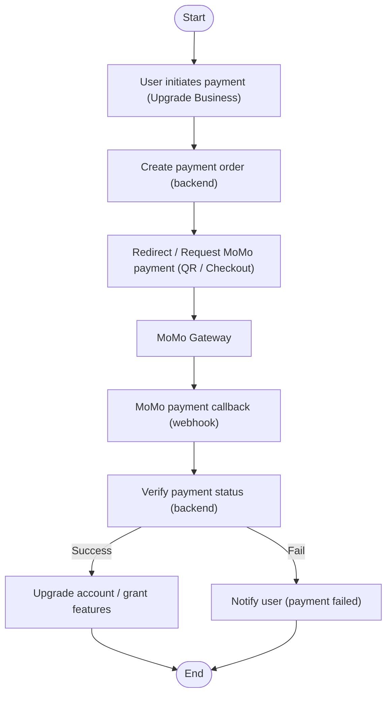

```mermaid
flowchart TD
  userStart([Start]) --> create["User initiates payment (Upgrade Business)"]
  create --> createOrder["Create payment order (backend)"]
  createOrder --> redirect["Redirect / Request MoMo payment (QR / Checkout)"]
  redirect --> MoMo["MoMo Gateway"]
  MoMo --> callback["MoMo payment callback (webhook)"]
  callback --> verify["Verify payment status (backend)"]
  verify -->|Success| upgrade["Upgrade account / grant features"]
  verify -->|Fail| notify["Notify user (payment failed)"]
  upgrade --> endNode([End])
  notify --> endNode

```
