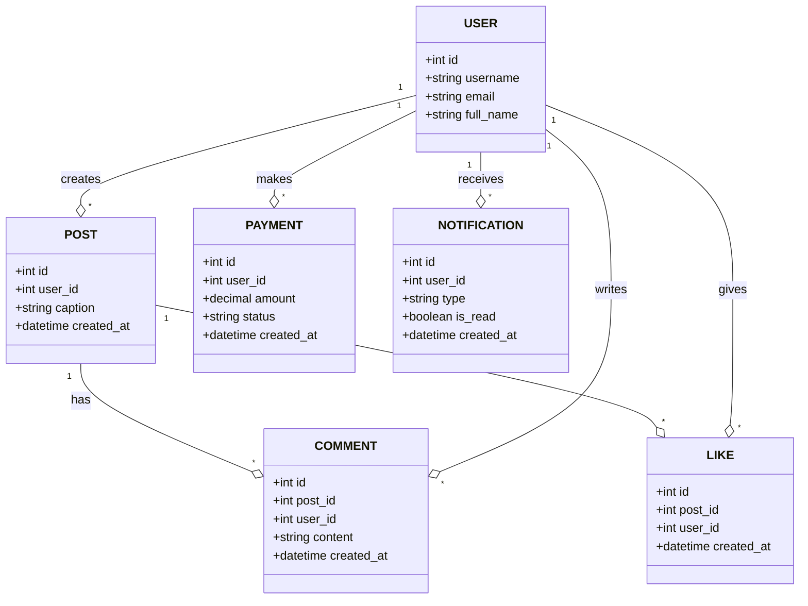

```mermaid
classDiagram
  class USER {
    +int id
    +string username
    +string email
    +string full_name
  }
  class POST {
    +int id
    +int user_id
    +string caption
    +datetime created_at
  }
  class COMMENT {
    +int id
    +int post_id
    +int user_id
    +string content
    +datetime created_at
  }
  class LIKE {
    +int id
    +int post_id
    +int user_id
    +datetime created_at
  }
  class PAYMENT {
    +int id
    +int user_id
    +decimal amount
    +string status
    +datetime created_at
  }
  class NOTIFICATION {
    +int id
    +int user_id
    +string type
    +boolean is_read
    +datetime created_at
  }

  USER "1" --o "*" POST : creates
  POST "1" --o "*" COMMENT : has
  USER "1" --o "*" COMMENT : writes
  POST "1" --o "*" LIKE : has
  USER "1" --o "*" LIKE : gives
  USER "1" --o "*" PAYMENT : makes
  USER "1" --o "*" NOTIFICATION : receives

```
