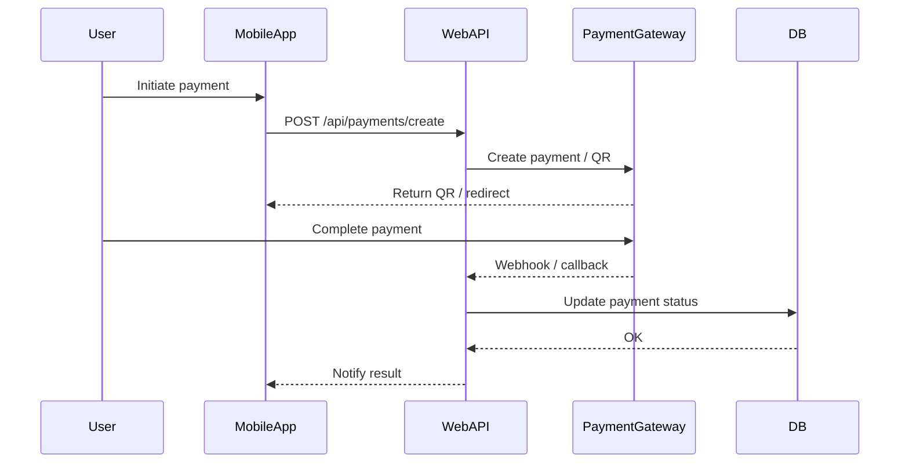

```mermaid
sequenceDiagram
    participant User
    participant MobileApp
    participant WebAPI
    participant PaymentGateway
    participant DB

    User->>MobileApp: Initiate payment
    MobileApp->>WebAPI: POST /api/payments/create
    WebAPI->>PaymentGateway: Create payment / QR
    PaymentGateway-->>MobileApp: Return QR / redirect
    User->>PaymentGateway: Complete payment
    PaymentGateway-->>WebAPI: Webhook / callback
    WebAPI->>DB: Update payment status
    DB-->>WebAPI: OK
    WebAPI-->>MobileApp: Notify result

```
