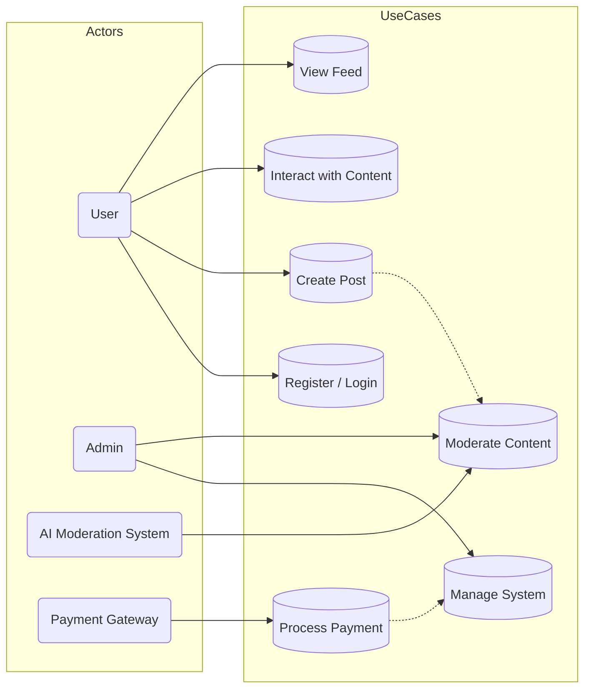

# Use Case Diagram (Toàn hệ thống)

Mô tả: sơ đồ Use Case tổng thể cho hệ thống (chỉ 1 sơ đồ duy nhất). Đây là một phiên bản chuyển sang `flowchart` để đảm bảo tương thích với renderer trên GitHub.

